<p align="center">
  
</p>

<div align="center">

# Universidad Peruana de Ciencias Aplicadas

## Carrera de Ingeniería de Software

</div>

<div align="center">

**Ciclo:** 2025 - 1  
**Curso:** Aplicaciones Web - 1ASI0730  
**Sección:** 4371  
**Docente:** Naldo Reupo-Musayon Gastulo  

**Startup:** Turisnap  
**Producto:** TripMatch

| Código      | Nombre                           |
|-------------|----------------------------------|
| U20231C505  | Marcia Victoria Melgarejo Gomez  |
| U202311258  | María Patricia Hernández Uchuya  |
| U20211G671  | Britney Delhy Qqueso Rodriguez   |
| U202219481  | Rodrigo Alaya Cabrera            |
| U20221D382  | Ariadna Geraldine Poma Muñoz     |
| U202316057  | Jorge Enrique Guevara Tejada     |
| U202210938  | Raúl Adrian Medina Cruzado       |

**Junio - 2025**

</div>

# **Registro de Versiones**

<table>
  <thead>
    <tr>
        <th>Versión</th>
        <th>Fecha</th>
        <th>Autor</th>
        <th>Descripción de modificación</th>
    </tr>
  </thead>
  <tbody>
  <tr>
      <td><strong>TB1</strong></td>
      <td>Abril</td>
      <td>
        <ul>
          <li>Marcia Melgarejo</li>
          <li>María Hernández</li>
          <li>Britney Qqueso</li>
          <li>Rodrigo Alaya</li>
          <li>Ariadna Poma</li>
          <li>Jorge Guevara</li>
          <li>Raúl Medina</li>
        </ul>
      </td>
      <td>
        Se han incluído los siguientes capítulos:
        <ul>
          <li>Capítulo I: Introducción</li>
          <li>Capítulo II: Requirements Elicitation & Analysis</li>
          <li>Capítulo III: Requirements Specification</li>
          <li>Capítulo IV: Product Design</li>
          <li>Avance del Capítulo V: Product Implementation, Validation & Deployment hasta el punto 5.2.1.8 Sprint 1</li>
          <li>Avance de Conclusiones, Bibliografía y Anexos</li>
        </ul>
      </td>
  </tr>
  <tr>
      <td><strong>TP1</strong></td>
      <td>14/05/25</td>
      <td>
        <ul>
          <li>Marcia Melgarejo</li>
          <li>María Hernández</li>
          <li>Britney Qqueso</li>
          <li>Rodrigo Alaya</li>
          <li>Ariadna Poma</li>
          <li>Jorge Guevara</li>
          <li>Raúl Medina</li>
        </ul>
      </td>
      <td>
        Se realizó el avance de los siguientes puntos:
        <ul>
          <li>5.2.2. Sprint 2</li>
          <li>5.2.2.1. Sprint Planning 2.</li>
          <li>5.2.2.2. Aspect Leaders and Collaborators.</li>
          <li>5.2.2.3. Sprint Backlog 2.</li>
          <li>5.2.2.4. Development Evidence for Sprint Review.</li>
          <li>5.2.2.5. Execution Evidence for Sprint Review.</li>
          <li>5.2.2.6. Services Documentation Evidence for Sprint Review.</li>
          <li>5.2.2.7. Software Deployment Evidence for Sprint Review.</li>
          <li>5.2.2.8. Team Collaboration Insights during Sprint.</li>
          <li>Avance de Conclusiones, Bibliografía y Anexos.</li>
        </ul>
      </td>
  </tr>
  <tr>
      <td><strong>TB2</strong></td>
      <td>19/06/25</td>
      <td>
        <ul>
          <li>Marcia Melgarejo</li>
          <li>María Hernández</li>
          <li>Britney Qqueso</li>
          <li>Rodrigo Alaya</li>
          <li>Ariadna Poma</li>
          <li>Jorge Guevara</li>
          <li>Raúl Medina</li>
        </ul>
      </td>
      <td>
        Se realizó el avance de los siguientes puntos:
        <ul>
          <li>5.2.3. Sprint 3</li>
          <li>5.2.3.1. Sprint Planning 3.</li>
          <li>5.2.3.2. Aspect Leaders and Collaborators.</li>
          <li>5.2.3.3. Sprint Backlog 3.</li>
          <li>5.2.3.4. Development Evidence for Sprint Review.</li>
          <li>5.2.3.5. Execution Evidence for Sprint Review.</li>
          <li>5.2.3.6. Services Documentation Evidence for Sprint Review.</li>
          <li>5.2.3.7. Software Deployment Evidence for Sprint Review.</li>
          <li>5.2.3.8. Team Collaboration Insights during Sprint.</li>
          <li>5.3.	Validation Interviews.</li>
          <li>5.3.1.	Diseño de Entrevistas.</li>
          <li>5.3.2.	Registro de Entrevistas.</li>
          <li>5.3.3.	Evaluaciones según heurísticas.</li>
          <li>5.4.	Video About-the-Product.</li>
          <li>Avance de Conclusiones, Bibliografía y Anexos.</li>
        </ul>
      </td>
  </tr>
  </tbody>
</table>

## Project Report Collaboration Insights


| URL de la organización del proyecto | URL del repositorio del reporte   |
| :------------------: | :---------------------------: | 
| https://github.com/Turisfera | https://github.com/Turisfera/workstation-markdown |

| URL del repositorio de la landing page | URL del repositorio del frontend |
| :----------------------------: | :-----------------------: |
| https://github.com/Turisfera/workstation-landing-page | https://github.com/Turisfera/workstation-front-end |


**URL LANDING PAGE DESPLEGADO**: https://turisfera.github.io/workstation-landing-page/

**URL FRONTEND DESPLEGADO:**: https://trip-match-2025.web.app/

**URL BACKEND DESPLEGADO:**:

Commits del Report:

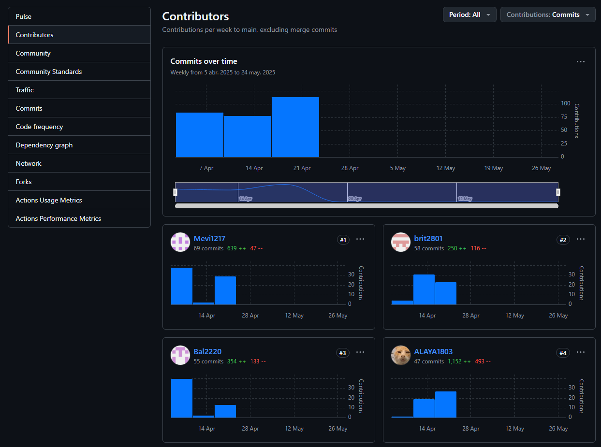 
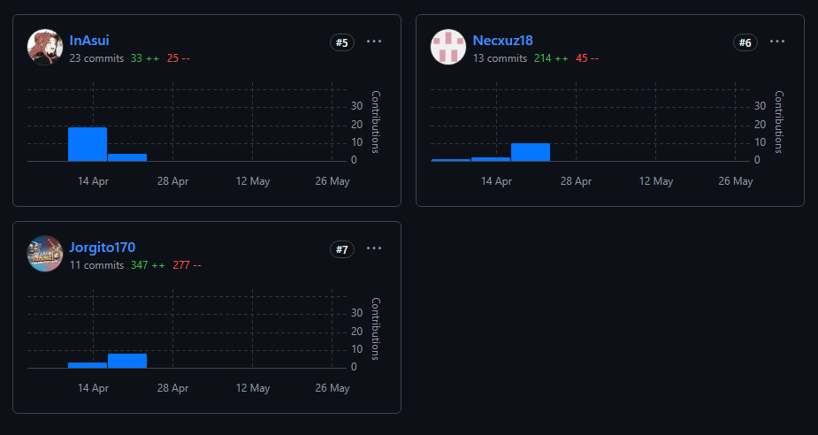 

# **Student Outcomes**

| <div style="width:100px">Criterio específico</div> | <div align="center" style="width:250px">Acciones Realizadas</div> | <div align="center" style="width:250px">Conclusiones</div> |
|:-------------------:|-------------------|------------|
|Comunica oralmente con efectividad a diferentes rangos de audiencia| **- Marcia Melgarejo** <br> **TB1:** Expliqué los hallazgos del needfinding y el recorrido del usuario de manera clara, apoyándome en wireframes y prototipos interactivos para comunicar las propuestas de diseño de TripMatch ante diferentes audiencias.<br> **TP:** Desarrollé la sección de Experience Manager y la página de layout por defecto (Default Layout Page) de la aplicación web, asegurando una estructura coherente, reutilizable y alineada con el diseño general del sistema. La sección de Experience Manager se implementó de forma modular para facilitar su integración con otras vistas, mientras que el layout por defecto establece la base visual y estructural sobre la cual se construyen las distintas páginas, garantizando consistencia en la experiencia del usuario.  <br> **TB2:** Expliqué al equipo el modelado de entidades y su relación con la base de datos, facilitando la comprensión del diseño de Usuario, Agencia, Paquete y Reserva. Respondí dudas técnicas durante la demo de Sprint 3, ajustando mi presentación al nivel del público. <br> **TF:** <br> <br> **- María Hernández** <br> **TB1:** En esta entrega me encargué de realizar una entrevista, además de colaborar con la elaboración de los wireframe y mockups de la landing page. Así mismo, realicé una de las sección del langing (About Us) y el Login. <br> **TP:** Desarrollé la vista de Reservas para la sección de Agencias dentro de la aplicación web, asegurando una estructura clara, coherente y alineada con el diseño general del sistema. El trabajo incluyó la implementación de la interfaz de usuario, el estilo visual y la integración con los datos necesarios para su correcto funcionamiento. Se mantuvo un enfoque modular y organizado para facilitar futuras mejoras y asegurar la mantenibilidad del código. <br> **TB2:** Presenté el flujo de autenticación y login, explicando oralmente cómo se validaron los accesos y cómo estos flujos se integraban con el resto del sistema. Expuse en términos simples para asegurar comprensión de todo el equipo. <br> **TF:** <br> <br> **- Britney Qqueso** <br> **TB1:** En esta entrega colaboré en la definición de las Style Guidelines generales y para web, así como en el desarrollo de la arquitectura de la información, incluyendo sistemas de organización, etiquetado, búsqueda y navegación. También participé en la elaboración de SEO y meta tags, así como en el registro de entrevistas y la creación de la landing page. <br> **TP:** Realicé el desarrollo de la sección de Consultas para la vista de Agencias dentro de la aplicación web, enfocándome en mantener una estructura clara y coherente con el resto del sistema. Además, corregí el diagrama C4 para reflejar con mayor precisión la arquitectura actual del proyecto, mejorando su claridad y consistencia. Finalmente, llevé a cabo correcciones en el archivo README, ajustando la documentación para que sea más precisa, comprensible y útil para futuros desarrolladores o colaboradores del proyecto. <br> **TB2:** Durante TB2, conduje entrevistas de validación y presenté los hallazgos obtenidos de manera clara y estructurada. Además, me encargué de documentar el Sprint 3, dejando registro del avance del equipo y comunicando oralmente los puntos clave del progreso y próximos pasos en las reuniones grupales.<br> **TF:** <br> <br> **- Jorge Guevara** <br> **TB1:** En esta entrega me encargué de comunicarle a mi equipo cuál sería la metodología de trabajo. Además, realicé una entrevista enfocadas en el segmento de agencias, con el propósito de entender mejor sus necesidades y expectativas. Asimismo, colaboré con la revisión retroactiva de los avances de mis compañeros, brindándoles observaciones sobre los puntos de la documentación que podrían ser mejorados. <br> **TP:** Desarrollé la vista principal (Home View) dirigida a turistas dentro de la aplicación web, asegurando una presentación clara, atractiva y alineada con la experiencia de usuario esperada. Además, se implementó un diseño responsive para la landing page, optimizando su visualización y funcionalidad en dispositivos móviles, con el objetivo de garantizar una navegación fluida y accesible desde cualquier pantalla. <br> **TB2:**Expuse los endpoints desarrollados para paquetes turísticos y destinos, explicando de forma clara las validaciones aplicadas y la estructura de los DTO utilizados, adaptando el lenguaje para compañeros no técnicos. <br> **TF:** <br> <br> **- Rodrigo Alaya** <br> **TB1:** Durante esta entrega, me encargué de presentar de manera clara el proceso de configuración del entorno de desarrollo y despliegue de TripMatch, explicando las herramientas utilizadas en cada etapa: desde la gestión de requisitos con Trello y Discord, hasta el despliegue automático con GitHub Pages. También expuse la estructura del repositorio y el uso del modelo GitFlow, logrando que el equipo y docente comprendan el flujo de trabajo técnico y colaborativo del proyecto. <br> **TP:** Desarrollé la sección de perfil de agencia dentro de la aplicación web, asegurando una estructura clara y organizada que permita visualizar y gestionar la información relevante de manera eficiente. Se mantuvo la coherencia visual y funcional con el resto del sistema, siguiendo buenas prácticas de diseño e implementación para facilitar su integración y futura escalabilidad. <br> **TB2:** Realicé una presentación técnica sobre el despliegue con Docker y la estructura docker-compose, asegurando que todos comprendieran cómo replicar el entorno local. Respondí consultas y aclaré conceptos durante la demo. <br> **TF:** <br><br> **- Ariadna Poma** <br> **TB1:** Durante esta entrega, me encargué de presentar de manera clara el apartado de Assumptions del Lean UX Canvas, identificando las creencias clave del equipo sobre nuestros usuarios, sus problemas, y cómo nuestra solución podría abordarlos. Expliqué cómo estas suposiciones guían las decisiones iniciales del diseño y desarrollo, y detallé el proceso seguido para priorizarlas en función de su impacto y riesgo. Además, facilité la discusión en equipo para validar o refutar estas ideas mediante experimentación, asegurando una base sólida para avanzar en el diseño centrado en el usuario. <br> **TP:** Desarrollé la sección de itinerarios para la vista de turistas dentro de la aplicación web, asegurando una presentación clara y estructurada de los planes de viaje. La implementación se centró en facilitar la navegación y visualización de los itinerarios, permitiendo a los turistas acceder fácilmente a la información relevante y disfrutar de una experiencia de usuario intuitiva y fluida. <br> **TB2:** Expliqué el funcionamiento de los controladores REST implementados, especialmente los de autenticación y reservas. Mostré los resultados en Swagger y justifiqué los cambios con base en pruebas funcionales. <br> **TF:** <br> <br> **- Raúl Medina** <br> **TB1:** Durante la entrega, expuse los avances relacionados con la implementación inicial del backend, explicando la lógica de los endpoints desarrollados y su integración con la base de datos. Utilicé diagramas y ejemplos funcionales para facilitar la comprensión técnica al resto del equipo y docente. <br> **TP:** Desarrollé la sección de reservas para la vista de turistas dentro de la aplicación web, permitiendo a los usuarios gestionar y visualizar sus reservas de manera eficiente. La implementación se centró en ofrecer una experiencia fluida y accesible, asegurando que los turistas puedan realizar, consultar y modificar sus reservas de forma sencilla y clara. <br> **TB2:** Presenté los casos de uso de inscripción y la lógica de itinerarios implementada, detallando su comportamiento y flujos dentro de la lógica del backend. Utilicé gráficos de flujo para apoyar la explicación. <br> **TF:** <br><br>| **TB1:** Cada integrante cumplió con las tareas que se le encomendaron, manteniendo una comunicación constante y efectiva que reforzó la confianza entre todos. Esto contribuyó al fortalecimiento del trabajo en equipo, un valor esencial en proyectos colaborativos. <br> **TP:** Cada miembro del equipo cumplió con las tareas asignadas, demostrando compromiso y responsabilidad. Se mantuvo una comunicación constante y efectiva, lo que favoreció la colaboración y fortaleció la confianza mutua. Este enfoque contribuyó al éxito del proyecto, resaltando la importancia del trabajo en equipo en entornos colaborativos <br> **TB2**  el equipo logró exponer técnicamente sus aportes de manera clara y accesible ante diferentes niveles de audiencia. Las presentaciones permitieron al grupo comprender el avance conjunto, validar el trabajo individual y tomar decisiones informadas, consolidando así la comunicación oral como un factor clave en el desarrollo colaborativo.<br> |
|Comunica por escrito con efectividad a diferentes rangos de audiencia| **- Marcia Melgarejo** <br> **TB1:** Documenté el proceso completo del diseño de TripMatch, incluyendo el needfinding, los perfiles y tareas del usuario, los mapas de empatía, los escenarios As-Is y To-Be, el wireframe, el prototipo y el diagrama de clases, en un formato claro y organizado.<br> **TP:** Documenté el proceso completo del Sprint 2, incluyendo la planificación detallada del Sprint (Sprint Planning 2), en un formato claro y organizado. Durante esta fase, se definieron los objetivos clave, las tareas prioritarias y los entregables, asegurando que todos los miembros del equipo tuvieran una comprensión clara de los requisitos y plazos. Además, se establecieron los criterios de éxito y se asignaron responsabilidades para garantizar una ejecución eficiente del Sprint. <br> **TB2:** Documenté con detalle el modelado de entidades realizado para el backend, especificando las relaciones entre Usuario, Agencia, Paquete, Reserva e Itinerario. Esta documentación fue presentada en un lenguaje técnico preciso y estructurado, de modo que facilitara su comprensión tanto para el equipo de desarrollo como para futuros colaboradores que deseen mantener o extender la base de datos.<br> <br> **- María Hernández** <br> **TB1:** Me encargué de hacer el diagrama de la base de datos, junto con los antecedentes y problemática, segmentos objetivos y refinar algunas cosas en el documento. <br> **TP:** Documenté el proceso de identificación y asignación de los líderes de cada aspecto (Aspect Leaders) y colaboradores dentro del Sprint 2, en un formato claro y organizado. Durante esta fase, se definieron las áreas clave del proyecto y se asignaron los roles correspondientes a los miembros del equipo, asegurando que cada uno tuviera una responsabilidad clara y alineada con sus habilidades y experiencia. Esto facilitó la colaboración efectiva y garantizó que los aspectos del proyecto fueran gestionados de manera eficiente. <br> **TB2:** Redacté los flujos de autenticación del sistema, enfocándome en la creación de cuentas y login de usuarios. Esta información fue presentada de forma clara y organizada, utilizando tanto diagramas como descripciones de cada validación realizada. La escritura se adaptó a un público técnico, pero con un enfoque explicativo para asegurar comprensión por parte del equipo y del docente evaluador. <br> **TF:** <br> <br> **- Britney Qqueso** <br> **TB1:** Aporté en la planificación de tareas relacionadas con la arquitectura de información y lineamientos de estilo, buscando siempre que todos los aportes fueran considerados. Coordiné junto al equipo la organización de contenidos y el diseño de la landing page. <br> **TP:** Documenté el proceso de recopilación de la evidencia de desarrollo (Development Evidence) y ejecución (Execution Evidence) para la revisión del Sprint 2, en un formato claro y organizado. En la fase de evidencia de desarrollo, se recopilaron los resultados de las tareas completadas durante el Sprint, demostrando los avances y logros alcanzados. Por otro lado, en la fase de evidencia de ejecución, se presentaron los resultados obtenidos en términos de implementación y pruebas, asegurando que los entregables cumplían con los criterios de aceptación establecidos. Ambas evidencias fueron fundamentales para la revisión del Sprint y para garantizar la alineación con los objetivos del proyecto. <br> **TB2:** En TB2, redacté las observaciones obtenidas en entrevistas de validación, resumiendo los hallazgos y plasmándolos en un lenguaje claro y directo para orientar mejoras. También me encargué de la documentación del Sprint 3, registrando por escrito los avances del equipo y facilitando una visión compartida del progreso logrado.<br> **TF:** <br> <br> **- Jorge Guevara** <br> **TB1:** Colabore con la elaboración de los alineamientos que el equipo seguiría durante el proceso de desarrollo. También, me encargue de hacer gran parte del capítulo 3.<br> **TP:** Documenté el proceso de creación y organización del Sprint Backlog 2, en un formato claro y estructurado. Durante esta fase, se identificaron y priorizaron las tareas y objetivos clave del Sprint, asegurando que todos los elementos necesarios para alcanzar los entregables fueran claramente definidos y asignados. Además, se establecieron plazos y dependencias, garantizando una ejecución eficiente y enfocada en los objetivos del Sprint.  <br> **TB2:** Elaboré documentación detallada sobre los endpoints desarrollados para la gestión de paquetes turísticos y destinos. Esta incluyó la estructura de los DTO utilizados, las validaciones aplicadas y ejemplos de uso. La redacción técnica fue clara, lo que facilitó el proceso de integración con otros módulos del backend y ayudó a reducir errores en la etapa de pruebas.<br> **TF:** <br> <br> **- Rodrigo Alaya** <br> **TB1:** Documenté detalladamente la configuración del entorno de desarrollo, estilo de codificación, convenciones de versionado y despliegue del proyecto en el Capítulo 5 del informe. Redacté la sección de herramientas utilizadas en cada fase del desarrollo, incluyendo UX/UI, documentación, y control de versiones, aplicando un lenguaje técnico claro, ordenado y alineado a las buenas prácticas de documentación de software. <br> **TP:** Documenté la evidencia de la documentación de servicios (Services Documentation Evidence) para la revisión del Sprint 2, en un formato claro y organizado. Durante esta fase, se recopiló y presentó la documentación técnica relacionada con los servicios implementados durante el Sprint, asegurando que toda la información necesaria para comprender y utilizar los servicios estuviera completa y accesible. Esta evidencia fue crucial para la revisión del Sprint, permitiendo a los miembros del equipo y las partes interesadas verificar que los servicios documentados cumplían con los estándares y requisitos establecidos.  <br> **TB2:**  Redacté la guía de configuración para el entorno de desarrollo y despliegue local mediante Docker y docker-compose. Utilicé un lenguaje técnico accesible, asegurándome de que cualquier miembro del equipo pudiera replicar el entorno sin dificultad. Los archivos de configuración fueron debidamente comentados y organizados para su mantenimiento a largo plazo. <br> **TF:** <br> <br> **- Ariadna Poma** <br> **TB1:** Realicé una entrevista en el marco del proyecto, con el objetivo de obtener información clave sobre los requisitos, expectativas o experiencias relacionadas con el desarrollo. Durante la entrevista, se plantearon preguntas estructuradas que permitieron recopilar datos relevantes, los cuales fueron documentados de manera clara y organizada para facilitar su análisis posterior. Esta entrevista contribuyó significativamente a la comprensión de las necesidades del proyecto y a la toma de decisiones informadas. <br> **TP:** Documenté la evidencia de despliegue de software (Software Deployment Evidence) para la revisión del Sprint 2, en un formato claro y organizado. Durante esta fase, se recopilaron y presentaron los detalles relacionados con el proceso de despliegue del software, incluyendo los pasos seguidos, las configuraciones realizadas y los resultados obtenidos. Esta evidencia fue esencial para la revisión del Sprint, ya que permitió verificar que el software desplegado cumplía con los requisitos técnicos y funcionales definidos, y estaba listo para su uso o prueba en el entorno correspondiente.  <br> **TB2:** Documenté los servicios REST implementados en los módulos de autenticación, reservas y usuarios, incluyendo sus rutas, lógica de controladores y resultados obtenidos durante las pruebas funcionales. La redacción combinó precisión técnica con claridad estructural, lo que permitió al equipo comprender los flujos y comportamientos del sistema con facilidad.<br> **TF:** <br><br> **- Raúl Medina** <br> **TB1:** Participé en la redacción del registro de una de las entrevistas realizadas a usuarios potenciales, destacando sus necesidades y puntos de dolor. Además, me encargué de redactar la sección de beneficios de la landing page, enfocándome en resaltar el valor agregado de TripMatch. Finalmente, colaboré con la documentación del Capítulo V relacionada con la evidencia de desarrollo e implementación correspondiente al Sprint 1.<br> **TP:** Documenté los insights de colaboración del equipo durante el Sprint 2, en un formato claro y organizado. A lo largo del Sprint, se identificaron y analizaron los aspectos clave de la interacción y colaboración entre los miembros del equipo, destacando las mejores prácticas, los desafíos enfrentados y las soluciones implementadas. Estos insights proporcionaron valiosa información sobre cómo mejorar la eficiencia, la comunicación y la cohesión del equipo en futuros Sprints, fortaleciendo así el enfoque colaborativo del proyecto.  <br> **TB2:** Desarrollé y documenté los casos de uso relacionados a la inscripción de usuarios y la lógica del dominio de itinerarios. Redacté los flujos en lenguaje técnico, utilizando diagramas de secuencia y tablas explicativas para detallar las interacciones entre componentes. Esta documentación facilitó tanto el análisis funcional como la validación de los servicios implementados. <br> **TF:** <br><br> | **TB1:** Todos los miembros se involucraron en las tareas que les correspondían, manteniendo una comunicación fluida y eficiente que favoreció la construcción de confianza entre ellos. Como resultado, se potenció el trabajo en equipo, un elemento fundamental en proyectos conjuntos. <br> **TP:** Cada integrante participó activamente en las tareas asignadas, manteniendo una comunicación constante y efectiva que contribuyó a fortalecer la confianza mutua. Esto resultó en un mayor impulso al trabajo en equipo, un aspecto clave para el éxito de proyectos colaborativos. <br> **TB2** Los integrantes del equipo demostraron una comunicación escrita precisa, técnica y orientada a la colaboración efectiva. Cada miembro redactó documentación clara y estructurada sobre los módulos que desarrolló, utilizando tanto lenguaje técnico como explicaciones funcionales que permitieron la comprensión transversal del sistema. Esta capacidad de redacción no solo facilitó el trabajo entre desarrolladores de frontend y backend, sino que también permitió que docentes, evaluadores y nuevos integrantes pudieran entender con facilidad el propósito, funcionamiento y estado de cada componente. Además, el uso de herramientas como Swagger, diagramas de flujo y archivos de configuración bien comentados reforzó la calidad de la documentación, sentando una base sólida para la escalabilidad, el mantenimiento futuro y la transferencia de conocimiento dentro del equipo. La escritura efectiva fue, sin duda, un elemento clave para el éxito del sprint y del proyecto en su conjunto.<br> |


# **Project Report Online**

URL Project Report (Github): 

- [Capítulo I: Introducción](#capítulo-i-introducción)
  - [1.1. Startup Profile](#11-startup-profile)
    - [1.1.1. Descripción de la Startup](#111-descripción-de-la-startup)
    - [1.1.2. Perfiles de integrantes del equipo](#112-perfiles-de-integrantes-del-equipo)
  - [1.2. Solution Profile](#12-solution-profile)
    - [1.2.1 Antecedentes y problemática](#121-antecedentes-y-problemática)
    - [1.2.2 Lean UX Process](#122-lean-ux-process)
      - [1.2.2.1. Lean UX Problem Statements](#1221-lean-ux-problem-statements)
      - [1.2.2.2. Lean UX Assumptions](#1222-lean-ux-assumptions)
      - [1.2.2.3. Lean UX Hypothesis Statements](#1223-lean-ux-hypothesis-statements)
      - [1.2.2.4. Lean UX Canvas](#1224-lean-ux-canvas)
  - [1.3. Segmentos objetivo](#13-segmentos-objetivo)

- [Capítulo II: Requirements Elicitation \& Analysis](#capítulo-ii-requirements-elicitation--analysis)
  - [2.1. Competidores](#21-competidores)
    - [2.1.1. Análisis competitivo](#211-análisis-competitivo)
    - [2.1.2. Estrategias y tácticas frente a competidores](#212-estrategias-y-tácticas-frente-a-competidores)
  - [2.2. Entrevistas](#22-entrevistas)
    - [2.2.1. Diseño de entrevistas](#221-diseño-de-entrevistas)
    - [2.2.2. Registro de entrevistas](#222-registro-de-entrevistas)
    - [2.2.3. Análisis de entrevistas](#223-análisis-de-entrevistas)
  - [2.3. Needfinding](#23-needfinding)
    - [2.3.1. User Personas](#231-user-personas)
    - [2.3.2. User Task Matrix](#232-user-task-matrix)
    - [2.3.3. User Journey Mapping](#233-user-journey-mapping)
    - [2.3.4. Empathy Mapping](#234-empathy-mapping)
    - [2.3.5. As-is Scenario Mapping](#235-as-is-scenario-mapping)
  - [2.4. Ubiquitous Language](#24-ubiquitous-language)

- [Capítulo III: Requirements Specification](#capítulo-iii-requirements-specification)
  - [3.1. To-Be Scenario Mapping](#31-to-be-scenario-mapping)
  - [3.2. User Stories](#32-user-stories)
  - [3.3. Impact Mapping](#33-impact-mapping)
  - [3.4. Product Backlog](#34-product-backlog)

- [Capítulo IV: Product Design](#capítulo-iv-product-design)
  - [4.1. Style Guidelines](#41-style-guidelines)
    - [4.1.1. General Style Guidelines](#411-general-style-guidelines)
    - [4.1.2. Web Style Guidelines](#412-web-style-guidelines)
  - [4.2. Information Architecture](#42-information-architecture)
    - [4.2.1. Organization Systems.](#421-organization-systems)
    - [4.2.2. Labeling Systems.](#422-labeling-systems)
    - [4.2.3. SEO Tags and Meta Tags](#423-seo-tags-and-meta-tags)
    - [4.2.4. Searching Systems.](#424-searching-systems)
    - [4.2.5. Navigation Systems.](#425-navigation-systems)
  - [4.3. Landing Page UI Design.](#43-landing-page-ui-design)
    - [4.3.1. Landing Page Wireframe.](#431-landing-page-wireframe)
    - [4.3.2. Landing Page Mock-up.](#432-landing-page-mock-up)
  - [4.4. Web Applications UX/UI Design.](#44-web-applications-uxui-design)
    - [4.4.1. Web Applications Wireframes.](#441-web-applications-wireframes)
    - [4.4.2. Web Applications Wireflow Diagrams.](#442-web-applications-wireflow-diagrams)
    - [4.4.2. Web Applications Mock-ups.](#442-web-applications-mock-ups)
    - [4.4.3. Web Applications User Flow Diagrams.](#443-web-applications-user-flow-diagrams)
  - [4.5. Web Applications Prototyping.](#45-web-applications-prototyping)
  - [4.6. Domain-Driven Software Architecture.](#46-domain-driven-software-architecture)
    - [4.6.1. Software Architecture Context Diagram.](#461-software-architecture-context-diagram)
    - [4.6.2. Software Architecture Container Diagrams.](#462-software-architecture-container-diagrams)
    - [4.6.3. Software Architecture Components Diagrams.](#463-software-architecture-components-diagrams)
  - [4.7. Software Object-Oriented Design.](#47-software-object-oriented-design)
    - [4.7.1. Class Diagrams.](#471-class-diagrams)
    - [4.7.2. Class Dictionary.](#472-class-dictionary)
  - [4.8. Database Design.](#48-database-design)
    - [4.8.1. Database Diagram.](#481-database-diagram)

- [Capítulo V: Product Implementation, Validation \& Deployment](#capítulo-v-product-implementation-validation--deployment)
  - [5.1. Software Configuration Management.](#51-software-configuration-management)
    - [5.1.1. Software Development Environment Configuration.](#511-software-development-environment-configuration)
    - [5.1.2. Source Code Management.](#512-source-code-management)
    - [5.1.3. Source Code Style Guide \& Conventions.](#513-source-code-style-guide--conventions)
    - [5.1.4. Software Deployment Configuration.](#514-software-deployment-configuration)
  - [5.2. Landing Page, Services \& Applications Implementation](#52-landing-page-services--applications-implementation)
    - [5.2.1. Sprint 1](#521-sprint-1)
      - [5.2.1.1. Sprint Planning 1](#5211-sprint-planning-1)
      - [5.2.1.2. Aspect Leaders and Collaborators.](#5212-aspect-leaders-and-collaborators)
      - [5.2.1.3. Sprint Backlog 1.](#5213-sprint-backlog-n)
      - [5.2.1.4. Development Evidence for Sprint Review.](#5214-development-evidence-for-sprint-review)
      - [5.2.1.5. Execution Evidence for Sprint Review.](#5215-execution-evidence-for-sprint-review)
      - [5.2.1.6. Services Documentation Evidence for Sprint Review.](#5216-services-documentation-evidence-for-sprint-review)
      - [5.2.1.7. Software Deployment Evidence for Sprint Review.](#5217-software-deployment-evidence-for-sprint-review)
      - [5.2.1.8. Team Collaboration Insights during Sprint.](#5218-team-collaboration-insights-during-sprint)
    - [5.2.2. Sprint 2](#522-sprint-2)
      - [5.2.2.1. Sprint Planning 2](#5221-sprint-planning-2)
      - [5.2.2.2. Aspect Leaders and Collaborators.](#5222-aspect-leaders-and-collaborators)
      - [5.2.2.3. Sprint Backlog 2.](#5223-sprint-backlog-2)
      - [5.2.2.4. Development Evidence for Sprint Review.](#5224-development-evidence-for-sprint-review)
      - [5.2.2.5. Execution Evidence for Sprint Review.](#5225-execution-evidence-for-sprint-review)
      - [5.2.2.6. Services Documentation Evidence for Sprint Review.](#5226-services-documentation-evidence-for-sprint-review)
      - [5.2.2.7. Software Deployment Evidence for Sprint Review.](#5227-software-deployment-evidence-for-sprint-review)
      - [5.2.2.8. Team Collaboration Insights during Sprint.](#5228-team-collaboration-insights-during-sprint)

    - [5.2.3. Sprint 3](#523-sprint-3)
      - [5.2.3.1. Sprint Planning 3](#5231-sprint-planning-3)
      - [5.2.3.2. Aspect Leaders and Collaborators.](#5232-aspect-leaders-and-collaborators)
      - [5.2.3.3. Sprint Backlog 3.](#5233-sprint-backlog-3)
      - [5.2.3.4. Development Evidence for Sprint Review.](#5234-development-evidence-for-sprint-review)
      - [5.2.3.5. Execution Evidence for Sprint Review.](#5235-execution-evidence-for-sprint-review)
      - [5.2.3.6. Services Documentation Evidence for Sprint Review.](#5236-services-documentation-evidence-for-sprint-review)
      - [5.2.3.7. Software Deployment Evidence for Sprint Review.](#5237-software-deployment-evidence-for-sprint-review)
      - [5.2.3.8. Team Collaboration Insights during Sprint.](#5238-team-collaboration-insights-during-sprint)

  - [5.3. Validation Interviews.](#53-validation-interviews)
    - [5.3.1. Diseño de Entrevistas.](#531-diseño-de-entrevistas)
    - [5.3.2. Registro de Entrevistas.](#532-registro-de-entrevistas)
    - [5.3.3. Evaluaciones según heurísticas.](#533-evaluaciones-según-heurísticas)
  - [5.4. Video About-the-Product.](#54-video-about-the-product)
- [Conclusiones](#conclusiones)
  - [Conclusiones y recomendaciones.](#conclusiones-y-recomendaciones)
- [Video About-the-Team.](#video-about-the-team)
- [Bibliografía](#bibliografía)
- [Anexos](#anexos)

# Capítulo 1: Introducción
## 1.1. Startup Profile
### 1.1.1. Descripción de la startup
En el mundo donde el turismo se ha diversificado y las experiencias personalizadas son cada vez más valoradas, Turisnap nace como una Startup que busca transformar la forma en que los viajeros conectan con agencias de turismo locales. Reconocemos que muchos turistas enfrentan la dificultad de encontrar paquetes confiables, ajustados a su presupuesto y verdaderamente adaptados a sus intereses, mientras que las agencias buscan nuevas maneras digitales de llegar a sus nuevos clientes.  

A través de nuestra plataforma TripMatch, brindamos un espacio donde los usuarios pueden explorar, comparar y reservar actividades y experiencias turísticas únicas, filtradas por destino, tipo de viaje, duración o presupuesto. Al mismo tiempo las agencias pueden administrar su catálogo de servicios, responder consultas en tiempo real y recibir reservas de forma directa y sencilla. Nuestro enfoque se basa en ofrecer una experiencia fluida y confiable tanto para el viajero como para el proveedor, promoviendo el turismo responsable y local. 

**Misión:** Nuestra misión es facilitar el acceso a experiencias turísticas auténticas y personalizadas mediante una platadorma digital que conecte a viajeros con agencias de turismo de manera directa, eficiente y transparente. Trabajamos paras simplificar el proceso de búsqueda y reserva de actividades, fomentando al mismo tiempo el crecimiento de negocios turísticos locales a través de soluciones tecnológias intuitivas.

**Visión:** Convertirnos en la plataforma de referencia para la planificación y reserva de experiencias turísticas, destacándonos por promover el turismo responsable, la innovación tecnológica y el fortalecimiento de agencias locales. Aspiramos a ser una solucion global que conecte millones de viajeros con sus destinos a través de unos clicks. 

**Valores:** Defendemos la integridad, la innovación y el turismo sostenible. Aseguramos precisión en la información, apoyamos a agencias locales y ofrecemos experiencias personalizadas para garantizar viajes auténticos, seguros y responsables.

### 1.1.2. Perfiles de integrantes del equipo

|  Nombres y Apellidos |    Codigo   | Descripción | Foto | 
|----------------------|-------------|-------------|------|
| Jorge Enrique Guevara Tejada  |  U202316057  | Soy un estudiante con un marcado sentido de la responsabilidad y un profundo compromiso con mi equipo de trabajo. Me dedico constantemente a superar los retos académicos, invirtiendo tiempo extra en fortalecer aquellas áreas en las que puedo mejorar. Mi meta no es solo lograr un buen desempeño académico, sino también aportar de forma significativa al logro conjunto, garantizando que cada proyecto en el que participo refleje el esfuerzo y la dedicación de todo el equipo. |    |
| Marcia Victoria Melgarejo Gomez |  U20231C505  | Actualmente estoy cursando el cuarto ciclo de la carrera de Ingeniería de Software en la UPC. Opté por esta carrera debido a mi interés en el mundo de la tecnología y todo lo que este campo puede ofrecer a la sociedad. <br> Me caracterizo por ser una persona curiosa, persistente y colaborativa. <br> Tengo conocimientos en C++, HTML, CSS, JS, Pyhton | |
| María Patricia Hernández Uchuya |  U202311258  | Estudio la carrera de Ingeniería de Software, tengo 19 años y actualmente me encuentro cursando el quinto ciclo de dicha carrera. Tengo conocimientos en C++, Python, Java, HTML, CSS y JavaScript. Me considero una persona con responsabilidad, optimismo y honestidad, cualidades que considero fundamentales para una colaboración efectiva en equipo y un buen desarrollo en este proyecto. |    |
| Raúl Adrian Medina Cruzado | U202210938 | Estudio la carrera de Ingenieria de Software, soy apasionado por la ciencia de datos. Me motiva descubrir cómo el análisis y la interpretación de grandes volúmenes de información pueden generar soluciones innovadoras dentro del desarrollo de software. Me concidero una persona la cual no tiene la facilidad de adaptarse a nuevos ambientes laborales, tambien me concidero una persona responsable, persistente y empatica. Tengo dominio en diferenetes lenguajes de programacion tale como C++, Java, JavaScript, Python, HTML, CSS.|    |
| Britney Delhy Qqueso Rodriguez | U20211G671 | Soy estudiante de la carrera de Ingeniería de Software en la Universidad Peruana de Ciencias Aplicadas (UPC). Me considero una persona autodidacta, dedicada, creativa y responsable. Cuento con experiencia en liderazgo y trabajo en equipo, y disfruto aprendiendo tanto de las personas como de las tecnologías con las que colaboro. Poseo conocimientos en diversos lenguajes de programación, como Python, HTML, CSS, JavaScript, entre otros. |   |
| Rodrigo Alaya Cabrera |  U202219481  | Soy una persona responsable, comprometida con mis objetivos y con gran disposición para aprender continuamente. Me adapto con facilidad al trabajo en equipo, aportando ideas y soluciones. Valoro mucho la eficiencia, la ética profesional y la mejora constante. Me esfuerzo por entregar siempre resultados de calidad, gestionando mis tareas con orden y enfoque. |    |
| Ariadna Geraldine Poma Muñoz  |  U20221D382  | Soy estudiante de la carrera de Ingeniería de Software, tengo 19 años. Me considero una persona comprometida, curiosa y optimista, con pasión por el aprendizaje continuo en diversos temas. Mi capacidad de adaptación al cambio se complementa con habilidades blandas como trabajo en equipo y resolución creativa de problemas. |    |

## 1.2. Solution Profile
### 1.2.1. Antecedentes y problemática
**What**
- ¿Cuál es el problema? <br>
  El problema central radica en la desconexión entre viajeros y agencias de turismo locales, donde los turistas enfrentan dificultades para encontrar experiencias auténticas, personalizadas y ajustadas a su presupuesto, mientras que las agencias locales luchan por adaptarse a la digitalización y encontrar nuevos canales efectivos para conectar con potenciales clientes en un mercado cada vez más competitivo y fragmentado.
- ¿Cuál es la relación con la persona en cuestión? <br>
  La implementación de la plataforma TripMatch busca resolver este problema de conexión mediante una solución digital que permite a los viajeros encontrar y reservar experiencias turísticas que realmente se ajusten a sus preferencias, mientras ofrece a las agencias locales herramientas tecnológicas para digitalizar y ampliar su alcance comercial de manera eficiente.

**When**
- ¿Cuándo sucede el problema? <br>
  El problema se manifiesta principalmente en las etapas de planificación y organización del viaje, cuando los turistas intentan investigar y contratar servicios turísticos confiables y personalizados, lo que puede ocurrir semanas o incluso meses antes del viaje, así como durante el propio desplazamiento cuando buscan actividades adicionales o alternativas a lo inicialmente planeado.
- ¿Cuándo utiliza el cliente el producto? <br>
  El cliente utiliza la plataforma TripMatch tanto en la fase de planificación previa al viaje, cuando explora destinos y actividades potenciales, como durante su estadía en el destino elegido cuando busca experiencias complementarias o modificaciones a su itinerario original, aprovechando la capacidad de conexión directa con agencias locales para realizar reservas de última hora o consultas específicas.

**Where**
- ¿Dónde está el cliente cuando utiliza el producto? <br>
  El usuario puede acceder a la plataforma desde múltiples ubicaciones. Desde su hogar durante la fase de planificación, utilizando dispositivos como computadoras o tablets; o bien desde su destino turístico a través de dispositivos móviles cuando ya se encuentra en viaje y necesita encontrar o modificar actividades en tiempo real.
- ¿A dónde se dirige? <br>
  El usuario se dirige a destinos turísticos nacionales o internacionales donde busca vivir experiencias auténticas y personalizadas, ya sean destinos populares donde desea evitar las experiencias masificadas, o lugares menos conocidos donde necesita orientación especializada para descubrir actividades de valor.
- ¿Dónde surge el problema? <br>
  El problema surge principalmente en el espacio digital fragmentado del sector turístico, donde la información se encuentra dispersa en múltiples sitios web, aplicaciones y plataformas sociales, dificultando la comparación de opciones y la verificación de la calidad y autenticidad de las experiencias ofrecidas por agencias locales que a menudo carecen de presencia digital efectiva.

**Who**
- ¿Quiénes están involucrados? <br>
  Los principales involucrados son los viajeros o turistas que buscan experiencias personalizadas, las agencias de turismo locales que ofrecen servicios especializados, los operadores de paquetes turísticos, y las plataformas tecnológicas que actualmente fragmentan el mercado sin ofrecer soluciones integrales para la conexión directa entre oferta y demanda.
- ¿A quiénes les sucede el problema? <br>
  El problema afecta directamente a dos grupos principales. Por un lado, afecta a los turistas que desean experiencias personalizadas y auténticas pero encuentran barreras para identificar y comunicarse con proveedores locales confiables. Por otro lado, a las pequeñas y medianas agencias de turismo local que tienen dificultades para digitalizar sus servicios y competir con grandes operadores turísticos o plataformas globales.
- ¿Quién lo utiliza? <br>
  La plataforma TripMatch será utilizada por viajeros independientes que buscan experiencias turísticas auténticas y personalizadas más allá del turismo masivo, así como por agencias locales de turismo que buscan ampliar su presencia digital y conectar directamente con clientes potenciales sin intermediarios que reduzcan sus márgenes o limiten su capacidad de personalización.

**Why**
- ¿Cuál es la causa del problema? <br>
  Se deben a la falta de personalización en los paquetes y a la limitada digitalización de las agencias de turismo y/o viaje. Los turistas buscan experiencias únicas, pero las agencias ofrecen opciones genéricas. Además, la digitalización insuficiente limita la capacidad de personalizar ofertas y mejorar la interacción con los clientes (KPMG Tendencias, 2024).

**How**
- ¿En qué condiciones nuestros clientes usan el producto? <br>
  Los clientes acceden a nuestra plataforma TripMatch cuando buscan experiencias turísticas auténticas y personalizadas que se ajusten a sus intereses específicos, presupuesto y disponibilidad de tiempo, ya sea durante la planificación anticipada de su viaje o cuando se encuentran ya en el destino y desean modificar o complementar su itinerario con actividades locales recomendadas.
- ¿Cómo nos conocieron nuestros compradores? <br>
  Los usuarios conocen nuestra plataforma principalmente a través de marketing digital especializado en viajes, asociaciones estratégicas con blogs y comunidades de viajeros, recomendaciones de otros usuarios satisfechos en redes sociales, y posicionamiento en buscadores especializados en turismo cuando buscan alternativas a las grandes plataformas tradicionales.
- ¿Cómo prefieren nuestros consumidores acceder a nuestro producto? <br>
  Los usuarios accederan a nuestra plataforma mediante un sitio web responsive para la planificación detallada previa, y notificaciones personalizadas sobre oportunidades relevantes basadas en sus preferencias e historial de búsqueda.
- ¿Qué llevó a la persona a esa situación? <br>
  El creciente deseo de los viajeros por experiencias auténticas y personalizadas, junto con la frustración provocada por las plataformas masivas que ofrecen opciones estandarizadas, lleva a los usuarios a buscar alternativas que faciliten la conexión directa con proveedores locales; mientras que las agencias de turismo local llegan a nuestra plataforma motivadas por la necesidad de digitalizar sus servicios y expandir su alcance sin depender exclusivamente de intermediarios tradicionales.

**How Much** <br>
Aproximadamente el 82% de las reservas de viajes en 2018 se realizaron a través de Internet, según un análisis de Mize (2021). Este cambio refleja cómo la tecnología ha transformado la industria turística, eliminando intermediarios y facilitando la personalización de experiencias para los viajeros. Además, más del 50% de viajeros suelen dedicar su tiempo en investigar sitios locales de reseñas de viajes con el objetivo de tomar una decisión informada sobre su próximo viaje, considerando aspectos como videos y fotos de destinos, la capacidad de los hoteles para destacar sus servicios y la experiencia previa de otros viajeros, entre otros factores (Travelperk, 2022). Asimismo, según el Ministerio de Comercio Exterior y Turismo (MINCETUR, 2024) solo en el Perú, aproximadamente 48 millones de viajes se realizan anualmente por motivos de turismo interno, incluyendo tanto turistas extranjeros que visitan el país como locales que viajan a otras ciudades dentro del territorio nacional.
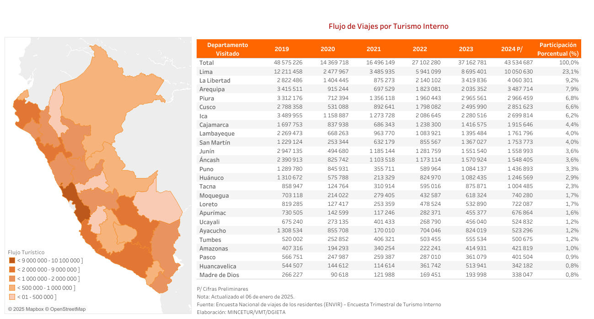

### 1.2.2. Lean UX Process
#### 1.2.2.1. Lean UX Problem Statements
Nuestro servicio ofrece una plataforma digital que conecta a viajeros con agencias de turismo locales, permitiendo a los usuarios explorar, comparar y reservar experiencias auténticas y personalizadas basadas en sus preferencias, presupuesto y destino. Al mismo tiempo, brindamos a las agencias locales herramientas tecnológicas para gestionar sus servicios, interactuar con clientes en tiempo real y ampliar su alcance comercial de manera eficiente, promoviendo el turismo responsable y el crecimiento de negocios locales. <br>
Hemos observado un factor crítico que afecta tanto a viajeros como a agencias locales. Los turistas enfrentan dificultades para encontrar experiencias confiables y adaptadas a sus intereses, mientras que las agencias locales carecen de presencia digital efectiva para competir en un mercado globalizado. Esta desconexión genera frustración en los viajeros, que recurren a opciones genéricas o masificadas, y limita el crecimiento de las agencias locales, que no logran aprovechar la demanda creciente de turismo personalizado y auténtico. <br>
¿Cómo mejorar la conexión entre viajeros y agencias locales para garantizar experiencias turísticas auténticas y personalizadas, al mismo tiempo que se fortalece la capacidad digital de los proveedores locales y se simplifica el proceso de planificación y reserva para los usuarios, promoviendo un impacto positivo en el turismo responsable?

#### 1.2.2.2. Lean UX Assumptions
**User Assumptions**
- ¿Quién es mi usuario? <br>
  Nuestros usuarios son viajeros que buscan experiencias auténticas y personalizadas, y agencias de turismo locales que necesitan digitalizar sus servicios para llegar a más clientes.
- ¿Dónde encaja nuestro producto en su trabajo o vida? <br>
  Para viajeros, simplifica la búsqueda y reserva de actividades únicas; para agencias, es una herramienta de gestión y conexión directa con turistas.
- ¿Qué problemas tiene nuestro producto? ¿Resolver? <br>
  Resuelve la dificultad de los viajeros para encontrar opciones confiables y personalizadas, y la falta de visibilidad digital de las agencias locales.
- ¿Cuándo y cómo es nuestro producto? ¿Usado? <br>
  Los viajeros lo usan al planificar su viaje o durante este para reservar actividades; las agencias lo usan diariamente para gestionar servicios y atender consultas.
- ¿Qué características son importantes? <br>
  Filtros avanzados, reseñas verificadas, chat en tiempo real, herramientas de gestión para agencias y opción de reservas móviles.
- ¿Cómo debe verse nuestro producto y cómo debe comportarse? <br>
  Debe ser visualmente atractivo, fácil de usar, seguro para transacciones e intuitivo para agencias con poca experiencia digital. <br>

**Business Assumptions**
- Creo que nuestros clientes necesitan una manera fácil y confiable de encontrar y reservar experiencias turísticas auténticas, personalizadas y gestionadas por agencias locales, sin tener que navegar en múltiples plataformas o correr riesgos de servicios poco verificados.
- Estas necesidades se pueden resolver con una plataforma digital que ofrezca filtros avanzados, reseñas verificadas, herramientas de comparación y comunicación en tiempo real, junto con un sistema de reservas seguro y eficiente.
- Mis clientes iniciales serán viajeros independientes nacionales e internacionales que priorizan experiencias locales auténticas, y agencias de turismo local que buscan digitalizar sus servicios para ampliar su alcance.
- El valor principal que mi cliente quiere de mi servicio acceder a herramientas digitales personalizadas que les permitan planificar, comparar y reservar experiencias turísticas de forma segura, eficiente y adaptada a sus intereses específicos y presupuesto.
- El cliente también puede obtener estos beneficios adicionales: Ahorro de tiempo en la búsqueda de actividades, conexión directa con proveedores confiables, flexibilidad para modificar o complementar su itinerario, reseñas verificadas, contenido visual auténtico y recomendaciones relevantes.
- Voy a adquirir la mayoría de mis clientes a través de marketing digital, alianzas con blogs y comunidades de viajeros, y estrategias de marketing con beneficios para usuarios que recomienden la plataforma.
- Haré dinero a través de marketing digital, anuncios y alianzas estratégicas con influencers de viajes.
- Mi competencia principal en el mercado serán plataformas como "TripMatch", "Withlocals", "ToursByLocals" y "Showaround", que se centran en ofrecer experiencias turísticas personalizadas a través de guías o agencias locales.
- Los venceremos debido a nuestro enfoque centrado en el turismo local auténtico, brindando soporte personalizado a pequeñas agencias que normalmente no tienen acceso a herramientas tecnológicas avanzadas. Además, nuestra tecnología prioriza la conexión directa, la confianza y la personalización, lo que nos diferencia de plataformas más genéricas y globalizadas.
- Mi mayor riesgo de producto es que las agencias locales no adopten la plataforma por falta de habilidades digitales o que no mantengan su información actualizada, afectando la calidad del servicio.
- Resolveremos esto a través de capacitación inicial y soporte técnico continuo para las agencias, una interfaz intuitiva especialmente pensada para usuarios con poca experiencia digital, y recordatorios automáticos que faciliten la gestión de sus servicios y reservas.

#### 1.2.2.3. Lean UX Hypothesis Statements
- **Creemos que** ofrecer filtros avanzados aumentará la adopción de la plataforma por parte de viajeros que buscan personalización. <br>
  **Sabremos que hemos tenido éxito** <br>
  **Cuando veamos** un aumento del 35% en las reservas realizadas con filtros personalizados durante los primeros 4 meses.
- **Creemos que** permitir a las agencias locales gestionar su catálogo digital y responder consultas en tiempo real incrementará su participación en la plataforma. <br>
  **Sabremos que hemos tenido éxito** <br>
  **Cuando veamos** que el 70% de las agencias registradas actualizan su catálogo semanalmente y responden a consultas en menos de 2 horas durante los primeros 3 meses.
- **Creemos que** eliminar intermediarios y ofrecer precios directos mejorará la rentabilidad de las agencias locales. <br>
  **Sabremos que hemos tenido éxito** <br>
  **Cuando veamos** un aumento del 25% en la renovación de contratos anuales con agencias locales y una reducción del 15% en quejas por precios elevados en el primer año.
- **Creemos que** la integración de reseñas verificadas y fotos reales de experiencias aumentará la confianza de los viajeros en las agencias locales. <br>
  **Sabremos que hemos tenido éxito** <br>
  **Cuando veamos** un aumento del 30% en las reservas de agencias con al menos 10 reseñas positivas durante el primer trimestre de uso.

#### 1.2.2.4. Lean UX Canvas


## 1.3. Segmentos Objetivos
**Segmento #1: Turistas** <br>
Este segmento está conformado por viajeros que buscan experiencias únicas y adaptadas a sus intereses y presupuestos. Se dirigen tanto a jóvenes aventureros como a familias y profesionales que desean descubrir destinos novedosos y actividades locales.
- Aspectos demográficos:
  - Sexo: Masculino y femenino
  - Edades: Entre 18 y 65 años
- Aspectos psicográficos:
  - Motivaciones: Vivir experiencias auténticas, apoyar el turismo local, evitar intermediarios innecesarios y optimizar su tiempo en la planificación.
  - Intereses: Turismo responsable, culturas locales, aventura, gastronomía típica y actividades fuera de lo convencional.
  - Comportamiento: Investigan opciones antes de reservar, comparan precios y valoran reseñas reales. Prefieren plataformas intuitivas que les permitan filtrar por preferencias específicas como duración, presupuesto, tipo de viaje, etc.

**Segmento #2: Agencias de Turismo** <br>
Este segmento agrupa a aquellas agencias y operadores turísticos que buscan ampliar su alcance y optimizar la gestión de sus servicios a través de canales digitales. Incluyen tanto pequeñas empresas emergentes como agencias consolidadas que desean modernizar sus procesos y alcanzar a un público más amplio mediante la reserva en tiempo real.
- Aspectos demográficos:
  - Tipo de negocio: Pequeñas y medianas agencias de turismo, y guías independientes.
  - Ubicación: Destinos turísticos con enfoque en experiencias culturales, ecológicas o de aventura.
- Aspectos psicográficos:
  - Motivaciones: Digitalizar su negocio, aumentar reservas directas, reducir costos de intermediación y fidelizar clientes mediante experiencias memorables.
  - Intereses: Innovación en turismo, marketing digital, sostenibilidad y herramientas que simplifiquen la gestión de reservas y consultas.
  - Comportamiento: Activos en redes sociales, dispuestos a adoptar tecnología accesible y con interés en destacar su propuesta de valor.


# Capítulo 2: Requirements Eliciation & Analysis
## 2.1. Competidores
### 2.1.1. Análisis competitivo
**¿Por qué llevar a cabo este análisis?**  
    Este análisis permite entender el entorno competitivo en el que TripMatch operará, identificar las fortalezas y debilidades de plataformas similares a nivel local e internacional, y delinear estrategias efectivas para posicionar a Turisnap como una solución confiable y diferenciada para el turismo personalizado y responsable.

| **Categoría** | **TripMatch**<br> | **Withlocals**<br> | **ToursByLocals**<br> | **Showaround**<br> |
|---------------|------------------|-------------------|----------------------|----------------------|
| **Overview** | Plataforma digital que conecta turistas con agencias locales para experiencias personalizadas. | Conecta viajeros con anfitriones locales para tours privados. | Tours privados guiados por expertos locales. | Recorridos personalizados con locales en su ciudad. |
| **Ventaja competitiva** | Filtros por tipo de viaje, presupuesto, duración; reservas instantáneas; soporte a agencias locales. | Experiencias privadas y auténticas en ciudades populares. | Personalización de itinerarios con guías especializados. | Perspectiva local auténtica para conocer la ciudad como residente. |
| **Mercado objetivo** | Viajeros que buscan autenticidad y agencias que desean digitalizarse. | Viajeros interesados en cultura local y experiencias no masificadas. | Turistas con alto presupuesto que buscan experiencias exclusivas. | Millennials y Gen Z viajeros espontáneos. |
| **Estrategias de marketing** | Alianzas con blogs de viaje, redes sociales, posicionamiento SEO en turismo peruano. | Marketing de influencers, presencia en redes, contenido en video. | Posicionamiento premium, campañas dirigidas a mercados maduros. | Promoción directa en Instagram y TikTok. |
| **Productos & Servicios** | Buscador por intereses, chat con agencias, reseñas, pagos online. | Tours guiados 1:1, personalizables. | Itinerarios custom, filtros por estilo de viaje. | Recorridos casuales, flexibles y sociales. |
| **Precios & Costos** | Comisión por transacción (microtransacciones), acceso freemium para agencias. | Precio por experiencia, sin comisiones intermedias. | Tarifa fija por guía, orientado a turismo premium. | Precios negociados directamente con los locales. |
| **Canales de distribución** | Web responsive, futura app móvil. | Web y app móvil. | Web y app. | App y sitio móvil social. |
| **Fortalezas** | Enfoque local, flexibilidad, apoyo a pymes, interfaz intuitiva. | Autenticidad, enfoque humano. | Alta calidad y seguridad en el servicio. | Espontaneidad, enfoque juvenil. |
| **Debilidades** | Plataforma nueva, sin marca reconocida aún. | Limitado a ciertas ciudades. | Costos altos | **Oportunidades** | Crecimiento del turismo interno y de experiencias locales. | Tendencia al turismo responsable. | Viajeros de lujo que buscan experiencias únicas. | Mayor uso de apps sociales de viaje. |
| **Amenazas** | Alta competencia y presencia de marcas globales. | Escalabilidad limitada por modelo 1:1. | Barrera de acceso por costos. | Riesgos de seguridad para el usuario. |

### 2.1.2. Estrategias y tácticas frente a competidores
 TripMatch debe posicionarse como una alternativa local, accesible, confiable y especializada en conectar a viajeros con agencias peruanas. A continuación, se detallan estrategias para competir frente a las fortalezas de plataformas globales, aprovechar debilidades del mercado y mitigar amenazas.

#### Frente a las fortalezas de los competidores

| **Fortalezas de los competidores** | **Estrategias de TripMatch** |
|-----------------------------------|-------------------------------|
| Withlocals ofrece tours íntimos y personalizados. | Reforzar alianzas con agencias locales para experiencias culturales en zonas menos exploradas. |
| ToursByLocals tiene alta reputación y seguridad. | Incorporar validación de identidad, garantías y sistema de soporte proactivo. |
| Showaround apela al contacto informal entre viajeros y locales. | Crear perfiles verificados para guías y filtros por estilo de viaje para personalización real. |

#### Frente a las debilidades de los competidores

| **Debilidades de los competidores** | **Tácticas de TripMatch** |
|------------------------------------|-------------------------------|
| Withlocals está limitado a ciudades grandes. | Enfocarse en destinos emergentes y rurales dentro del Perú. |
| ToursByLocals tiene precios elevados. | Ofrecer experiencias de calidad a precios accesibles gracias a la eliminación de intermediarios. |
| Showaround carece de control de calidad. | Sistema de reputación, verificación de agencias y reseñas verificadas. |

#### Aprovechamiento de oportunidades del entorno

| **Oportunidades del entorno** | **Estrategias para capitalizarlas** |
|-------------------------------|------------------------------------|
| Creciente interés en el turismo responsable. | Promover experiencias sostenibles y apoyar económicamente a comunidades locales. |
| Mayor uso de herramientas digitales para planificar viajes. | Optimizar UX de TripMatch para dispositivos móviles y ofrecer recomendaciones inteligentes. |

#### Mitigación de amenazas del entorno

| **Amenazas externas** | **Tácticas de mitigación** |
|------------------------|----------------------------|
| Presencia de plataformas consolidadas. | Posicionar TripMatch como una solución peruana con valor local y enfoque en experiencias genuinas. |
| Baja confianza en plataformas nuevas. | Transparencia total en tarifas, reseñas verificadas, y garantías de reserva. |

#### Estrategia general

TripMatch se posicionará como una plataforma peruana de turismo responsable y digitalizado, enfocada en conectar viajeros con experiencias auténticas de forma directa y accesible. Su modelo flexible y su enfoque en la experiencia del usuario permitirá escalar en destinos clave del Perú y luego expandirse regionalmente, diferenciándose de competidores globales por su cercanía, confiabilidad y valor cultural.

## 2.2. Entrevistas
### 2.2.1. Diseño de entrevistas  

**Preguntas Generales:**  
+ ¿Cuál es tu nombre y a qué te dedicas actualmente?
+ ¿Cuántos años tienes?

**Preguntas Especificas:**   
  
Segmento 1: Turistas    
1. Cuando estás organizando un viaje, ¿qué tan fácil te resulta encontrar actividades o experiencias que realmente se alineen a tus intereses y presupuesto?
2. ¿Qué problemas sueles encontrar cuando buscas y reservas actividades turísticas online?
3. ¿Alguna vez has querido contratar un tour o actividad local y no supiste cómo contactarte con alguien confiable? ¿Qué hiciste en ese caso?
4. ¿Qué tan dispuesto estás a descubrir actividades nuevas durante tu viaje, que no estaban en tu plan original?
5. ¿Te gustaría poder encontrar experiencias personalizadas en una sola app, según tus intereses y reservar directamente con agencias locales? ¿Por qué?
6. ¿Qué haría que confíes en una app que te conecta con operadores locales directamente?
7. ¿Sientes que las plataformas actuales te dan opciones hechas a medida o más bien paquetes estándar para el turismo masivo? ¿Qué te gustaría que cambie?
   
Segmento 2: Agencias de Turismo  
1. ¿Cómo te das a conocer actualmente ante nuevos clientes?
2. ¿Qué tan fácil o difícil es para ti atraer turistas independientes sin intermediarios?
3. ¿Qué herramientas digitales utilizas actualmente para gestionar reservas o promocionar tus servicios?
4. ¿Has tenido problemas para digitalizar algunos aspectos de tu operación? ¿Cuáles?
5. ¿Qué desafíos enfrentas al competir con grandes agencias o plataformas conocidas?
6. ¿Te interesaría una plataforma que permita mostrar tus tours a turistas según sus intereses específicos y que puedan reservar directamente contigo? ¿Por qué?
7. ¿Qué características serían imprescindibles para ti en una plataforma como TripMatch?
8. ¿Cómo manejas actualmente las consultas y reservas de último minuto? ¿Sientes que necesitas automatizar eso?
9. ¿Qué beneficios esperarías obtener al usar una plataforma que conecte directamente agencias locales con viajeros sin tantos intermediarios?

### 2.2.2. Registro de entrevistas

> Segmento 1: Turistas
<div align="center">

| Nº Entrevista | Datos del entrevistado                                                                                                                                                                | Resumen de la entrevista                                                                                                                                                                                                                                                                                                                                                                                                                                                                                       | Evidencia de entrevista                          |
|---------------|---------------|------------------------------------------------------------------------------------------------------------------------------------------------------------------------------------------------------------------------------------------------------------------------------------------------------------------------------------------------------------------------------------------------------------------------------------------------------------------------------------------------------------------|--------------------------------------------------|
| 1             | - **Nombre:** Karla Rojas <br> - **Edad:** 19 años <br> - **Distrito:** La Molina <br> - **Link:** [Entrevista 1: Karla Rojas](https://upcedupe-my.sharepoint.com/:v:/g/personal/u202311258_upc_edu_pe/EacDNvV_oulFoz4vMVU_BT8BSuGGmomw0ULMWN7Nf8dMKg?e=LBQ57A) | Karla, estudiante universitaria, comenta que organizar viajes en grupo es difícil por los distintos presupuestos e intereses. Desconfía de reservas online debido a cambios de horario y transporte deficiente. Le gustaría una app que centralice experiencias personalizadas, con reseñas reales, procesos seguros y adaptadas a jóvenes estudiantes.                                                                                                          | .png) |
| 2             | - **Nombre:** Leslie Vanessa Quispe <br> - **Edad:** 22 años <br> - **Distrito:** Pachacútec – Ica <br> - **Link:** [Entrevista 2: Leslie Vanessa](https://upcedupe-my.sharepoint.com/:v:/g/personal/u202219481_upc_edu_pe/ER9uSjjYeUpAlCGDYI6ikEUBMF_SZ3xek6ePFchu92xoNg?e=KnUET1) | Leslie, joven viajera, enfrenta dificultades por precios altos y reseñas dudosas. Desea una app como TripMatch con precios claros, reseñas reales y conexión directa con operadores locales. Valora la autenticidad y personalización de las experiencias. Está motivada a apoyar el turismo local mediante plataformas confiables.                                                                                                                   |  |
| 3             | - **Nombre:** Kevin Vargas <br> - **Edad:** 24 años <br> - **Distrito:** La Molina <br> - **Link:** [Entrevista 3: Kevin Vargas](https://upcedupe-my.sharepoint.com/:v:/g/personal/u20211g671_upc_edu_pe/EZejm6seAVdMvwuToOcx1xgB1scDFPDb0jd3zL9AoQ1BkA?e=upGl44) | Kevin, ingeniero mecatrónico, considera complicado encontrar actividades turísticas personalizadas y confiables. Le interesa una app como TripMatch con recomendaciones reales, multimedia y validaciones. Critica que las plataformas actuales promueven turismo masivo y sugiere integrar pequeños operadores que ofrezcan experiencias auténticas adaptadas a cada viajero.                                                              | .png) |

</div>

  #### Resumen de entrevistas  segmento #1
  Las entrevistas realizadas a Karla Rojas, Leslie Vanessa Quispe de la Cruz y Kevin Vargas revelan una serie de necesidades y frustraciones comunes entre los turistas jóvenes al momento de planear y disfrutar de sus viajes. En general, todos coinciden en que encontrar actividades turísticas alineadas a sus intereses personales y presupuesto resulta complicado, debido a la predominancia de paquetes estándar, precios elevados, disponibilidad limitada, y una falta de personalización en las ofertas actuales. También manifiestan una profunda desconfianza hacia las plataformas online, debido a experiencias pasadas con reseñas poco fiables, fotografías engañosas y escasa información sobre operadores locales. A pesar de ello, muestran una alta disposición a descubrir nuevas actividades durante sus viajes, sobre todo si estas son auténticas, accesibles y distintas a las típicas propuestas de turismo masivo. Finalmente, valoran la idea de una app como TripMatch, siempre que esta ofrezca experiencias personalizadas, reseñas verificadas, contacto directo con agencias confiables y un diseño que considere segmentos con necesidades específicas, como estudiantes o grupos de amigos.

>Segmento 2: Agencias de Turismo

<div align="center">

| Nº Entrevista | Datos del entrevistado                                                                                                                                                                | Resumen de la entrevista                                                                                                                                                                                                                                                                                                                                                                                                                                                                                       | Evidencia de entrevista                          |
|---------------|----------------------------------------------------------------------------------------------------------------------------------------------------------------------------------------|------------------------------------------------------------------------------------------------------------------------------------------------------------------------------------------------------------------------------------------------------------------------------------------------------------------------------------------------------------------------------------------------------------------------------------------------------------------------------------------------------------------|--------------------------------------------------|
| 1             | - **Nombre:** Abigail Rodriguez <br> - **Edad:** 21 años <br> - **Distrito:** Surco <br> - **Agencia:** Authentic Peru Travel <br> - **Link:** [Entrevista 1: Abigail Rodriguez](https://upcedupe-my.sharepoint.com/:v:/g/personal/u202210938_upc_edu_pe/EaM1U4j5zvhOs7G1DdZANkABz6WEAFJP5zx0mbfVEhGvvQ?e=dCxsWD) | Abigail, representante joven de agencia, indica que se dan a conocer principalmente por redes sociales y colaboraciones con influencers. Sus principales retos son atraer turistas independientes y enfrentar la competencia de plataformas grandes. Enfrentan problemas con pagos online, reservas simultáneas y resistencia a lo digital. Valora una app como TripMatch por su potencial para visibilizar servicios locales, automatizar consultas, gestionar pagos y reservas, y ofrecer autenticidad. |  |
| 2             | - **Nombre:** Jose Sosa <br> - **Edad:** 22 años <br> - **Distrito:** Los Olivos <br> - **Agencia:** Travel Perú <br> - **Link:** [Entrevista 2: Jose Sosa](https://upcedupe-my.sharepoint.com/:v:/g/personal/u202316057_upc_edu_pe/EYVl_NJV4VNGtS-3XhPGVhIBLR2bjWAxQK1Iz8K4b-xVyQ?e=RlInAd) | José es dueño de una pequeña agencia que depende de redes sociales, posicionamiento en Google y alianzas con hoteles. Los principales problemas son la falta de reservas directas, el manejo disperso de herramientas y limitaciones en pagos en línea. Ve en TripMatch una solución útil para mostrar sus tours, automatizar reservas y mejorar la conexión directa con turistas sin intermediarios, lo que aumentaría sus ingresos y visibilidad. |  |
| 3             | - **Nombre:** Carlos Puma <br> - **Edad:** 23 años <br> - **Departamento:** Cusco <br> - **Agencia:** Local Trekkers Perú <br> - **Link:** [Entrevista 3: Carlos Puma](https://upcedupe-my.sharepoint.com/:v:/g/personal/u20221d382_upc_edu_pe/Efa3TJjWZ0tOqBBYaxlHYjoBWM9G087BxQmRgo7UQcteBw?e=iYPsIk) | Carlos, asistente en Local Trekkers Perú, señala que usan Instagram, su web y TripAdvisor para captar clientes, aunque les cuesta atraer turistas independientes. Enfrentan problemas operativos como desorganización en canales de contacto y escasa visibilidad frente a plataformas grandes. Desea una app como TripMatch que centralice reservas, tenga diseño visual atractivo, mensajería básica, filtros por intereses y permita destacar experiencias auténticas de operadores locales. |  |

</div>

  #### Resumen de entrevistas  segmento #2
  Las entrevistas realizadas a tres representantes de agencias de turismo locales evidencian una problemática común: la dificultad para competir frente a grandes plataformas turísticas, como Despegar o portales asociados a aerolíneas. Aunque estas agencias han desarrollado presencia en redes sociales (Instagram, Facebook, TikTok), páginas web y canales como TripAdvisor o WhatsApp, la atracción de turistas independientes sin intermediarios sigue siendo limitada. Todas coinciden en que los viajeros suelen llegar con servicios ya contratados y que sus recursos no les permiten igualar en visibilidad ni en precios a las grandes agencias.
  Además, enfrentan problemas operativos importantes, como la gestión dispersa de herramientas digitales (Google Forms, correo, WhatsApp, etc.), pagos online inseguros o ineficientes, y falta de sincronización en tiempo real de disponibilidad, lo que afecta la calidad del servicio. También se identificó la necesidad de automatizar reservas y consultas de último minuto, ya que muchas veces pierden potenciales clientes por demoras en la respuesta.
  A pesar de estos retos, todas valoran positivamente una solución como TripMatch.

### 2.2.3. Análisis de entrevistas
#### SEGMENTO 1: Turistas

Este segmento está compuesto por tres jóvenes entre 19 y 24 años que viajan en grupo, tienen un perfil digital activo y buscan experiencias auténticas y accesibles. Todos han expresado frustraciones con plataformas tradicionales y un fuerte deseo por soluciones más personalizadas y seguras.

**Principales características comunes:**

- 100% tiene entre 19 y 24 años.
- 100% suele viajar acompañado (grupo o amigos).
- 100% ha tenido dificultades para encontrar experiencias alineadas a sus intereses y presupuesto.
- 66.7% ha tenido problemas para contactar operadores confiables sin intermediarios.
- 100% utiliza medios digitales para informarse y reservar (reseñas, apps, plataformas web).
- 100% expresa desconfianza hacia plataformas turísticas tradicionales (reseñas falsas, fotos engañosas, poca transparencia).
- 100% muestra disposición a descubrir actividades no planificadas durante sus viajes.
- 100% valora una app como TripMatch, que permita personalización, contacto directo y reseñas verificadas.
- 66.7% critica que las plataformas actuales ofrecen paquetes estandarizados que no responden a sus intereses reales.

**Gráfico de resultados:**


**Análisis del gráfico:**

El gráfico refleja una marcada homogeneidad en las necesidades de los turistas jóvenes: prefieren experiencias personalizadas, tienen altos niveles de autonomía digital y desconfían de las plataformas tradicionales. La falta de contacto directo con agencias locales y la estandarización de los paquetes turísticos son frustraciones claves. Este segmento representa una oportunidad clara para TripMatch de posicionarse como una app auténtica, transparente y centrada en el usuario.

---

#### SEGMENTO 2: Agencias de Turismo

Este segmento agrupa a tres representantes de agencias turísticas peruanas que enfrentan barreras en el entorno digital dominado por grandes plataformas. Todos buscan herramientas que les permitan automatizar procesos, conectarse directamente con turistas y visibilizar su propuesta auténtica.

**Principales características comunes:**

- 100% usa redes sociales como canal principal de promoción (Instagram, Facebook, TikTok).
- 100% encuentra difícil captar turistas sin intermediarios.
- 100% emplea herramientas digitales dispersas (WhatsApp, Google Forms, Mailchimp).
- 100% menciona problemas para gestionar pagos online y disponibilidad en tiempo real.
- 100% atiende consultas por WhatsApp manualmente (sin automatización).
- 100% destaca la atención personalizada como su mayor diferencial competitivo.
- 100% considera valiosa una app como TripMatch para reservas directas, filtros por intereses, contenido visual y reseñas reales.
- 100% desea automatizar procesos básicos como confirmaciones, disponibilidad y consultas.
- 100% indica que las plataformas actuales reducen su visibilidad y no permiten mostrar el verdadero valor de sus servicios.

**Gráfico de resultados:**


**Análisis del gráfico:**

Las agencias entrevistadas comparten limitaciones tecnológicas similares: falta de integración, baja visibilidad y dependencia de canales manuales. La atención personalizada es su ventaja competitiva, pero requiere herramientas que potencien su alcance sin intermediarios. La propuesta de TripMatch les permitiría automatizar tareas repetitivas, centralizar operaciones y fortalecer su relación directa con los turistas, resaltando su autenticidad en un entorno más justo.


## 2.3. Needfinding
### 2.3.1. User Personas
>Segmento 1: Turistas


>Segmento 2: Agencias de Turismo


### 2.3.2. User Task Matrix  

>Segmento 1: Turistas

|Tarea| Frecuencia| Importancia|
|-----|-----------|-------------|
|Buscar experiencias de viaje alineadas a sus intereses y presupuesto| Often|	High|
|Comparar actividades entre distintas agencias antes de tomar una decisión|	Often|	High|
Leer reseñas de otros viajeros sobre paquetes turísticos|	Often|	High|
Reservar paquetes directamente desde la plataforma|	Occasionally	|High|
Contactar a la agencia para resolver dudas antes de reservar	|Sometimes	|Medium|
Compartir su experiencia dejando una reseña	|Occasionally	|Medium|

>Segmento 2: Agencias de Turismo

|Tarea| Frecuencia| Importancia|
|-----|-----------|-------------|
Publicar nuevos paquetes turísticos y actualizarlos	|Often	|High|
Gestionar reservas en tiempo real |	Often	|High|
Responder dudas y mensajes de potenciales clientes	|Often	|High|
Revisar estadísticas sobre visualización y reservas de sus servicios	|Sometimes|	Medium|
Gestionar promociones y descuentos especiales	|Occasionally	|Medium|
Leer y responder reseñas de usuarios sobre sus servicios	|Occasionally	|Medium|
Explorar tendencias en tipos de experiencias populares	|Rarely	|Medium|  

### 2.3.3. User Journey Mapping  

>Segmento 1: Turistas


>Segmento 2: Agencias de Turismo


### 2.3.4. Empathy Mapping    

>Segmento 1: Turistas  


>Segmento 2: Agencias de Turismo  


### 2.3.5. As-Is Scenario Mapping  

>Segmento 1: Turistas


>Segmento 2: Agencias de Turismo


## 2.4. Ubiquitous Language  
Este glosario representa los conceptos clave que definen nuestro dominio turístico. Su propósito es establecer un lenguaje común entre todos los miembros del equipo y partes interesadas, eliminando ambigüedades y asegurando que todos hablemos el mismo idioma al momento de diseñar, construir y validar nuestra solución.   


| Término | Definición |
| ------- | ------- |
| Traveler (Viajero) | Persona que utiliza la plataforma para descubrir, filtrar y reservar experiencias turísticas de acuerdo a sus intereses, presupuesto y tiempo disponible. | 
| Tour Experience (Experiencia Turística) | Actividad organizada por una agencia, ofrecida en la plataforma, que puede incluir desde recorridos culturales hasta aventuras al aire libre. | 
| Agency (Agencia) | Empresa turística que publica y gestiona sus experiencias a través de la plataforma, ofreciendo disponibilidad, precios y descripciones. | 
| Direct Booking (Reserva Directa) | Proceso mediante el cual el viajero contrata una experiencia directamente con la agencia, sin pasar por intermediarios externos. | 
| Tourist Profile | Proceso mediante el cual el viajero contrata una experiencia directamente con la agencia, sin pasar por intermediarios externos. | 
| Review (Reseña) | Opinión publicada por un viajero después de realizar una experiencia. Las reseñas ayudan a otros viajeros a tomar decisiones basadas en experiencias reales. | 
| Host Location (Destino Anfitrión) | Lugar donde se lleva a cabo la experiencia turística y que forma parte del entorno local ofrecido por las agencias. | 
| Booking Confirmation (Confirmación de Reserva) | Notificación recibida por el viajero y la agencia después de completar la reserva de una experiencia, que garantiza la disponibilidad y los detalles de la actividad. | 
| Custom Experience (Experiencia Personalizada) | Actividad o paquete turístico diseñado específicamente para un viajero o grupo, basado en preferencias particulares como intereses, tiempo disponible o tipo de viaje. | 


# Capítulo 3: Requirements Specifications

### 3.1 To-Be Scenario Mapping  

>Segmento 1: Turistas


>Segmento 2: Agencias de Turismo


## 3.2. User Stories

|**User story ID**|**Título**|**Descripción** |**Criterio de aceptación**|**Relación (EPIC ID)**|
| - | - | - | - | - |
|US01|Registro de usuario|**Como** usuario, **quiero** registrarme en la aplicación **para** poder acceder a sus funcionalidades y planificar mis viajes.|<p>Escenario : Validación de registro de usuario</p><p></p><p>**Dado que** el sistema verifica que el correo electrónico no esté registrado</p><p>**Y** el usuario selecciona "Crear cuenta"</p><p>**Cuando** el usuario ingresa todos los campos requeridos y hace clic en "Registrar"</p><p>**Entonces** el sistema valida los datos y crea la cuenta del usuario</p><p>**Y** muestra un mensaje de éxito en el registro</p>|EP01|
|US02|Validación de datos de registro|**Como** usuario, **quiero** que el sistema valide mis datos correctamente al registrarme **para** evitar errores.|<p>Escenario : Validación de campos obligatorios</p><p>**Dado que** el usuario intenta registrarse<br>` `**Y** el sistema detecta campos vacíos o mal ingresados<br>` `**Cuando** el usuario hace clic en "Registrar"<br>` `**Entonces** el sistema muestra mensajes de error junto a los campos incorrectos<br>` `**Y** evita que se complete el registro hasta que todos los campos sean válidos</p>|EP01|
|US03|Confirmación de contraseña|**Como** usuario, **quiero** confirmar mi contraseña durante el registro **para** asegurarme de que la escribí correctamente.|<p>Escenario: Comparación de contraseña y confirmación</p><p></p><p>**Dado que** el usuario ingresa su contraseña en dos campos distintos</p><p>**Y** el sistema debe comparar ambas</p><p>**Cuando** el usuario hace clic en "Registrar"</p><p>**Entonces** el sistema valida que ambas contraseñas coincidan</p><p>**Y** muestra un mensaje de error si son diferente</p>|EP01|
|US04|Mensaje de bienvenida|**Como** usuario, **quiero** recibir un mensaje de bienvenida después de registrarme **para** sentirme valorado.|<p>Escenario: Registro exitoso con saludo inicial</p><p></p><p>**Dado que** el usuario ha completado exitosamente el proceso de registro</p><p>**Y** el sistema crea su cuenta</p><p>**Cuando** se redirige al usuario a la pantalla principal</p><p>**Entonces** el sistema muestra un mensaje de bienvenida con su nombre</p>|EP01|
|US05|Registro con redes sociales|**Como** usuario, **quiero** poder registrarme con mi cuenta de Google o Facebook **para** ahorrar tiempo.|<p>Escenario: Registro mediante cuenta social</p><p></p><p>**Dado que** el usuario selecciona "Registrarse con Google/Facebook"</p><p>**Y** concede los permisos necesarios</p><p>**Cuando** se completa la autenticación externa</p><p>**Entonces** el sistema crea una cuenta en Turisfera con los datos recibidos</p><p>**Y** redirige al usuario a la pantalla principal</p>|EP01|
|US06|Confirmación por correo electrónico|**Como** usuario, **quiero** recibir un correo de confirmación después de registrarme **para** validar mi cuenta.|<p>Escenario: Envío de correo de confirmación</p><p></p><p>**Dado que** el usuario ha completado el formulario de registro</p><p>**Y** ha ingresado un correo electrónico válido</p><p>**Cuando** el sistema crea la cuenta</p><p>**Entonces** se envía un correo con un enlace de verificación</p><p>**Y** el usuario debe hacer clic en el enlace para activar su cuenta</p>|EP01|
|US07|Búsqueda de destinos turísticos|**Como** usuario, **quiero** buscar destinos turísticos dentro de la aplicación **para** explorar opciones de viaje que se ajusten a mis intereses.|<p>Escenario: Búsqueda por nombre del destino</p><p></p><p>**Dado que** el usuario se encuentra en la sección de búsqueda</p><p>**Y** desea encontrar un destino específico</p><p>**Cuando** el usuario escribe el nombre del destino en la barra de búsqueda</p><p>**Entonces** el sistema muestra resultados relacionados con el nombre ingresado</p><p>**Y** permite al usuario seleccionar uno para ver más detalles</p>|EP02|
|US08|Filtros de búsqueda|**Como** usuario, **quiero** usar filtros al buscar destinos **para** encontrar los que se ajusten a mis preferencias.|<p>Escenario: Aplicación de filtros de búsqueda</p><p></p><p>**Dado que** el usuario está explorando destinos turísticos</p><p>**Y** desea ajustar los resultados</p><p>**Cuando** selecciona filtros como tipo de destino, clima o presupuesto</p><p>**Entonces** el sistema actualiza los resultados según los filtros seleccionados</p>|EP02|
|US09|Resultados relevantes de búsqueda|**Como** usuario, **quiero** que los resultados de búsqueda sean relevantes **para** no perder tiempo revisando opciones irrelevantes|<p>Escenario: Resultados personalizados por preferencia</p><p></p><p>**Dado que** el usuario ha ingresado un término de búsqueda</p><p>**Y** ha configurado previamente sus intereses</p><p>**Cuando** se realiza la búsqueda</p><p>**Entonces** el sistema ordena los resultados según relevancia y preferencias del usuario</p>|EP02|
|US10|Vista previa de destinos|**Como** usuario, **quiero** ver una vista previa de cada destino **para** decidir rápidamente cuál me interesa explorar.|<p>Escenario: Mostrar resumen de destinos en resultados</p><p></p><p>**Dado que** el usuario visualiza la lista de resultados</p><p>**Y** está explorando varias opciones</p><p>**Cuando** se muestra cada destino</p><p>**Entonces** el sistema incluye nombre, imagen, calificación y breve descripción en la vista previa</p>|EP02|
|US11|Acceso rápido a destino favorito|**Como** usuario, **quiero** poder marcar destinos como favoritos **para** acceder a ellos rápidamente más adelante.|<p>Escenario: Agregar destino a favoritos</p><p>**<br>` `**Dado que** el usuario ha encontrado un destino interesante<br>` `**Y** desea guardarlo<br>` `**Cuando** hace clic en el ícono de favorito<br>` `**Entonces** el sistema lo agrega a la lista de favoritos del usuario<br>` `**Y** permite consultarlo fácilmente desde su perfil</p><p></p>|EP02|
|US12|Búsqueda por región o país|**Como** usuario, **quiero** buscar destinos por país o región **para** explorar zonas específicas que me interesen.|<p>Escenario: Filtro de región geográfica</p><p></p><p>**Dado que** el usuario quiere ver destinos dentro de una región específica</p><p>**Y** selecciona la región desde un menú desplegable</p><p>**Cuando** aplica el filtro</p><p>**Entonces** el sistema muestra únicamente los destinos que pertenecen a esa región o país seleccionado</p>|EP02|
|US13|Eliminar itinerario|**Como** usuario, **quiero** eliminar un itinerario que ya no necesito **para** mantener mi cuenta organizada.|<p>Escenario: Eliminación de itinerario</p><p>**<br>` `**Dado que** el usuario ha accedido a su lista de itinerarios<br>` `**Y** desea eliminar uno<br>` `**Cuando** selecciona "Eliminar"<br>` `**Entonces** el sistema solicita confirmación<br>` `**Y** elimina el itinerario seleccionado si el usuario acepta</p>|EP03|
|US14|Visualizar itinerario completo|<p>**Como** usuario, **quiero** visualizar todos los detalles de mi itinerario **para** revisarlo antes y durante el viaje.</p><p></p>|<p>Escenario: Visualización de detalles del itinerario</p><p>**<br>` `**Dado que** el usuario tiene itinerarios guardados<br>` `**Y** desea consultarlos<br>` `**Cuando** selecciona un itinerario<br>` `**Entonces** el sistema muestra toda la información detallada por día, hora y actividad</p>|EP03|
|US15|Buscar destinos turísticos por nombre|**Como** usuario, **quiero** buscar destinos turísticos por nombre **para** encontrar rápidamente el lugar que deseo visitar.|<p>Escenario: Búsqueda por nombre de destino</p><p>**<br>` `**Dado que** el usuario está en la sección de búsqueda<br>` `**Cuando** ingresa el nombre de un destino en el buscador<br>` `**Entonces** el sistema muestra una lista de coincidencias relacionadas con el término ingresado</p>|EP04|
|US16|Filtrar destinos por tipo de experiencia|**Como** usuario, **quiero** filtrar los destinos por tipo de experiencia (aventura, relax, cultura, etc.) **para** encontrar opciones que se alineen con mis intereses.|<p>Escenario: Filtrar destinos</p><p></p><p>**Dado que** el usuario accede a la búsqueda avanzada</p><p>**Cuando** selecciona una o varias categorías de experiencia</p><p>**Entonces** el sistema muestra solo aquellos destinos que coincidan con los filtros seleccionados</p>|EP04|
|US17|Ver detalles de un destino turístico|**Como** usuario, **quiero** ver la información completa de un destino (fotos, descripción, actividades disponibles) **para** decidir si me interesa visitarlo.|<p>Escenario: Visualización del destino</p><p></p><p>**Dado que** el usuario ha seleccionado un destino de la lista</p><p>**Cuando** hace clic en su nombre o imagen</p><p>**Entonces** el sistema muestra una página con todos los detalles del destino y opciones relacionadas</p>|EP04|
|US18|Guardar destinos favoritos|**Como** usuario, **quiero** guardar destinos como favoritos **para** poder acceder rápidamente a ellos en el futuro.|<p>Escenario: Agregar a favoritos</p><p></p><p>**Dado que** el usuario ve un destino interesante</p><p>**Cuando** presiona el botón "Guardar como favorito"</p><p>**Entonces** el sistema añade ese destino a su lista personal de favoritos y lo confirma con un mensaje</p>|EP04|
|US19|Ver recomendaciones de destinos según preferencias|**Como** usuario, **quiero** recibir recomendaciones de destinos según mis búsquedas y preferencias **para** descubrir nuevas opciones personalizadas.|<p>Escenario: Sugerencias personalizadas</p><p></p><p>**Dado que** el usuario ha interactuado con el sistema (búsquedas, favoritos, filtros)</p><p>**Cuando** accede a la sección de recomendaciones</p><p>**Entonces** el sistema muestra una lista de destinos sugeridos que se alinean con sus intereses y comportamientos anteriores</p>|EP04|
|US20|Publicación de paquetes turísticos|**Como** agencia de turismo, **quiero** poder publicar mis paquetes turísticos en la plataforma **para** llegar a más usuarios interesados en viajar.|<p>**Escenario:** Registro de paquetes turísticos</p><p>**Dado que** la agencia tiene una cuenta verificada en TripMatch</p><p>**Cuando** accede a la sección de gestión de experiencias</p><p>**Y** le da click en el boton "Añadir nueva"<p><p>**Entonces** puede ingresar los detalles del viaje y publicarlos para los usuarios</p>|EP05|
|US21|Edición de paquetes turísticos publicados|**Como** agencia de turismo, **quiero** editar la información de los paquetes turísticos que ya publiqué **para** mantenerlos actualizados.|<p>**Escenario:** Actualización de contenido</p><p>Dado que la agencia ya tiene paquetes publicados</p><p>Cuando necesita cambiar información (fechas, precios, destinos)</p><p>Entonces el sistema le permite hacer modificaciones y actualizar los datos</p>|EP05|
|US22|Edición de perfil de agencia|**Como** agencia de turismo, **quiero** editar los datos de mi perfil, **para** mantener mi información actualizada.|<p>**Escenario:** Ingreso al formulario de edición</p><p>**Dado que** la agencia se encuentra en la sección “Perfil de Agencia”</p><p>**Y** visualiza sus datos</p><p>**Cuando** hace clic en el botón “Editar perfil”</p><p>**Entonces** el sistema muestra un formulario editable con los campos: nombre, RUC, descripción, y contacto</p><br><p>**Escenario:** Actualización exitosa del perfil</p><p>**Dado que** la agencia ha ingresado nuevos datos válidos en el formulario de edición</p><p>**Cuando** hace clic en “Guardar cambios”</p><p>**Entonces** el sistema actualiza los datos del perfil</p><p>**Y** muestra un mensaje confirmando que la información se actualizó correctamente</p><br><p>**Escenario:** Redirección a edición tras registro nuevo</p><p>**Dado que** una agencia recién se ha registrado y no tiene datos de perfil</p><p>**Cuando** se completa el proceso de creación de cuenta</p><p>**Entonces** el sistema redirige automáticamente a la pantalla de edición de perfil</p><p>**Y** la agencia puede llenar los datos iniciales</p>|EP06|
|US23|Gestión de reservas de paquetes turísticos|**Como** agencia de turismo, **quiero** gestionar las reservas realizadas por los usuarios **para** tener un control claro de los cupos y atención al cliente.|<p>**Escenario:** Visualización de reservas</p><p>**Dado que** los usuarios realizan reservas a través de la plataforma</p><p>**Cuando** la agencia accede a su panel de control</p><p>**Entonces** puede ver el listado de reservas con sus detalles (usuario, fecha, paquete)</p>|EP06|
|US24|Ver perfil de agencia|**Como** agencia de turismo, **quiero** visualizar mi perfil de agencia, **para** consultar mis datos y el resumen de mi actividad.|<p>**Escenario:** Visualización del perfil de agencia</p><p>**Dado que** la agencia tiene una cuenta activa</p><p>**Y** ha iniciado sesión en la plataforma</p><p>**Cuando** accede a la sección “Perfil de Agencia” desde el menú principal</p><p>**Entonces** el sistema muestra la información registrada: nombre de agencia, RUC, descripción, datos de contacto</p><p>**Y** el sistema muestra el resumen con número de reseñas, promedio de calificación y cantidad de reservaciones</p><br><p>**Escenario:** Visualización de resumen de reseñas</p><p>**Dado que** la agencia se encuentra en la sección “Perfil de Agencia”</p><p>**Cuando** el sistema carga el componente de reseñas</p><p>**Entonces** se muestran las 2 reseñas más recientes</p><p>**Y** se muestra el promedio de calificaciones y número total de reseñas</p>|EP06|
|US25|Comunicación directa con el cliente|**Como** agencia de turismo, **quiero** comunicarme directamente con los usuarios que reservaron **para** brindar información adicional o resolver dudas.|<p>**Escenario:** Contacto post-reserva</p><p>**Dado que** un usuario ha realizado una reserva</p><p>**Cuando** la agencia necesite enviar información adicional</p><p>**Entonces** se comunicara directamente con el cliente</p>|EP06|
|US26|Gestión y edición de paquetes turísticos|**Como** agencia de turismo, **quiero** crear y editar paquetes turísticos en la plataforma **para** ofrecer experiencias personalizadas a los usuarios.|<p>**Escenario:** Creación de paquetes</p><p>**Dado que** la agencia desea agregar un nuevo paquete turístico</p><p>**Cuando** accede a la sección de administración de paquetes</p><p>**Entonces** puede ingresar información como destino, fechas, precios y servicios incluidos</p>|EP07|
|US27|Ver reseñas de la agencia|**Como** agencia de turismo, **quiero** ver todas las reseñas que han dejado los usuarios, **para** conocer su experiencia y mejorar mis servicios.|<p>**Escenario:** Acceso a pantalla flotante con todas las reseñas</p><p>**Dado que** la agencia visualiza el resumen de reseñas en su perfil</p><p>**Cuando** hace clic en el botón “Ver más” en la sección de reseñas</p><p>**Entonces** el sistema abre una pantalla flotante</p><p>**Y** muestra el listado completo de reseñas realizadas por los usuarios</p><br><p>**Escenario:** Visualización de detalle de cada reseña</p><p>**Dado que** el sistema muestra el listado completo de reseñas en la pantalla flotante</p><p>**Cuando** la agencia explora la lista</p><p>**Entonces** puede ver en cada reseña: el nombre del usuario, fecha, calificación y comentario detallado</p>|EP06|
| US28 | Descubrimiento de beneficios para turistas | **Como** visitante del segmento de turistas, **quiero** ver claramente los beneficios que ofrece la plataforma **para** entender cómo puede mejorar mi experiencia de viaje. | <p>**Escenario:** Visualización de beneficios</p><p>**Dado que** el visitante se encuentra en la sección “Benefits”</p><p>**Cuando** hace scroll hasta esa sección</p><p>**Entonces** puede visualizar una lista de beneficios relevantes para turistas</p><p>Y entender cómo estos se relacionan con sus necesidades</p> | EP08 |
| US29 | Conocer el propósito de la plataforma | **Como** visitante del segmento de turistas, **quiero** saber de qué se trata Turisfera **para** decidir si me interesa seguir explorando. | <p>**Escenario:** Lectura de “About us”</p><p>**Dado que** el visitante accede a la sección “About us”</p><p>**Cuando** lee la descripción disponible</p><p>**Entonces** puede comprender el propósito de la plataforma</p> | EP08  |
| US30 | Navegación simple desde el header | **Como** visitante del segmento de turistas, **quiero** usar el menú superior **para** moverme fácilmente por la página. | <p>**Escenario:** Uso del menú</p><p>**Dado que** el visitante visualiza el menú superior</p><p>**Cuando** hace clic en un ítem (Home, About us, etc.)</p><p>**Entonces** la página hace scroll automáticamente a esa sección</p> | EP08  |
| US31 | Acceder al formulario de contacto | **Como** visitante del segmento de turistas, **quiero** llegar fácilmente al formulario de contacto **para** comunicarme con el equipo. | <p>**Escenario:** Acceso al formulario</p><p>**Dado que** el visitante está en la landing</p><p>**Cuando** hace clic en “Contact”</p><p>**Entonces** es dirigido al formulario en la parte inferior</p> | EP08  |
| US32 | Registro desde la landing | **Como** visitante del segmento de turistas, **quiero** encontrar fácilmente el botón de registro **para** crear una cuenta. | <p>**Escenario:** Clic en "Sign Up"</p><p>**Dado que** el visitante está en la landing</p><p>**Cuando** ve y hace clic en el botón “Sign Up”</p><p>**Entonces** es redirigido a la interfaz de registro</p> | EP08  |
| US33 | Identificación de beneficios para agencias | **Como** visitante del segmento de agencias de turismo, **quiero** conocer los beneficios que se me ofrecen **para** evaluar si vale la pena registrarme. | <p>**Escenario:** Revisión de beneficios</p><p>**Dado que** la sección "Benefits" incluye beneficios generales</p><p>**Cuando** una agencia revisa esta sección</p><p>**Entonces** puede identificar beneficios aplicables</p> | EP09  |
| US34 | Conocer cómo funciona la plataforma | **Como** visitante del segmento de agencias de turismo, **quiero** entender cómo funciona la plataforma **para** saber si es compatible con mis servicios. | <p>**Escenario:** Lectura de “How does it work?”</p><p>**Dado que** el visitante accede a esa sección</p><p>**Cuando** lee los pasos indicados</p><p>**Entonces** comprende el flujo de uso general</p> | EP09 |
| US35 | Contacto para consultas comerciales | **Como** visitante del segmento de agencias de turismo, **quiero** usar el formulario de contacto **para** hacer consultas o proponer colaboración. | <p>**Escenario:** Envío de mensaje</p><p>**Dado que** el visitante llega a la sección de contacto</p><p>**Cuando** completa los campos requeridos</p><p>**Entonces** puede enviar una consulta al equipo</p> | EP09 |
| US36 | Acceder a secciones informativas | **Como** visitante del segmento de agencias de turismo, **quiero** acceder desde el menú a secciones como FAQs y About us **para** informarme. | <p>**Escenario:** Navegación por menú</p><p>**Dado que** el menú incluye accesos</p><p>**Cuando** hace clic en “FAQs” o “About us”</p><p>**Entonces** es dirigido a esas secciones</p> | EP09 |
| US37 | Registro para agencias | **Como** visitante del segmento de agencias de turismo, **quiero** registrarme desde la landing **para** empezar a formar parte de la plataforma. | <p>**Escenario:** Registro desde botón</p><p>**Dado que** el botón “Sign Up” está visible</p><p>**Cuando** el visitante hace clic en él</p><p>**Entonces** es redirigido a la interfaz de registro correspondiente</p> | EP09 |

### Epics:
| Epic ID | Título                                      | Descripción                                                                                                     | HUs asociadas                      |
| ---- | ------------------------------------------- | --------------------------------------------------------------------------------------------------------------- | ---------------------------------- |
| EP01 | Registro y validación de usuario            | Funcionalidades relacionadas al proceso de registro, validación y bienvenida de nuevos usuarios.                | US01, US02, US03, US04, US05, US06 |
| EP02 | Búsqueda y exploración de destinos          | Permite a los usuarios buscar, filtrar y previsualizar destinos turísticos.                                     | US07, US08, US09, US10, US11, US12 |
| EP03 | Gestión de itinerarios                      | Funcionalidades para visualizar y eliminar itinerarios planificados por el usuario.                             | US13, US14                         |
| EP04 | Experiencia personalizada y recomendaciones | Proporciona a los usuarios funciones para ver detalles, guardar favoritos y recibir sugerencias personalizadas. | US15, US16, US17, US18, US19       |
| EP05 | Publicación de experiencias por agencias    | Permite a las agencias registrar y editar los paquetes turísticos que ofrecen.                                  | US20, US21                         |
| EP06 | Gestión de perfil y reservas para agencias  | Permite a las agencias gestionar su perfil, reservas y comunicación con clientes.                               | US22, US23, US24, US25, US27       |
| EP07 | Creación y edición de paquetes turísticos   | Unifica la creación y mantenimiento de experiencias por parte de las agencias.                                  | US26                               |
| EP08 | Experiencia de visitante (turistas)         | Información orientada a visitantes turistas no registrados: beneficios, navegación y contacto.                  | US28, US29, US30, US31, US32       |
| EP09 | Experiencia de visitante (agencias)         | Información orientada a visitantes del segmento de agencias: funcionamiento, beneficios y registro.             | US33, US34, US35, US36, US37       |


### Technical Stories:
| Story ID | Título                             | Descripción                                                                                                                                                           |
| -------- | ---------------------------------- | --------------------------------------------------------------------------------------------------------------------------------------------------------------------- |
| TS01     | Post Usuario                       | Como desarrollador de TripMatch, quiero registrar un nuevo usuario mediante una API REST para que pueda autenticarse y utilizar las funcionalidades de la plataforma. |
| TS02     | Get Usuario                        | Como desarrollador de TripMatch, quiero obtener los datos del perfil de un usuario para mostrarlos en la interfaz y permitir su edición.                              |
| TS03     | Post Autenticación                 | Como desarrollador de TripMatch, quiero permitir que un usuario inicie sesión a través de la API para gestionar su sesión de forma segura.                            |
| TS04     | Post Agencia                       | Como desarrollador de TripMatch, quiero registrar una nueva agencia de turismo mediante la API REST para que pueda publicar paquetes turísticos.                      |
| TS05     | Get Agencia                        | Como desarrollador de TripMatch, quiero obtener la información del perfil de una agencia para mostrar sus datos y sus paquetes en la plataforma.                      |
| TS06     | Put Agencia                        | Como desarrollador de TripMatch, quiero permitir que una agencia actualice su perfil mediante la API REST para mantener la información vigente.                       |
| TS07     | Post Paquete Turístico             | Como desarrollador de TripMatch, quiero registrar un nuevo paquete turístico desde la API para que las agencias puedan publicarlos en la plataforma.                  |
| TS08     | Get Paquetes por Agencia           | Como desarrollador de TripMatch, quiero listar todos los paquetes turísticos registrados por una agencia específica para mostrarlos en su perfil.                     |
| TS09     | Put Paquete Turístico              | Como desarrollador de TripMatch, quiero permitir la actualización de paquetes turísticos mediante la API para mantenerlos actualizados.                               |
| TS10     | Post Reserva                       | Como desarrollador de TripMatch, quiero permitir que los usuarios reserven paquetes turísticos mediante la API para confirmar su participación en una experiencia.    |
| TS11     | Get Reservas por Agencia           | Como desarrollador de TripMatch, quiero obtener la lista de reservas asociadas a una agencia para facilitar su gestión en el panel de administración.                 |
| TS12     | Get Destinos                       | Como desarrollador de TripMatch, quiero listar los destinos turísticos disponibles mediante la API para alimentar la búsqueda de los usuarios.                        |
| TS13     | Get Detalle de Destino             | Como desarrollador de TripMatch, quiero obtener la información completa de un destino para mostrarla cuando el usuario lo seleccione.                                 |
| TS14     | Post Favorito                      | Como desarrollador de TripMatch, quiero permitir que un usuario agregue un destino a su lista de favoritos a través de la API.                                        |
| TS15     | Get Favoritos del Usuario          | Como desarrollador de TripMatch, quiero obtener la lista de destinos favoritos de un usuario para mostrarlos en su perfil.                                            |
| TS16     | Get Recomendaciones Personalizadas | Como desarrollador de TripMatch, quiero obtener recomendaciones de destinos en base al comportamiento del usuario para ofrecerle experiencias personalizadas.         |
| TS17     | Post Itinerario                    | Como desarrollador de TripMatch, quiero permitir que un usuario registre un nuevo itinerario con destinos seleccionados mediante la API REST.                         |
| TS18     | Get Itinerario del Usuario         | Como desarrollador de TripMatch, quiero obtener todos los itinerarios de un usuario para que pueda gestionarlos desde su cuenta.                                      |
| TS19     | Delete Itinerario                  | Como desarrollador de TripMatch, quiero permitir que un usuario elimine un itinerario que ya no necesita desde la API.                                                |


## 3.3. Impact Mapping

El Impact Mapping es una metodología visual y ágil que permite a las organizaciones enfocar el desarrollo de productos y servicios en función de sus metas estratégicas. Esta técnica facilita la identificación de una relación directa entre los objetivos del negocio, las acciones esperadas de los usuarios clave y las soluciones o funcionalidades que deben implementarse para lograr dichos objetivos.

## 3.4. Product Backlog

|# Orden|User Story Id|Description|Story Points (1 /3 /5 /8)|
| :-: | :-: | - | :-: |
|1|US01|**Como** usuario, **quiero** registrarme en la aplicación **para** poder acceder a sus funcionalidades y planificar mis viajes.|8|
|2|US02|**Como** usuario, **quiero** que el sistema valide mis datos correctamente al registrarme **para** evitar errores.|5|
|3|US03|**Como** usuario, **quiero** confirmar mi contraseña durante el registro **para** asegurarme de que la escribí correctamente.|3|
|4|US04|**Como** usuario, **quiero** recibir un mensaje de bienvenida después de registrarme **para** sentirme valorado.|8|
|5|US05|**Como** usuario, **quiero** poder registrarme con mi cuenta de Google o Facebook **para** ahorrar tiempo.|8|
|6|US06|**Como** usuario, **quiero** recibir un correo de confirmación después de registrarme **para** validar mi cuenta.|8|
|7|US07|**Como** usuario, **quiero** buscar destinos turísticos dentro de la aplicación **para** explorar opciones de viaje que se ajusten a mis intereses.|5|
|8|US08|**Como** usuario, **quiero** usar filtros al buscar destinos **para** encontrar los que se ajusten a mis preferencias.|5|
|9|US09|**Como** usuario, **quiero** que los resultados de búsqueda sean relevantes **para** no perder tiempo revisando opciones irrelevantes|3|
|10|US10|**Como** usuario, **quiero** ver una vista previa de cada destino **para** decidir rápidamente cuál me interesa explorar.|5|
|11|US11|**Como** usuario, **quiero** poder marcar destinos como favoritos **para** acceder a ellos rápidamente más adelante.|8|
|12|US12|**Como** usuario, **quiero** buscar destinos por país o región **para** explorar zonas específicas que me interesen.|8|
|13|US13|**Como** usuario, **quiero** eliminar un itinerario que ya no necesito **para** mantener mi cuenta organizada.|5|
|14|US14|<p>**Como** usuario, **quiero** visualizar todos los detalles de mi itinerario **para** revisarlo antes y durante el viaje.</p><p></p>|5|
|15|US15|**Como** usuario, **quiero** buscar destinos turísticos por nombre **para** encontrar rápidamente el lugar que deseo visitar.|3|
|16|US16|**Como** usuario, **quiero** filtrar los destinos por tipo de experiencia (aventura, relax, cultura, etc.) **para** encontrar opciones que se alineen con mis intereses.|5|
|17|US17|**Como** usuario, **quiero** ver la información completa de un destino (fotos, descripción, actividades disponibles) **para** decidir si me interesa visitarlo.|5|
|18|US18|**Como** usuario, **quiero** guardar destinos como favoritos **para** poder acceder rápidamente a ellos en el futuro.|8|
|19|US19|**Como** usuario, **quiero** recibir recomendaciones de destinos según mis búsquedas y preferencias **para** descubrir nuevas opciones personalizadas.|3|
|20|US20|**Como** agencia de turismo, **quiero** poder publicar mis paquetes turísticos en la plataforma **para** llegar a más usuarios interesados en viajar.|3|
|21|US21|**Como** agencia de turismo, **quiero** editar la información de los paquetes turísticos que ya publiqué **para** mantenerlos actualizados.|3|
|22|US22|**Como** agencia de turismo, **quiero** poder activar o desactivar la disponibilidad de mis paquetes **para** ajustarlos según la temporada o los cupos disponibles.|5|
|23|US23|**Como** agencia de turismo, **quiero** gestionar las reservas realizadas por los usuarios **para** tener un control claro de los cupos y atención al cliente.|5|
|24|US24|**Como** agencia de turismo, **quiero** confirmar o rechazar reservas pendientes **para** asegurar que se respeten los cupos y condiciones del servicio.|5|
|25|US25|**Como** agencia de turismo, **quiero** comunicarme directamente con los usuarios que reservaron **para** brindar información adicional o resolver dudas.|3|
|26|US26|**Como** agencia de turismo, **quiero** crear y editar paquetes turísticos en la plataforma **para** ofrecer experiencias personalizadas a los usuarios.|3|
|27|US27|**Como** agencia de turismo, **quiero** modificar precios y aplicar promociones en mis paquetes **para** atraer más clientes según temporadas.|8|
|28| US28 |  **Como** visitante del segmento de turistas, **quiero** ver claramente los beneficios que ofrece la plataforma **para** entender cómo puede mejorar mi experiencia de viaje. | 3 |
|29| US29 | **Como** visitante del segmento de turistas, **quiero** saber de qué se trata Turisfera **para** decidir si me interesa seguir explorando.| 5  |
|30| US30 | **Como** visitante del segmento de turistas, **quiero** usar el menú superior **para** moverme fácilmente por la página. | 3  |
|31| US31  | **Como** visitante del segmento de turistas, **quiero** llegar fácilmente al formulario de contacto **para** comunicarme con el equipo. | 8  |
|32| US32  | **Como** visitante del segmento de turistas, **quiero** encontrar fácilmente el botón de registro **para** crear una cuenta.  | 3  |
|33| US33  | **Como** visitante del segmento de agencias de turismo, **quiero** conocer los beneficios que se me ofrecen **para** evaluar si vale la pena registrarme.  | 3  |
|34| US34  | **Como** visitante del segmento de agencias de turismo, **quiero** entender cómo funciona la plataforma **para** saber si es compatible con mis servicios.  | 5 |
|35| US35  | **Como** visitante del segmento de agencias de turismo, **quiero** usar el formulario de contacto **para** hacer consultas o proponer colaboración. | 8 |
|36| US36  | **Como** visitante del segmento de agencias de turismo, **quiero** acceder desde el menú a secciones como FAQs y About us **para** informarme. | 5 |
|37| US37  | **Como** visitante del segmento de agencias de turismo, **quiero** registrarme desde la landing **para** empezar a formar parte de la plataforma.  | 5 |
|38|TS01|**Como** desarrollador de TripMatch, **quiero** registrar un nuevo usuario mediante una API REST **para** que pueda autenticarse y utilizar las funcionalidades de la plataforma.|8|
|39|TS02|**Como** desarrollador de TripMatch, **quiero** obtener los datos del perfil de un usuario **para** mostrarlos en la interfaz y permitir su edición.|5|
|40|TS03|**Como** desarrollador de TripMatch, **quiero** permitir que un usuario inicie sesión mediante la API **para** gestionar su sesión de forma segura.|5|
|41|TS04|**Como** desarrollador de TripMatch, **quiero** registrar una nueva agencia de turismo mediante la API REST **para** que pueda publicar paquetes turísticos.|5|
|42|TS05|**Como** desarrollador de TripMatch, **quiero** obtener la información del perfil de una agencia **para** mostrar sus datos y sus paquetes en la plataforma.|3|
|43|TS06|**Como** desarrollador de TripMatch, **quiero** permitir que una agencia actualice su perfil mediante la API REST **para** mantener la información vigente.|3|
|44|TS07|**Como** desarrollador de TripMatch, **quiero** registrar un nuevo paquete turístico desde la API **para** que las agencias puedan publicarlos en la plataforma.|8|
|45|TS08|**Como** desarrollador de TripMatch, **quiero** listar todos los paquetes turísticos de una agencia específica **para** mostrarlos en su perfil.|3|
|46|TS09|**Como** desarrollador de TripMatch, **quiero** permitir la actualización de paquetes turísticos mediante la API **para** mantenerlos actualizados.|5|
|47|TS10|**Como** desarrollador de TripMatch, **quiero** permitir que los usuarios reserven paquetes turísticos mediante la API **para** confirmar su participación en una experiencia.|8|
|48|TS11|**Como** desarrollador de TripMatch, **quiero** obtener la lista de reservas asociadas a una agencia **para** facilitar su gestión en el panel de administración.|3|
|49|TS12|**Como** desarrollador de TripMatch, **quiero** listar los destinos turísticos disponibles mediante la API **para** alimentar la búsqueda de los usuarios.|5|
|50|TS13|**Como** desarrollador de TripMatch, **quiero** obtener la información completa de un destino **para** mostrarla cuando el usuario lo seleccione.|3|
|51|TS14|**Como** desarrollador de TripMatch, **quiero** permitir que un usuario agregue un destino a su lista de favoritos a través de la API **para** poder guardarlo.|3|
|52|TS15|**Como** desarrollador de TripMatch, **quiero** obtener la lista de destinos favoritos de un usuario **para** mostrarlos en su perfil.|3|
|53|TS16|**Como** desarrollador de TripMatch, **quiero** obtener recomendaciones de destinos en base al comportamiento del usuario **para** ofrecer experiencias personalizadas.|8|
|54|TS17|**Como** desarrollador de TripMatch, **quiero** permitir que un usuario registre un nuevo itinerario con destinos seleccionados mediante la API REST **para** planificar su viaje.|5|
|55|TS18|**Como** desarrollador de TripMatch, **quiero** obtener todos los itinerarios de un usuario **para** que pueda gestionarlos desde su cuenta.|3|
|56|TS19|**Como** desarrollador de TripMatch, **quiero** permitir que un usuario elimine un itinerario que ya no necesita desde la API **para** mantener su planificación actualizada.|3|


# Capítulo 4: Product Design
## 4.1. Style Guidelines
Una Style Guidelines es un conjunto de lineamientos y criterios que establecen la forma en que deben redactarse, diseñarse o presentar documentos, contenido web, software u otros tipos de trabajos creativos. A continuación, se describen las especificaciones de los parámetros aplicados en la estructura del proyecto.

### 4.1.1. General Style Guidelines
__Branding:__
Para la creación del logo de nuestro producto TripMatch, se ha optado por un diseño representativo y amigable que transmite los valores de aventura, autenticidad y conexión con la naturaleza. El logotipo está compuesto por una tipografía redondeada y moderna, acompañada de un ícono que representa una montaña nevada dentro de un círculo, evocando destinos naturales, seguridad y dirección. Los colores utilizados son armónicos y cálidos, lo que refuerza la idea de un turismo responsable y accesible.


__Typography:__
Para la tipografía de TripMatch, se ha seleccionado una fuente moderna, clara y legible, ideal para dispositivos móviles y plataformas digitales. La tipografía principal es Poppins, una fuente amigable y versátil que refuerza el carácter accesible y dinámico de la plataforma. Para títulos y encabezados se puede emplear una versión más gruesa de la misma fuente, garantizando jerarquía visual sin perder coherencia estética.
A continuación, se presentan la tipografía seleccionadas para TripMatch:


__Colors:__
La paleta de colores de TripMatch se compone de tonos que evocan calma, naturaleza y aventura. Los colores seleccionados son vibrantes pero equilibrados, lo cual permite captar la atención del usuario sin saturar visualmente la interfaz. A continuación, se presentan los colores seleccionados para TripMatch:


__Spacing:__
El espaciado es un elemento clave en el diseño de TripMatch, ya que permite mantener una interfaz ordenada, limpia y fácil de navegar. Se ha utilizado un espaciado generoso y coherente entre elementos, lo cual mejora la legibilidad y crea una sensación de equilibrio visual. El uso uniforme del espacio contribuye a una experiencia de usuario fluida y cómoda, tanto en dispositivos móviles como en escritorio.


### 4.1.2. Web Style Guidelines
La interfaz web de TripMatch está diseñada con un estilo moderno, limpio y totalmente adaptable a distintos dispositivos, asegurando una navegación fluida tanto en móviles como en pantallas de escritorio. Se emplean paletas de colores inspiradas en la naturaleza y la aventura, tipografías claras como Poppins, y componentes visuales amigables como botones redondeados e íconos intuitivos.

Además, se prioriza la experiencia del usuario mediante interacciones suaves, menús simplificados, tarjetas informativas y animaciones sutiles. Todo el diseño responde a criterios de accesibilidad, garantizando legibilidad, contraste adecuado y compatibilidad con lectores de pantalla.


## 4.2. Information Architecture
La arquitectura de información de Turisnap está diseñada para optimizar la experiencia de navegación de dos tipos principales de usuarios: turistas y anfitriones. La plataforma permite a los turistas descubrir experiencias personalizadas, planificar itinerarios y conectar con guías locales o grupos de viaje. A su vez, los anfitriones pueden registrar y ofrecer actividades o tours. La estructura de la información facilita la exploración del contenido, mejora la accesibilidad a las funciones principales y permite una experiencia fluida e intuitiva.

### 4.2.1. Organization Systems 
Turisnap aplica distintos tipos de organización según la naturaleza de la información y la interacción esperada de cada tipo de usuario:

**Organización jerárquica visual:** <br/>
Para una navegación intuitiva, tanto turistas como agencias cuentan con accesos laterales clave en la pantalla principal. Los turistas disponen de "Inicio", "Favoritos", "Itinerarios" y "Buscar", mientras que las agencias acceden a "Inicio", "Gestión de experiencias", "Reservas", "Consultas" y "Perfil de agencia".<br/>

**Organización secuencial:** <br/>
En la planificación del itinerario personalizado para turistas, la secuencia comienza con la elección del destino, seguida por la selección de fechas, intereses y tipo de experiencia, culminando con la confirmación del itinerario. De manera similar, el registro de una nueva experiencia por parte de las agencias sigue este orden: selección de la experiencia, llenado de los campos requeridos (ubicación, horarios, etc.) y, finalmente, se guarda la informacion. <br/>

**Organización matricial:** <br/>
En la sección de resultados o búsqueda de experiencias, los usuarios refinan su búsqueda mediante filtros combinables por destino, día, presupuesto y tipo de experiencia. Los resultados se actualizan dinámicamente en función de las selecciones aplicadas. <br/>

**Sistemas de categorización:**

- **Por tópicos:** actividades, anfitriones, turistas, destinos, experiencias recomendadas, favoritos, historial de viajes.

- **Cronológica:** ordenamiento de experiencias según la fecha de publicación o según las fechas de viaje elegidas.

- **Alfabética:** búsqueda por tipo de experiencia, destino, o nombre de la agencia.

- **Por audiencia:** se presentan interfaces diferenciadas para turistas (busqueda y planificación de itinerarios) y agencias (gestión de experiencias ofrecidas y reservas).

### 4.2.2. Labeling Systems
Para garantizar una experiencia intuitiva y sin confusiones, las etiquetas empleadas en TripMatch han sido diseñadas con base en principios de simplicidad, claridad y consistencia.

**Etiquetas para la navegación principal (menú lateral):**
* **Inicio:** Página principal con acceso a destinos sugeridos y novedades.
* **Busqueda:** Sección para descubrir nuevos lugares mediante filtros o búsqueda.
* **Itinerario:** Espacio donde el usuario puede planificar, visualizar y editar sus viajes.
* **Perfil:** Acceso a la información personal y configuraciones.

**Etiquetas para acciones:**
* **Buscar:** Entrada para realizar búsquedas de destinos o usuarios.
* **Agregar al itinerario:** Acción rápida para incluir un destino en un viaje.
* **Editar / Eliminar:** Gestión de elementos guardados por el usuario.
* **Guardar cambios:** Confirmación de edición o creación de itinerario.

**Etiquetas asociativas para categorías:**
* **Populares, Culturales, Naturaleza, Aventura, Relax:** Categorías que agrupan destinos según intereses.
* **Hoy, Próximo destino, Favoritos:** Agrupaciones cronológicas y personalizadas que facilitan el acceso a información relevante.

### 4.2.3. SEO Tags and Meta Tags 
En TripMatch, el uso de etiquetas SEO y metaetiquetas se ha diseñado con el objetivo de mejorar la visibilidad de la plataforma en motores de búsqueda y garantizar una representación clara, concisa y coherente de la información. Se prioriza la simplicidad en la redacción de etiquetas, asegurando que los términos utilizados reflejen con precisión los intereses de los usuarios y las categorías de contenido disponibles. <br/>

**Landing Page:**
- **Title:** TripMatch | Donde viajar se combina con la facilidad digital con TripMatch.
- **Meta Description:** Plataforma para descubrir experiencias, crear itinerarios a medida y conectar con guías locales.
- **Meta Keywords:** About us, befefits, how does it work, frequently asked questions, contact.
- **Meta Author:** Turisnap 

**Aplicación Web:**
- **Title:** TripMatch
- **Meta Description:** Crea y personaliza itinerarios, descubre actividades y vive nuevas experiencias en tus destinos favoritos.
- **Meta Keywords:** Home, favoritos, planificación de itinerarios, busqueda por categoria, turismo inteligente, reservas y gestion de experiencias.
- **Meta Author:** Turisnap 

### 4.2.4. Searching Systems
Para garantizar una experiencia de usuario fluida y eficiente, se ha definido un sistema de búsqueda que facilite el acceso a la información dentro de TripMatch. 
* **Búsqueda de destinos turísticos:** con filtros por tipo de lugar (playa, ciudad, naturaleza), presupuesto, temporada y popularidad.
* **Búsqueda de experiencias:** por categoría (aventura, cultura, gastronomía), ubicación y duración.
* **Búsqueda por palabras clave:** desde cualquier pantalla, para encontrar rápidamente destinos, usuarios o actividades relacionadas.
* **Historial y búsquedas guardadas:** los usuarios podrán revisar búsquedas recientes y guardar filtros frecuentes para agilizar futuras consultas.

### 4.2.5. Navigation Systems 
El sistema de navegación de TripMatch ha sido diseñado para ofrecer una experiencia fluida, adaptada a los distintos perfiles de usuario: turistas y agencias. La interfaz presenta una navegación lateral que permite un acceso rápido a las funciones principales, y mantiene una estructura coherente en toda la plataforma.

**Navegación principal para turistas:**

- **Inicio:** Punto de partida que muestra recomendaciones, novedades y experiencias destacadas.
- **Buscar:** Permite explorar destinos y actividades mediante filtros avanzados.
- **Itinerario:** Sección donde se visualizan, editan o crean nuevos itinerarios personalizados.
- **Favoritos:** Muestra actividades o lugares marcados previamente por el usuario.
- **Perfil:** Configuraciones personales, historial de viajes y preferencias.

**Navegación principal para anfitriones/agencias:**

- **Inicio:** Resumen de actividades programadas, métricas de interacción y novedades del sistema.
- **Gestión de experiencias:** Sección dedicada a registrar, editar o eliminar experiencias ofrecidas.
- **Reservas:** Visualización y administración de las reservas generadas por los turistas.
- **Consultas:** Interacción con usuarios interesados, resolución de dudas o solicitud de detalles.
- **Perfil de agencia:** Modificación de datos institucionales, fotos y verificación de identidad.

## 4.3. Landing Page UI Design  

### 4.3.1. Landing Page Wireframe      

La navegación principal está compuesta por secciones clave: Home, About Us, Benefits, How Does It Work?, FAQs, Contact, complementadas por botones visibles de Login y Sign Up, ubicados estratégicamente para facilitar el acceso de los usuarios según su necesidad. La estructura de la landing page fue pensada para acompañar al visitante de forma progresiva, desde entender qué ofrece la aplicación, hasta generar confianza e impulsar la acción de registro.  

**Desktop Web Browser** 
Se presentan las siguientes secciones:  

+ Navbar: Fijo en la parte superior con todas las secciones del sitio y botones a la derecha para iniciar sesión o registrarse.
+ Hero Section: Imagen destacada, con un eslogan directo y botón de llamada a la acción que invita al usuario a unirse.
+ About Us: Breve sección que explica la misión y vision de nuestra aplicación.
+ Benefits: Cards visuales donde se muestran los beneficios clave de la plataforma tanto para agencias como turistas, con íconos y descripciones breves.
+ How Does It Work?: Sección paso a paso explicando el funcionamiento de la plataforma tanto para turistas y agencias.
+ FAQs: Preguntas frecuentes en formato acordeón, de fácil lectura y con foco en resolver dudas comunes.
+ Contact: Formulario básico para consultas o sugerencias, junto con correo electrónico y numero de contacto.
+ Footer: Redes sociales y accesos rápidos adicionales.


**Mobile Web Browser**    
En la versión móvil se incorpora un menú hamburguesa que al desplegarse permite acceder fácilmente a las secciones: Home, About Us, Benefits, How Does It Work?, FAQs, Contact, así como botones de Login y Sign Up.  


Se mantiene una estructura vertical sencilla, optimizada para pantallas pequeñas, priorizando la legibilidad, la navegación por scroll y el toque con el dedo. Las secciones siguen el mismo orden y contenido que en la versión desktop.


### 4.3.2. Landing Page Mock-up  

El mock-up de la landing page presenta un diseño limpio, moderno y enfocado en la experiencia del usuario. Se emplea una estructura clara y jerárquica que guía al visitante desde la propuesta de valor hasta la acción de registro, utilizando una paleta de colores coherente con la identidad visual del proyecto. Se prioriza la legibilidad, el contraste visual y la accesibilidad, adaptando el contenido tanto para pantallas de escritorio como para móviles, asegurando una experiencia fluida y responsiva en cualquier dispositivo.  


## 4.4. Web Applications UX/UI Design  
### 4.4.1. Web Applications Wireframes  

La propuesta de wireframes fue desarrollada aplicando los principios de diseño inclusivo, accesibilidad, jerarquía visual y usabilidad. Se busca asegurar una navegación clara y coherente, tanto para turistas como para agencias, adaptando la estructura y contenido de la interfaz según el tipo de usuario para optimizar su experiencia.  

Estructura General  
La interfaz cuenta con una barra de navegación dinámica que varía según el perfil del usuario (turista o agencia). Las secciones están organizadas para facilitar el acceso rápido a las funcionalidades más importantes para cada rol.

**Para turistas**  
Se divide en Inicio, favoritos, itinerarios y una barra de busqueda rapida, donde podra buscar agencias y experiencias por nombre.


**Inicio**  
Esta sección presenta un buscador con filtros (por tipo, lugar, precio y dia) que permite a los usuarios explorar experiencias turísticas de manera rápida. También se muestran recomendaciones personalizadas según intereses y tendencias.  

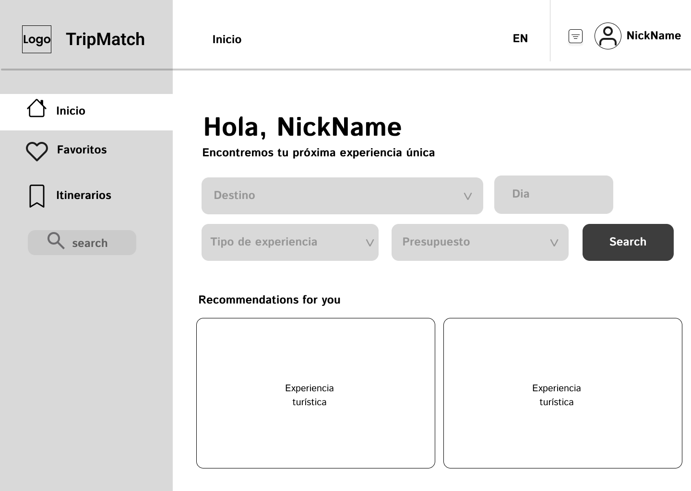

*Favoritos*
Aquí se almacenan todas las experiencias marcadas como favoritas por el turista, permitiendo un acceso rápido a opciones que desea considerar más adelante.   

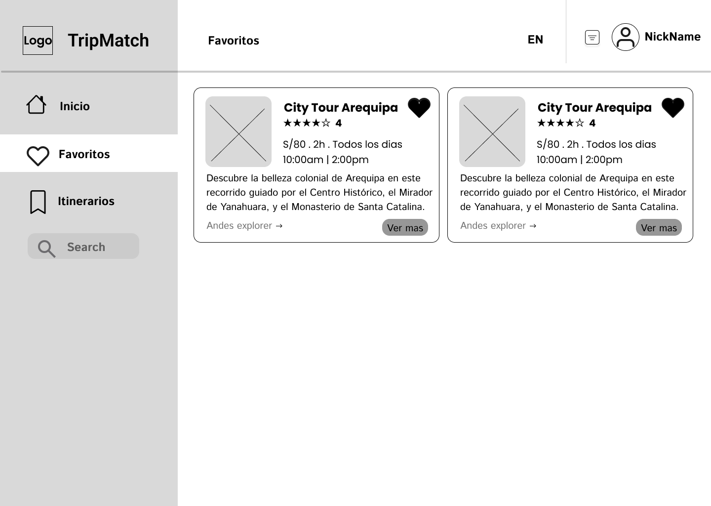

**Itinerarios**  

Se muestra el historial de reservas del usuario, permitiéndole ver detalles de sus próximas experiencias y acceder fácilmente a la información necesaria para cada actividad.    


**Resultados de la busqueda** 

Aqui se mostraran los resultados de las busquedas que el usuario realice.   

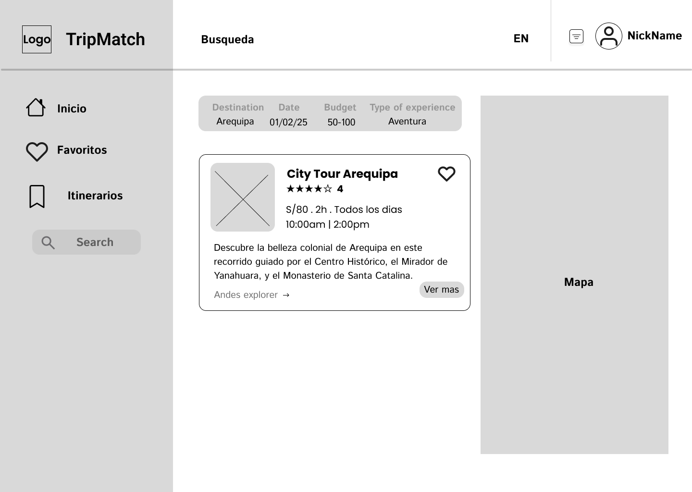

**visualización de perfil de agencias para Turistas**  

Aquí se muestran los datos públicos de la agencia (nombre, descripcion, contacto, etc.), con opción de editar su información cuando sea necesario.  
 

**Para Agencias de Turismo**  

**Inicio**  

Brinda una vista general del estado actual de la agencia, incluyendo un resumen, comentarios o reseñas recientes de sus experiencias, y algunas reservas recientes.    

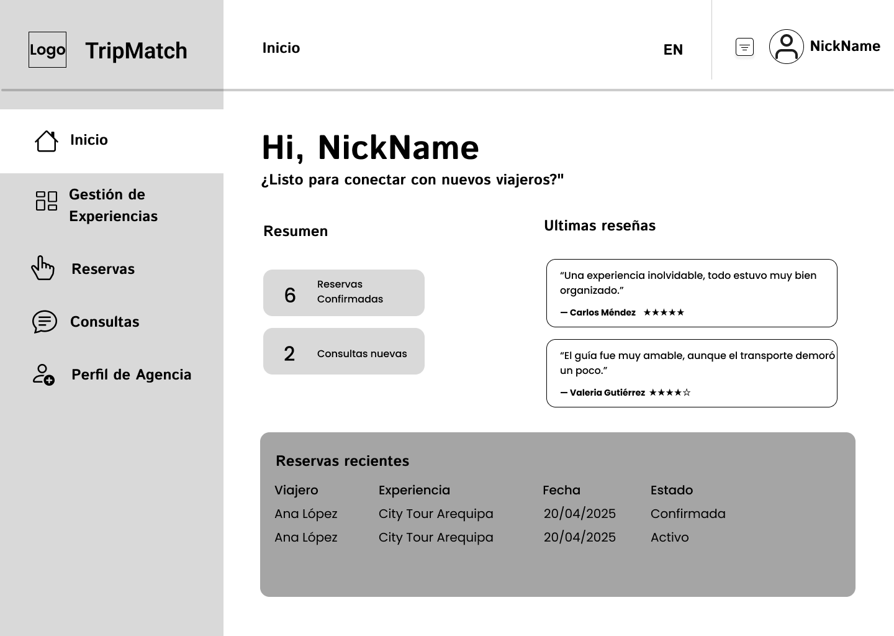  


**Gestión de experiencias**  

Permite a la agencia crear, editar o eliminar experiencias turísticas.  

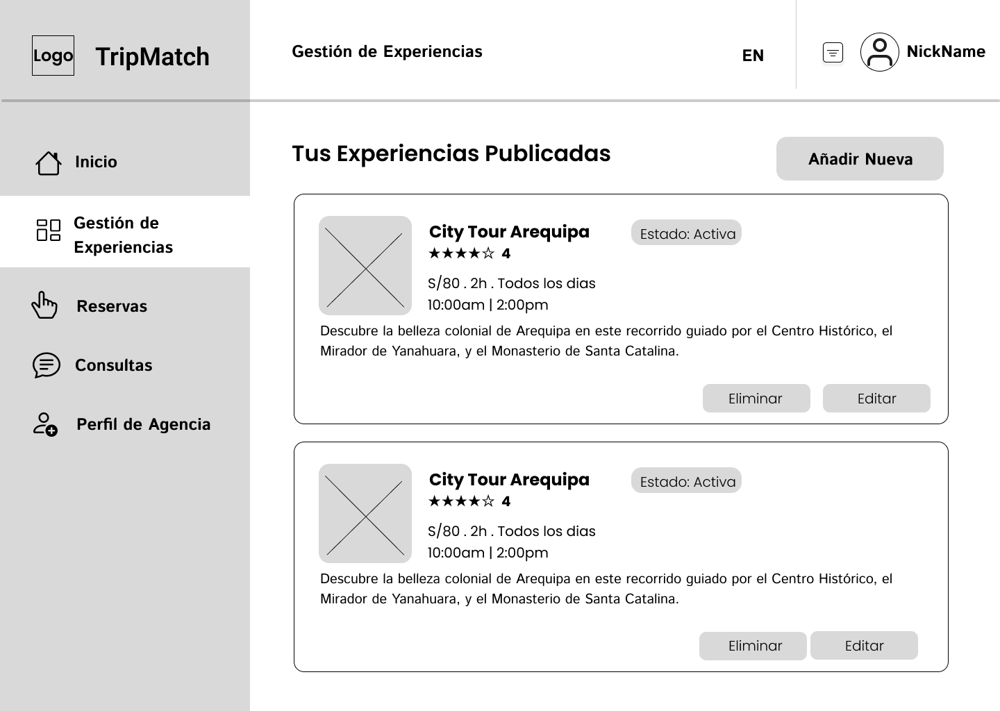   


**Reservas**   

En esta sección se listan todas las reservas hechas por los turistas, con información detallada por experiencia y fecha. Incluye filtros para facilitar la gestión.    

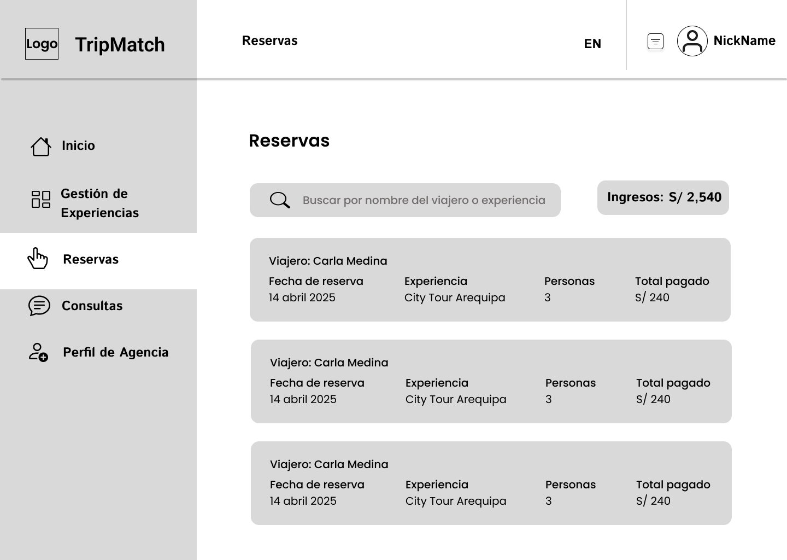  


**Consultas**  

Las agencias pueden ver preguntas o dudas realizadas por los usuarios respecto a sus experiencias y responderlas desde esta misma vista.  

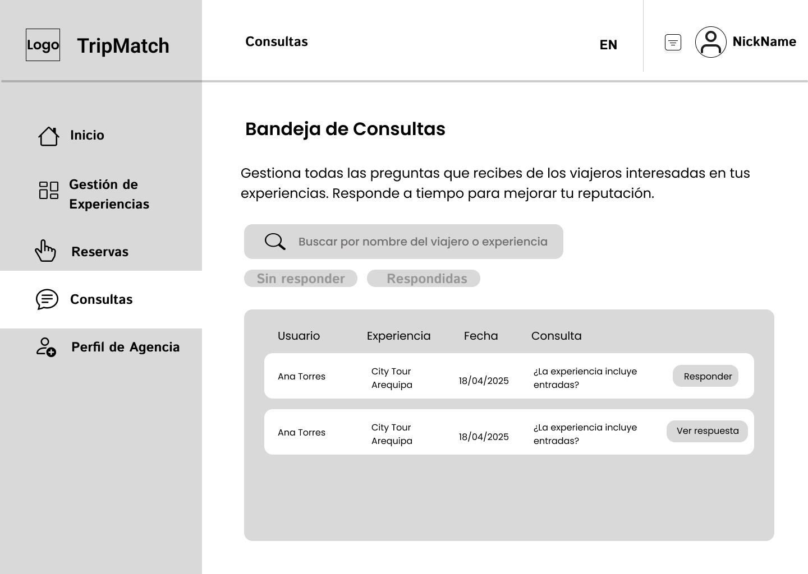  


**Perfil de agencia**  

Aquí se muestran los datos públicos de la agencia (nombre, descripcion, contacto, etc.), con opción de editar su información cuando sea necesario.  

 


### 4.4.2. Web Applications Wireflow Diagrams   

Esta sección presenta los Wireflows propuestos para los principales objetivos de usuario identificados en la plataforma, considerando tanto el perfil del turista como el de la agencia.  

Los diagramas reflejan visualmente cómo evoluciona cada pantalla en función de las acciones del usuario, mostrando tanto los estados iniciales como los cambios posteriores. Estos flujos no solo ilustran la navegación paso a paso, sino que también evidencian cómo se aplican principios de diseño centrado en el usuario, arquitectura de información y consistencia en la interfaz.    

**Turistas**  

Buscar experiencias turisticas

    

Cancelar reserva 

     

Dejar una reseña

  

Realizar una consulta

  

Realizar una reserva

 

Seleccionar como experiencias como favoritas

    

**Para Agencias de Turismo**    

Registrar una experiencia turística  

   

Editar una experiencia ya creada

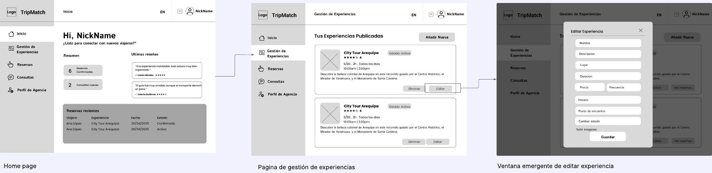    

Eliminar una experiencia ya creada 

    

Editar perfil de agencia  

    

Ver reservas  

  

Responder consultas a los clientes

    


Ver reseñas  

  

### 4.4.3. Web Applications Mock-ups  


La propuesta de Mock-ups busca representar visualmente la experiencia final de la aplicación web, integrando los principios de diseño inclusivo, jerarquía informativa, accesibilidad y consistencia visual. El diseño responde a las necesidades diferenciadas de turistas y agencias, priorizando la claridad en la navegación, la eficiencia en las tareas y la estética alineada al propósito del proyecto.  
Se utilizó un diseño que incluye una paleta de colores asociada al turismo sostenible, íconos comprensibles, tipografía legible y componentes reutilizables que aseguran coherencia y escalabilidad. 

**Turistas**  
Los mock-ups para turistas presentan una interfaz enfocada en la exploración de experiencias, con una sección de inicio que destaca filtros intuitivos y recomendaciones personalizadas. Las secciones de favoritos e itinerarios permiten un acceso rápido al contenido guardado o reservado. La barra de búsqueda se presenta de forma accesible en todo momento, facilitando la localización de agencias o experiencias específicas.  

**Inicio**    


**Favoritos**  

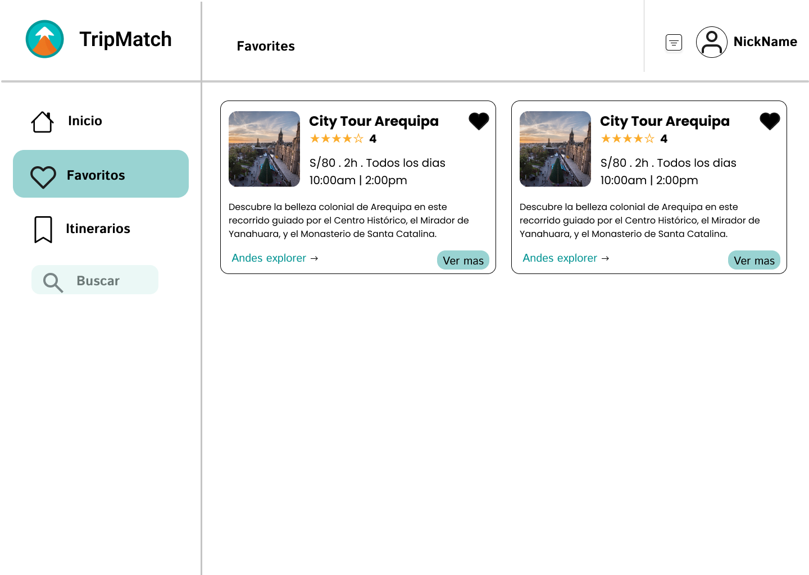 
 
**Itinerarios**    
 
 
**Resultados de la busqueda**  


**visualización de perfil de agencias para Turistas**  

 

**Para Agencias de Turismo**    
En el caso de las agencias, los mock-ups reflejan una interfaz orientada a la gestión eficiente. En el inicio se muestran métricas clave, últimas reservas y reseñas recientes. Las secciones de gestión de experiencias y reservas cuentan con formularios organizados, tablas y botones de acción bien jerarquizados. Se prioriza la claridad en los procesos de edición, respuesta a consultas y mantenimiento del perfil público de la agencia.

Ambas interfaces fueron diseñadas pensando en una experiencia fluida tanto en pantallas de escritorio como en dispositivos con distintas resoluciones, asegurando una estructura responsive y accesible para todos los usuarios.

**Inicio**    

  


**Gestión de experiencias**  

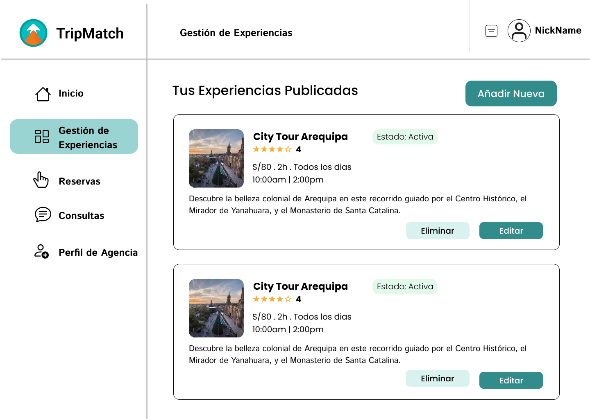   


**Reservas**       

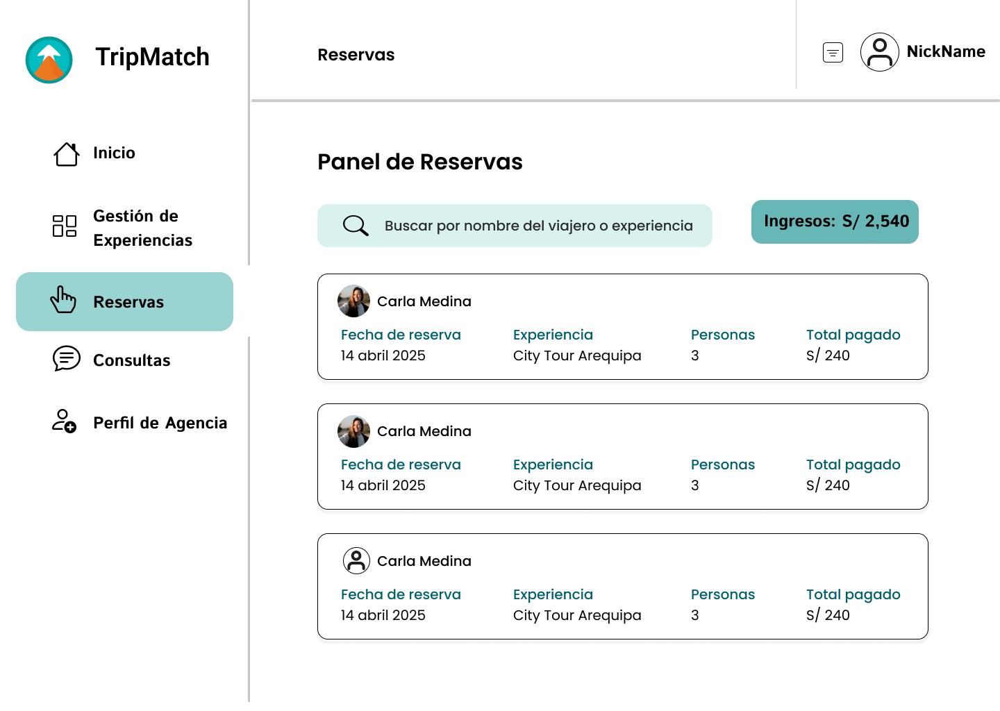  


**Consultas**      

  


**Perfil de agencia**   

 


### 4.4.4. Web Applications User Flow Diagrams    

Esta sección presenta los User Flows diseñados para las aplicaciones web en su versión de escritorio, con el objetivo de cubrir rutas clave de interacción para cada tipo de usuario: turista y agencia. Cada flujo muestra visualmente el recorrido que realiza el usuario a través de la aplicación, integrando los mock-ups de las pantallas involucradas. Se consideran tanto rutas exitosas (happy path) como posibles rutas alternativas (unhappy path), asegurando que la navegación sea intuitiva, inclusiva y coherente con la arquitectura de información planteada.  

**Turistas**  

Como turista, quiero poder buscar experiencias turísticas.

 

Como turista, quiero poder realizar una reserva.

 

Como turista, quiero poder cancelar una reserva.

 

Como turista, quiero poder dejar una reseña sobre una experiencia realizada.

 

Como turista, quiero poder realizar una consulta a una agencia.

 

**Para Agencias de Turismo**   

Como agencia, quiero poder registrar una nueva experiencia turística.

 

Como agencia, quiero poder editar una experiencia ya creada.

 

Como agencia, quiero poder eliminar una experiencia ya creada.

 

Como agencia, quiero poder ver las reservas recibidas.

 

Como agencia, quiero poder responder consultas de los turistas.

 

Como agencia, quiero poder ver las respuestas enviadas.

 

Como agencia, quiero poder editar mi perfil.

 


## 4.5. Web Applications Prototyping  

En esta sección se presentan los prototipos de interfaz de usuario desarrollados para la versión web en navegadores de escritorio, tanto para turistas como para agencias. Estos prototipos simulan la navegación e interacción con las principales funcionalidades, en base a los flujos definidos previamente en los Wireflow Diagrams.

Las decisiones de interacción se tomaron considerando principios de usabilidad, claridad visual, diseño inclusivo y una arquitectura de información coherente. Se priorizó una navegación intuitiva, adaptada al perfil y objetivos de cada usuario. El sistema de navegación, las jerarquías visuales y los tipos de interacción fueron diseñados para facilitar la exploración de contenido, la gestión de experiencias y la reserva de actividades turísticas.

Los prototipos permiten visualizar el comportamiento del sistema ante las principales tareas definidas, asegurando una experiencia consistente y funcional. Se incluye una captura de pantalla y un enlace al video en Microsoft Stream donde se muestra la simulación de interacción correspondiente.

   

Link del video: https://upcedupe-my.sharepoint.com/:v:/g/personal/u20231c505_upc_edu_pe/EWCB3XE4nJhNpKf_2ovj8msB2RBu4poQh48oS5TLIKm62w?e=7f7JKE&nav=eyJyZWZlcnJhbEluZm8iOnsicmVmZXJyYWxBcHAiOiJTdHJlYW1XZWJBcHAiLCJyZWZlcnJhbFZpZXciOiJTaGFyZURpYWxvZy1MaW5rIiwicmVmZXJyYWxBcHBQbGF0Zm9ybSI6IldlYiIsInJlZmVycmFsTW9kZSI6InZpZXcifX0%3D


## 4.6. Domain-Driven Software Architecture
### 4.6.1. Software Architecture Context Diagram  

Este diagrama muestra el sistema TripMatch dentro de su entorno, identificando cómo interactúa con usuarios y otros sistemas externos.


### 4.6.2. Software Architecture Container Diagrams

Este diagrama detalla los principales contenedores (aplicaciones o servicios ejecutables) que componen el sistema y cómo se comunican entre sí.


### 4.6.3. Software Architecture Components Diagrams

Este diagrama profundiza en los componentes internos del contenedor principal


## 4.7. Software Object-Oriented Design  

.png)

### 4.7.1. Class Diagrams   


.png)


### 4.7.2. Class Dictionary  

**User**

Entidad base que representa a cualquier usuario de la plataforma.

| Campo     | Tipo de dato | Descripción                        |
|-----------|--------------|------------------------------------|
| _id       | UUID         | Identificador único del usuario    |
| firstName | String       | Nombre del usuario                 |
| lastName  | String       | Apellido del usuario               |
| number    | String       | Número de contacto                 |
| email     | Email        | Correo del usuario                 |
| password  | Password     | Contraseña del usuario             |

**AgencyUser**

Usuario que representa a una agencia, hereda de User.

| Campo         | Tipo de dato     | Descripción                                |
|---------------|------------------|--------------------------------------------|
| agencyName    | String           | Nombre de la agencia                        |
| ruc           | String           | Registro Único de Contribuyente             |
| contactInfo   | String           | Información de contacto adicional           |
| publicProfile | PublicProfile    | Perfil público visible de la agencia        |
| location      | Location         | Ubicación física de la agencia              |

**TouristUser**

Usuario con rol de turista, hereda de `User`.

| Campo       | Tipo de dato | Descripción                         |
|-------------|--------------|-------------------------------------|
| preferences | String[]     | Preferencias del turista            |

**PublicProfile**

Perfil público de una agencia.

| Campo       | Tipo de dato | Descripción               |
|-------------|--------------|---------------------------|
| bio         | String       | Biografía o presentación  |
| website     | String       | Página web oficial        |
| socialLinks | List<String> | Redes sociales asociadas  |

**Booking**

Reserva hecha por un usuario para una experiencia.

| Campo          | Tipo de dato | Descripción                              |
|----------------|--------------|------------------------------------------|
| id             | UUID         | ID de la reserva                         |
| experienceId   | UUID         | ID de la experiencia reservada           |
| userId         | UUID         | ID del usuario que reserva               |
| bookingDate    | DateTime     | Fecha y hora de la reserva               |
| numberOfPeople | Int          | Número de personas incluidas en la reserva |

**Inquiry**

Consulta hecha por un turista a una agencia.

| Campo          | Tipo de dato | Descripción                          |
|----------------|--------------|--------------------------------------|
| id             | UUID         | ID de la consulta                    |
| experienceId   | UUID         | ID de la experiencia consultada      |
| fromUserId     | UUID         | ID del usuario que consulta          |
| toAgencyUserId | UUID         | ID de la agencia consultada          |
| question       | String       | Pregunta del usuario                 |
| answer         | String       | Respuesta de la agencia              |
| askedAt        | DateTime     | Fecha de consulta                    |
| answeredAt     | DateTime     | Fecha de respuesta                   |

**Review**

Reseña hecha por un usuario sobre una experiencia.

| Campo        | Tipo de dato | Descripción                            |
|--------------|--------------|----------------------------------------|
| id           | UUID         | ID de la reseña                        |
| userId       | UUID         | ID del usuario que realizó la reseña   |
| rating       | Number       | Calificación otorgada                  |
| comment      | String       | Comentario de la reseña                |
| createdAt    | DateTime     | Fecha de creación                      |
| favorite     | Boolean      | Marca si es una reseña destacada       |

**Experience**

Experiencia publicada por una agencia.

| Campo          | Tipo de dato   | Descripción                             |
|----------------|----------------|-----------------------------------------|
| id             | UUID           | ID de la experiencia                    |
| title          | String         | Título de la experiencia                |
| description    | String         | Descripción detallada                   |
| location       | Location       | Ubicación de la experiencia             |
| price          | Money          | Precio de la experiencia                |
| duration       | String         | Duración estimada                       |
| meetingPoint   | String         | Punto de encuentro                      |
| schedule       | Schedule[]     | Horarios disponibles                    |
| categories     | Category[]     | Categorías de la experiencia            |
| photos         | Photo[]        | Imágenes relacionadas                   |
| availableDates | AvailableDate[]| Fechas disponibles                      |

**Category**

Categoría asociada a una experiencia.

| Campo | Tipo de dato | Descripción               |
|-------|--------------|---------------------------|
| _id   | UUID         | Identificador único       |
| name  | String       | Nombre de la categoría    |

**Schedule**

Días y horarios disponibles para una experiencia.

| Campo     | Tipo de dato | Descripción                  |
|-----------|--------------|------------------------------|
| dayOfWeek | String       | Día de la semana             |
| times     | String[]     | Horarios disponibles         |

**Photo**

Imagen de una experiencia.

| Campo   | Tipo de dato | Descripción               |
|---------|--------------|---------------------------|
| url     | String       | URL de la imagen          |
| caption | String       | Descripción de la imagen  |

**PriceRange**

Rango de precios usado en filtros de búsqueda.

| Campo | Tipo de dato | Descripción         |
|-------|--------------|---------------------|
| min   | Number       | Precio mínimo       |
| max   | Number       | Precio máximo       |

**Location**

Ubicación geográfica.

| Campo       | Tipo de dato | Descripción                 |
|-------------|--------------|-----------------------------|
| country     | String       | País                        |
| city        | String       | Ciudad                      |
## 4.8. Database Design
### 4.8.1. Database Diagram
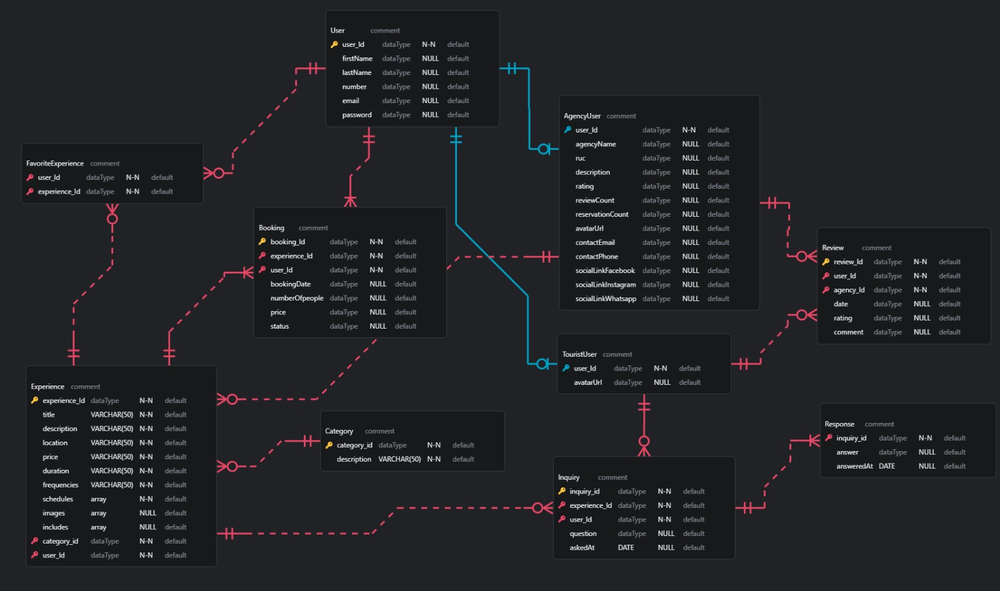
# Capítulo V: Product Implementation, Validation & Deployment
## 5.1. Software Configuration Management
### 5.1.1 Configuración del Entorno de Desarrollo de Software

**Requirements Management**  
1.  **[Trello](https://trello.com/)**: Tablero Kanban web para planificar y hacer seguimiento de historias de usuario y tareas por sprint. Permite asignar responsables, fechas de entrega y checklists para cada tarjeta.  
2.  **[Discord](https://discord.com/)**: Plataforma de chat y voz VoIP con canales temáticos, notificaciones y bots. Se utiliza como canal principal de comunicación en tiempo real, para compartir pantallazos de código, coordinar reuniones flash y notificar despliegues.  
3.  **[Vertabelo](https://vertabelo.com/)**: Herramienta SaaS para diseño y modelado de bases de datos relacionales. Facilita la creación de diagramas ER, versionado de esquemas y generación de scripts SQL.

**Product UX/UI Design**  
1.  **[Figma](https://www.figma.com/)**: Editor de interfaces colaborativo en la nube. Soporta diseño vectorial, prototipado interactivo y comentarios en tiempo real. Usado para iterar wireframes y mock-ups de Desktop y Mobile Web.  
2.  **[Lucidchart](https://www.lucidchart.com/)**: Aplicación web para diagramas de flujo, wireflows y diagramas de clases. Permite conectar objetos con líneas inteligentes y exportar en múltiples formatos.  
3.  **[Uxpressia](https://uxpressia.com/)**: Plataforma online para mapas de empatía, Customer Journey y escenarios As-Is / To-Be. Estandariza hallazgos de entrevistas y visualiza puntos de dolor.  
4.  **[Visual Paradigm](https://www.visual-paradigm.com/)**: Suite de modelado UML y C4 para diagramas de contenedores, componentes y despliegue. Genera documentación técnica que facilita la comunicación entre analistas y desarrolladores.

**Software Development**  
1.  **[WebStorm](https://www.jetbrains.com/webstorm/)**: IDE de JetBrains con autocompletado inteligente, refactorización segura, depurador integrado y plugins de linters/formateadores.  
2.  **HTML5**: Lenguaje de marcado semántico para estructurar contenido y mejorar accesibilidad (etiquetas `<header>`, `<nav>`, `<main>`, `<footer>`).  
3.  **CSS3**: Hojas de estilo en cascada para layouts, media queries y variables CSS, siguiendo la convención BEM ligero.  
4.  **[JavaScript](https://developer.mozilla.org/docs/Web/JavaScript)**: Lenguaje de scripting para manipular el DOM, manejar eventos y validar formularios en `script.js` (por ejemplo, validación de campos antes de enviar).

**Software Deployment**  
1.  **[Git](https://git-scm.com/)**: Sistema de control de versiones distribuido. Utilizamos GitFlow para crear ramas `feature/`, `release/` y `hotfix/`, facilitar merges y revertir cambios si es necesario.  
2.  **[GitHub Pages](https://pages.github.com/)**: Servicio de hosting estático gratuito. Configuramos la carpeta `/docs` en `main` para publicar automáticamente la landing page tras cada push.

**Software Documentation and Project Management**  
1.  **[GitHub](https://github.com/)** (Wiki / `README.md`): Documentación técnica centralizada con guías de estilo, convenciones de commits y manuales de despliegue.  
2.  **[Google Drive](https://drive.google.com/)** /**[Google Docs](https://docs.google.com/)**: Repositorio de requisitos, actas de reunión y borradores de informes con control de versiones de documento y comentarios colaborativos.  


### 5.1.2 Source Code Management

Para garantizar trazabilidad y control de versiones claros, adoptamos el modelo **GitFlow** de Vincent Driessen (https://nvie.com/posts/a-successful-git-branching-model/):

**Branching Model (GitFlow)**
1. **main**: contiene siempre el código listo para producción.
2. **develop**: integración continua de todas las _features_ terminadas; funciona como base para nuevos desarrollos.
3. **feature/<name>**: ramas derivadas de `develop` para cada funcionalidad.
```bash
git checkout develop
git checkout -b feature/user-auth
```
Al completarla, abrimos un Pull Request hacia `develop`.

4. **release/vMAJOR.MINOR.PATCH**: se crea desde `develop` para preparar una nueva versión; en ella corregimos bugs menores, actualizamos documentación y realizamos el bump de versión.
5. **hotfix/vMAJOR.MINOR.PATCH**: correcciones urgentes derivadas de `main`; tras aplicarlas, se fusiona tanto a `main` como a `develop`.

**Versionado Semántico & Conventional Commits**
- **Semantic Versioning** (`MAJOR.MINOR.PATCH`):
  - **MAJOR**: cambios incompatibles con versiones anteriores.
  - **MINOR**: añadidos de funcionalidades sin romper API.
  - **PATCH**: correcciones de bugs y mejoras menores.
- **Conventional Commits**: mensajes de commit con estructura:
  ```text
  docs(report): actualizar sección 5.1.2 de Source Code Management
  feat(landing-page): centrar iconos sociales y mejorar CSS de formulario
  fix(form-validation): impedir envío si hay errores de validación
  chore(assets): agregar diagramas UML de C4 en carpeta img
Esto facilita la generación de _changelogs_ automáticos y una lectura rápida del historial.

**Etiquetado de Releases**
Al finalizar el testing de una _release_ branch, generamos la etiqueta con:
```bash
git tag -a v1.0.0 -m "release: v1.0.0"
git push origin v1.0.0
```

**Repositorios & Enlaces**
- **Landing Page**: https://github.com/Turisfera/Landing-Page
- **Repository**: https://github.com/Turisfera/workstation-markdown

Cada repositorio sigue el mismo flujo GitFlow y cumple con las convenciones de naming y commits descritas.

### 5.1.3 Source Code Style Guide & Conventions

Para garantizar código limpio, consistente y mantenible, adoptamos las siguientes convenciones (todas en inglés):

**HTML**  
- **Semantics first**: usar etiquetas `<header>`, `<nav>`, `<main>`, `<section>`, `<article>`, `<footer>` según el propósito del contenido.  
- **Lowercase & closing tags**: nombres de elementos y atributos siempre en minúsculas, cerrar explícitamente todas las etiquetas (incluyendo ``, `<input />`).  
- **Attribute order**: primero `id`, luego `class`, después otros atributos (`name`, `src`, `alt`, `aria-*`).  
- **Indentation**: 2 spaces por nivel de anidamiento.  
- **Comments**: `<!-- Comment -->` en una línea o multilínea, sin abreviaturas.

**CSS**  
- **Naming**: kebab-case para clases y selectores (`.btn-primary`, `.card-header`).  
- **BEM‐inspired**: bloques, elementos y modificadores (`.block`, `.block__element`, `.block--modifier`).  
- **Property order**:  
  1. Positioning (`position`, `top`, `left`, `z-index`)  
  2. Box Model (`display`, `margin`, `padding`, `width`, `height`)  
  3. Typography (`font`, `line-height`, `color`)  
  4. Visual (`background`, `border`, `box-shadow`)  
  5. States and interactions (`:hover`, `:focus`, `:active`)  
- **Formatting**: 2 spaces por nivel, un selector por línea, llave de apertura en la misma línea, cierre en nueva línea.  
- **Comments**: `/* Section name */` para separar bloques lógicos.

**JavaScript**  
- **Naming**:  
  - `camelCase` para variables y funciones (`myFunction`, `userName`).  
  - `PascalCase` para clases y constructores (`UserService`, `DataModel`).  
- **Syntax**:  
  - Siempre `;` al final de declaraciones.  
  - Comillas simples para strings (`'hello'`), salvo cuando el contenido requiere comillas dobles.  
- **Indentation**: 2 spaces, no tabs.  
- **Modern ES**: usar `const`/`let` en lugar de `var`, arrow functions para callbacks.  
- **Modules**: `import { something } from './module.js';`  
- **Comments & JSDoc**:  
  ```js
  /**
   * Fetch user data by ID.
   * @param {string} id
   * @returns {Promise<User>}
   */
  export async function fetchUser(id) { … }

  
### 5.1.4 Software Deployment Configuration

Para el despliegue de la **Landing Page** en GitHub Pages, hemos seguido estos pasos:

1. **Repositorio**  
   - URL: https://github.com/Turisfera/Landing-Page  
   - Rama principal: `main`  

2. **Estructura de archivos**  
   - `index.html` en la raíz  
   - Carpetas:  
     - `styles/` (CSS)  
     - `scripts/` (JavaScript)  
     - `img/` (imágenes y assets)  

3. **Configuración de GitHub Pages**  
   - En el repositorio, ir a **Settings → Pages**  
   - Seleccionar fuente de despliegue:  
     - **Branch**: `main`  
     - **Folder**: `/ (root)`  
   - Guardar los cambios  

4. **Publicación automática**  
   Cada vez que hacemos `git push origin main`, GitHub reconstruye y publica la página sin intervención manual.

5. **URL pública**  
   https://turisfera.github.io/workstation-landing-page/

Con esta configuración, cualquier actualización en `main`—ya sea HTML, CSS, JS o imágenes—se refleja automáticamente en el sitio publicado.


## 5.2. Landing Page, Services & Applications Implementation
### 5.2.1. Sprint 1
En el primer sprint se implementó y desplegó la Landing Page.
#### 5.2.1.1 Sprint Planning 1

El Sprint Planning 1 es la reunión inicial de la iteración donde el equipo define la meta (Sprint Goal), revisa el Sprint anterior y selecciona los User Stories que abordará en este Sprint.

| **Sprint #**                        | **Sprint 1**                                                                                                                                          |
| ----------------------------------- | ----------------------------------------------------------------------------------------------------------------------------------------------------- |
| **Sprint Planning Background**      |                                                                                                                                                       |
| **Date**                            | 2025-04-19                                                                                                                                            |
| **Time**                            | 07:00 PM – 10:00 PM                                                                                                                                    |
| **Location / Platform**             | Discord                                                                                                                                               |
| **Prepared by**                     | Marcia Victoria Melgarejo Gomez – U20231C505                                                                                                          |
| **Attendees (to planning meeting)** | María Patricia Hernández Uchuya – U202311258<br>Britney Delhy Q. Rodríguez – U20211G671<br>Rodrigo Alaya Cabrera – U202219481<br>Ariadna G. Poma Muñoz – U20221D328<br>Jorge E. Guevara Tejada – U202316057<br>Raúl A. Medina Cruzado – U202210938 |
| **Sprint 0 Review Summary**         | Definición del Product Backlog inicial, creación de wireframes y prototipo de landing page en Figma, y feedback temprano de stakeholders.             |
| **Sprint 0 Retrospective Summary**  | Consolidación de roles (diseño vs. desarrollo), estandarización de estilos CSS y establecimiento de canales de comunicación (Discord, WhatsApp, GitHub). |
| **Sprint 1 Goal**                   | Nos centramos en una página de destino totalmente adaptable. Creemos que ofrece una primera impresión clara y una experiencia de registro sencilla para los nuevos usuarios. Esto se confirmará cuando las pruebas de control de calidad informen un 100 % de éxito en el registro de tickets en entornos de prueba.. |
| **Sprint 1 Velocity**               | 15                                                                                                                                                    |
| **Sum of Story Points**             | 15                                                                                                                                                    |
 
Los User Stories planificados (US01, US02, US03, US04, US06, US07, US15 y US10) y sus criterios de aceptación están detallados en la sección User Stories.

#### 5.2.1.2 Aspect Leaders and Collaborators

En el Sprint 1 se definieron los siguientes aspectos clave para la implementación del Landing Page:

1. **UI/UX Design**  
2. **Maquetación HTML/CSS**  
3. **Desarrollo JavaScript**  
4. **Documentación de Servicios**  
5. **Despliegue**  

A continuación la matriz de Liderazgo y Colaboración (LACX), donde “L” indica el líder de cada aspecto y “C” a sus colaboradores:

| **Team Member (Last Name, First Name)** | **GitHub Username** | **UI/UX Design** | **Maquetación HTML/CSS** | **Desarrollo JavaScript** | **Documentación de Servicios** | **Despliegue** |
|-----------------------------------------|---------------------|:----------------:|:------------------------:|:-------------------------:|:------------------------------:|:--------------:|
| Hernández Uchuya, María Patricia        | Bal2220             | C                | C                        | C                         | C                              | C              |
| Qqueso Rodríguez, Britney Delhy         | Brit2801            | C                | L                        | C                         | C                              | C              |
| Alaya Cabrera, Rodrigo                  | ALAYA1803           | C                | C                        | L                         | C                              | C              |
| Poma Muñoz, Ariadna Geraldine           | InAsui              | C                | C                        | C                         | L                              | C              |
| Guevara Tejada, Jorge Enrique           | Jorgito170          | C                | C                        | C                         | L                              | C              |
| Medina Cruzado, Raúl Adrián             | Necxuz18            | C                | C                        | C                         | C                              | L              |
| Melgarejo Gomez, Marcia Victoria        | Mevi1217            | L                | C                        | C                         | C                              | C              |

#### 5.2.1.3 Sprint Backlog 1

El objetivo principal de Sprint 1 fue implementar y validar el flujo de registro de usuarios (User Stories EP01) y desarrollar las secciones clave del landing page para turistas (User Stories EP08) y agencias (EP09).

  
URL público del Board: [turisfera-sprint1](https://trello.com/invite/b/680a5d07ff18703eb7402872/ATTI2fd77ec1fb5032204a94d6d21ba910772CC16189/tripmatch-sprint-1) https://trello.com/invite/b/680a5d07ff18703eb7402872/ATTI2fd77ec1fb5032204a94d6d21ba910772CC16189/tripmatch-sprint-1

| **User Story** | **Work-Item/Task Id** | **Título**                                                     | **Estimation (Hours)** | **Assigned To**                        | **Status** |
|---------------:|-----------------------|----------------------------------------------------------------|-----------------------:|----------------------------------------|------------|
| US01          | T01                   | Implementar formulario de registro                            | 2                      | Britney Delhy Q. Rodríguez             | Done         |
| US02          | T02                   | Validar datos de registro                                      | 2                      | Rodrigo Alaya Cabrera                  | IN-PROGRESS|
| US03          | T03                   | Implementar confirmación de contraseña                         | 1                      | Marcia Victoria Melgarejo Gomez        | Done       |
| US04          | T04                   | Mostrar mensaje de bienvenida dinámico                         | 1                      | Marcia Victoria Melgarejo Gomez        | To-do      |
| US06          | T05                   | Configurar envío de correo de confirmación                     | 2                      | Ariadna Geraldine Poma Muñoz           | To-do        |
| US28          | T06                   | Crear y maquetar sección “Benefits”                            | 2                      | María Patricia Hernández Uchuya        | Done       |
| US29          | T07                   | Maquetar sección “About us”                                    | 1                      | María Patricia Hernández Uchuya        | Done       |
| US30          | T08                   | Implementar el header y la gestion de navegación               | 1                      | Marcia Victoria Melgarejo Gomez        | To-do        |
| US31          | T09                   | Vincular botón “Contact” con el formulario                     | 1                      | Rodrigo Alaya Cabrera                  | Done       |
| US32          | T10                   | Añadir y enlazar botón “Sign Up” en el header                  | 1                      | Britney Delhy Q. Rodríguez             | Done       |
| US33          | T11                   | Adaptar sección “Benefits” para agencias                       | 2                      | Raúl Adrián Medina Cruzado             | Done     |
| US34          | T12                   | Desarrollar sección “How does it work?”                        | 2                      | Jorge Enrique Guevara Tejada           | Done      |
| US35          | T13                   | Implementar formulario de contacto para agencias               | 2                      | Rodrigo Alaya Cabrera                  | Done      |
| US36          | T14                   | Agregar enlaces “FAQs” y “About us” en el menú para agencias   | 1                      | Ariadna Geraldine Poma Muñoz           | Done      |
| US37          | T15                   | Implementar flujo de registro para agencias desde landing page | 2                      | Jorge Enrique Guevara Tejada           | IN-PROGRESS      |

#### 5.2.1.4 Development Evidence for Sprint Review

Durante el Sprint 1 se avanzó en la implementación de la landing page del sistema, incluyendo prototipado, maquetación responsiva y ajustes visuales. A continuación se listan los commits más relevantes:

| **Repository**        | **Branch**                | **Commit Id** | **Commit Message**                   | **Commit Message Body**                                                                                                              | **Committed on** |
|-----------------------|---------------------------|---------------|--------------------------------------|--------------------------------------------------------------------------------------------------------------------------------------|------------------|
| user/turisfera-web    | feature/landing-page      | a1b2c3d       | feat: diseño base del landing        | Se implementó la estructura HTML de la landing page en `/src/pages/index.html` y los estilos iniciales en `/src/styles/styles.css`. | 2025-04-19       |
| user/turisfera-web    | feature/landing-page      | d4e5f6a       | style: mejoras visuales en el home   | Ajustes de color, tipografías y espaciados en la sección principal para alinear con el prototipo de Figma y mejorar la legibilidad.       | 2025-04-20       |
| user/turisfera-web    | feature/landing-page      | f7g8h9i       | fix: corrección de márgenes y fuentes | Corrección de inconsistencias en márgenes y fuentes para asegurar uniformidad entre vistas de escritorio y móvil.                         | 2025-04-21       |
#### 5.2.1.5 Execution Evidence for Sprint Review

Durante el Sprint 1 se completó la implementación de las principales secciones del **Landing Page** y se validó su diseño y navegación.

**Principales avances ejecutados**  
- Header fijo con navegación y botones “Log in” / “Sign Up”  
- Secciones “Home”, “About us”, “Benefits”, “How does it work?”, “FAQs” y “Contact”  
- Scroll suave y comportamiento responsive en toda la página  
- Formulario de contacto operativo y validado  

**Capturas de pantalla**  

  
Hero section con imagen de fondo, título y CTA “Get started”. 

  
Sección “About Us” mostrando misión y visión con imágenes.  

  
Sección “Benefits” para turistas y agencias y “How does it work?” con tarjetas de pasos. 

  
Sección de Preguntas Frecuentes y formulario de contacto.  
**Video de demostración**  
[Ver demo del Sprint 1]()  
Recorrido por el Landing Page mostrando navegación entre secciones y formulario de contacto.  

#### 5.2.1.6 Services Documentation Evidence for Sprint Review

Nota: En el Sprint 1 nos enfocamos en el front-end (Landing Page) y no se implementaron Web Services.  
La documentación de endpoints se trabajará a partir del Sprint 2, cuando desarrollemos e integremos la API.


#### 5.2.1.7 Software Deployment Evidence for Sprint Review

Durante el Sprint 1 se desplegó la **Landing Page** en GitHub Pages, asegurando que la versión en producción reflejara los cambios implementados:

- **Configuración del repositorio**  
  - Se creó la rama `gh-pages` a partir de `main`.  
  - En Settings → Pages, se habilitó la publicación desde la rama `gh-pages` y la carpeta `/ (root)`.  
- **Automatización básica**  
  - Se añadió un workflow de GitHub Actions (`deploy.yml`) que compila y publica automáticamente al merge en `main`.  
- **URL de producción**  
  https://turisfera.github.io/Landing-Page/

| **Repository**       | **Branch**       | **Commit Id** | **Commit Message**                     | **Committed on** |
|----------------------|------------------|---------------|----------------------------------------|------------------|
| user/turisfera-web   | gh-pages         | c4e1f2a       | ci: agregar workflow de despliegue     | 2025-04-22       |
| user/turisfera-web   | gh-pages         | a1b2c3d       | feat: desplegar landing en GitHub Pages| 2025-04-22       |

**Capturas de despliegue**  

  

#### 5.2.1.8 Team Collaboration Insights for Sprint Review

Durante el Sprint 1 el equipo mantuvo una colaboración activa y organizada, apoyándose en los siguientes canales y herramientas:

- **Comunicación:** reuniones diarias breves por Discord y canal de WhatsApp para consultas rápidas.  
- **Gestión de tareas:** GitHub Projects con tablero Kanban (“To Do”, “In Progress”, “Done”).  
- **Control de versiones:** GitHub para commits, pull requests y revisiones de código.  

**Participación por miembro (commits en `feature/landing-page`):**

| Miembro                              | Commits |
|--------------------------------------|--------:|
| María Patricia Hernández Uchuya      |       13 |
| Britney Delhy Q. Rodríguez           |     2 |
| Rodrigo Alaya Cabrera                |       3 |
| Ariadna Geraldine Poma Muñoz         |       54 |
| Jorge Enrique Guevara Tejada         |       1 |
| Raúl Adrián Medina Cruzado           |       4 |
| Marcia Victoria Melgarejo Gomez      |       4 |

**Capturas de GitHub Insights**  

  
Gráfico de actividad de commits durante el Sprint 1 (GitHub Insights).

  

**Observaciones:**  
- Hubo un promedio de 12 commits por desarrollador en `feature/landing-page`.  
- El equipo cumplió el 100 % de las tareas “Done” planificadas para Sprint 1.  
- La comunicación asíncrona en Discord permitió resolver bloqueos técnicos en menos de 1 hora.
### 5.2.2. Sprint 2
En el segundo sprint se desarrollaron funcionalidades clave como login, reservas, vistas diferenciadas por rol, y se adaptó la landing page al diseño responsive mobile.

#### 5.2.2.1 Sprint Planning 2

El Sprint Planning 2 es la reunión inicial de la iteración donde el equipo define la meta (Sprint Goal), revisa el Sprint anterior y selecciona los User Stories que abordará en este Sprint.

| **Sprint #**                        | **Sprint 2**                                                                                                                                          |
| ----------------------------------- | ----------------------------- |
| **Sprint Planning Background**      | En esta iteración se priorizaron funcionalidades centrales para los primeros accesos al sistema, incluyendo el login, rutas por rol y vistas base.   |
| **Date**                            | 2025-05-04                                                                                                                                            |
| **Time**                            | 07:00 PM – 10:00 PM                                                                                                                                   |
| **Location / Platform**             | Discord                                                                                                                                               |
| **Prepared by**                     | María Patricia Hernández Uchuya – U202311258                                                                                                          |
| **Attendees (to planning meeting)** | Britney Delhy Q. Rodríguez – U20211G671<br>Rodrigo Alaya Cabrera – U202219481<br>Ariadna G. Poma Muñoz – U20221D328<br>Jorge Enrique Guevara Tejada – U202316057<br>Raúl A. Medina Cruzado – U202210938<br>Marcia Victoria Melgarejo Gomez – U20231C505 |
| **Sprint 1 Review Summary**         | Se completó la landing page, validación visual y formularios. Se detectaron necesidades de navegación por usuario y diseño responsivo. Y un avance de la aplicacion web              |
| **Sprint 1 Retrospective Summary**  | Se acordó documentar mejor el uso de GitHub, revisar nombres de ramas y establecer responsables por vista.                                           |
| **Sprint 2 Goal**                   | Tener un flujo de login funcional, vistas por rol (usuario y agencia), reservas, sección de perfil y navegación básica funcional desde el layout.    |
| **Sprint 2 Velocity**               | 47                                                                                                                                                    |
| **Sum of Story Points**             | 47                                                                                                                                                    |

Los User Stories planificados (US10 al US20) están detallados en el Sprint Backlog.

#### 5.2.2.2 Aspect Leaders and Collaborators

En el Sprint 2 se definieron los siguientes aspectos clave para la implementación del login, reservas, home por rol y responsividad:

1. **Login y autenticación**  
2. **Vistas diferenciadas (usuario y agencia)**  
3. **Diseño responsive**  
4. **Reservas y consultas**  
5. **Perfil de agencia**  
6. **Documentación y corrección técnica**

A continuación la matriz de Liderazgo y Colaboración (LACX):

| **Team Member (Last Name, First Name)** | **GitHub Username** | **Login y Auth** | **Vista Turista** | **Reservas / Consultas** | **Responsive Design** | **Documentación / Fixes** |
|----------------------------------------|---------------------|:----------------:|:------------------:|:------------------------:|:---------------------:|:--------------------------:|
| Hernández Uchuya, María Patricia       | Bal2220             | C                | C                  | C                        | L                     | C                          |
| Qqueso Rodríguez, Britney Delhy        | Brit2801            | C                | C                  | C                        | C                     | C                          |
| Alaya Cabrera, Rodrigo                 | ALAYA1803           | L                | L                  | C                        | C                     | L                          |
| Poma Muñoz, Ariadna Geraldine          | InAsui              | C                | C                  | C                        | C                     | C                          |
| Guevara Tejada, Jorge Enrique          | Jorgito170          | C                | C                  | L                        | C                     | C                          |
| Medina Cruzado, Raúl Adrián            | Necxuz18            | C                | C                  | C                        | C                     | C                          |
| Melgarejo Gomez, Marcia Victoria       | Mevi1217            | C                | C                  | C                        | C                     | C                          |

#### 5.2.2.3 Sprint Backlog 2

El objetivo principal de Sprint 2 fue implementar el flujo de inicio de sesión, vistas diferenciadas, diseño responsive y sistema básico de reservas para agencias.

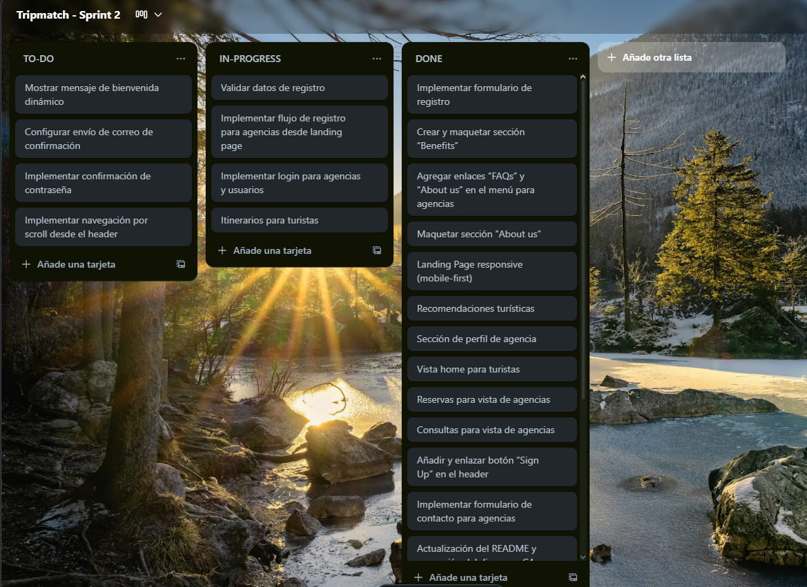  
URL público del Board: [turisfera-sprint2](https://trello.com/b/680a5d07ff18703eb7402872)

| **User Story** | **Work-Item/Task Id** | **Título**                                             | **Estimation (Hours)** | **Assigned To**                        | **Status**     |
|---------------:|-----------------------|--------------------------------------------------------|------------------------|----------------------------------------|----------------|
| US09           | T16                   | Implementar lógica de ordenamiento por relevancia      | 1                      | Jorge Enrique Guevara Tejada           | Done           |
| US09           | T17                   | Mostrar resultados priorizando coincidencias           | 1                      | Jorge Enrique Guevara Tejada           | Done           |
| US16           | T18                   | Crear selección múltiple de categorías de experiencia  | 1                      | Jorge Enrique Guevara Tejada           | Done           |
| US16           | T19                   | Programar lógica de filtrado por categorías             | 1                      | Jorge Enrique Guevara Tejada           | Done           |
| US16           | T20                   | Mostrar resultados que coincidan con categorías         | 2                      | Jorge Enrique Guevara Tejada           | Done           |
| US20           | T21                   | Crear sección "Gestión de experiencias" para agencias  | 1                     | Marcia Victoria Melgarejo Gomez        | Done           |
| US20           | T22                   | Programar botón "Añadir nueva experiencia turística"   | 2                      | Marcia Victoria Melgarejo Gomez        | Done           |
| US20           | T23                   | Diseñar e implementar formulario de ingreso de experiencia | 1                   | Marcia Victoria Melgarejo Gomez        | Done           |
| US20           | T24                   | Guardar nueva experiencia en base de datos y mostrarla | 2                      | Marcia Victoria Melgarejo Gomez        | Done           |
| US20           | T25                   | Implementar layout base por defecto                      | 1                      | Marcia Victoria Melgarejo Gomez        | Done           |
| US21           | T26                   | Permitir visualización de experiencias publicadas       | 1                      | Marcia Victoria Melgarejo Gomez        | Done           |
| US21           | T27                   | Implementar botón "Editar" en experiencias              | 2                      | Marcia Victoria Melgarejo Gomez        | Done           |
| US21           | T28                   | Permitir modificación de campos de experiencia          | 1                      | Marcia Victoria Melgarejo Gomez        | Done           |
| US21           | T29                   | Guardar cambios en base de datos y actualizar info      | 1                      | Marcia Victoria Melgarejo Gomez        | Done           |
| US22           | T30                   | Implementar botón "Editar perfil" y mostrar formulario editable | 1                 | Rodrigo Alaya Cabrera                  | Done           |
| US22           | T31                   | Desarrollar lógica para guardar cambios y actualizar datos | 1                    | Rodrigo Alaya Cabrera                  | Done           |
| US22           | T32                   | Redirigir automáticamente a edición tras registro nuevo | 1                      | Rodrigo Alaya Cabrera                  | Done           |
| US23           | T33                   | Crear sección de reservas para agencias                  | 1                      | María Patricia Hernández Uchuya        | Done           |
| US23           | T34                   | Mostrar listado de reservas con detalles relevantes      | 1                      | María Patricia Hernández Uchuya        | Done           |
| US23           | T35                   | Implementar búsqueda por reserva                         | 1                      | María Patricia Hernández Uchuya        | Done           |
| US24           | T36                   | Crear vista "Perfil de Agencia" y mostrar datos básicos  | 1                      | Rodrigo Alaya Cabrera                  | Done           |
| US24           | T37                   | Mostrar resumen de actividad: reseñas, calificación, reservas | 2                 | Rodrigo Alaya Cabrera                  | Done           |
| US24           | T38                   | Cargar y mostrar las 2 reseñas más recientes             | 1                      | Rodrigo Alaya Cabrera                  | Done           |
| US27           | T39                   | Implementar botón "Ver más" en sección de reseñas        | 1                      | Rodrigo Alaya Cabrera                  | Done           |
| US27           | T40                   | Crear modal con listado completo de reseñas              | 2                      | Rodrigo Alaya Cabrera                  | Done           |
| US27           | T41                   | Mostrar detalle en cada reseña: usuario, fecha, calificación, comentario | 3             | Rodrigo Alaya Cabrera                  | Done           |
| US02           | T42                   | Implementar mensajes de error específicos junto a los campos con errores | 2              | Rodrigo Alaya Cabrera                  | In Progress    |
| US03           | T43                   | Mostrar mensaje de error si las contraseñas no coinciden | 1                      | Rodrigo Alaya Cabrera                  | In Progress    |
| US04           | T44                   | Programar mensaje de bienvenida personalizado          | 1                      | Rodrigo Alaya Cabrera                  | In Progress    |
| US04           | T45                   | Estilizar el mensaje para que sea visible y amigable   | 2                      | Rodrigo Alaya Cabrera                  | In Progress    |
| US12           | T46                   | Diseñar menú desplegable con regiones o países          | 2                      | Jorge Enrique Guevara Tejada           | In Progress    |
| US12           | T47                   | Conectar selección con backend para filtrar destinos    | 1                      | Jorge Enrique Guevara Tejada           | In Progress    |
| US12           | T48                   | Mostrar únicamente destinos filtrados                   | 1                      | Jorge Enrique Guevara Tejada           | In Progress    |
| US22           | T49                   | Mostrar mensaje de confirmación tras guardar cambios    | 2                      | Rodrigo Alaya Cabrera                  | In Progress    |


#### 5.2.2.4 Development Evidence for Sprint Review

Durante el Sprint 2 se avanzó en la estructuración base del sistema post-login, así como en mejoras visuales responsivas y rutas diferenciadas.

| **Repository**        | **Branch**               | **Commit Id** | **Commit Message**                      | **Commit Message Body**                                                                                              | **Committed on** |
|-----------------------|--------------------------|---------------|-----------------------------------------|------------------------------------------------------------------------------------------------------------------------|------------------|
| user/turisfera-web    | feature/login-auth       | x1a2b3c       | feat: login con control de rol          | Implementación del formulario de login con redirección según tipo de usuario                                          | 2025-05-05       |
| user/turisfera-web    | feature/layout-setup     | x1b2c3d       | feat: default layout                     | Se agregó estructura base con sidebar condicional                                                                     | 2025-05-06       |
| user/turisfera-web    | feature/agency-views     | x1c2d3e       | feat: vistas de reservas y consultas     | Se crearon las secciones respectivas con mock data                                                                    | 2025-05-07       |
| user/turisfera-web    | feature/responsive       | x1d2e3f       | style: adaptación responsive             | Se adaptó landing y navegación básica a diseño mobile                                                                 | 2025-05-08       |
| user/turisfera-web    | feature/fixes-doc        | x1e2f3g       | fix: readme y diagrama actualizados      | Correcciones ortográficas y de estructura del documento base                                                          | 2025-05-09       |

#### 5.2.2.5 Execution Evidence for Sprint Review

Durante el Sprint 2 se completaron:

- Login funcional con control de acceso por rol
- Redirección automática a vistas diferenciadas (`/user/home`, `/agency/home`)
- Sidebar dinámico con opciones exclusivas para agencias o usuarios
- Landing Page responsiva para pantallas móviles
- Secciones iniciales de reservas, consultas, perfil e itinerarios

**Capturas de pantalla**


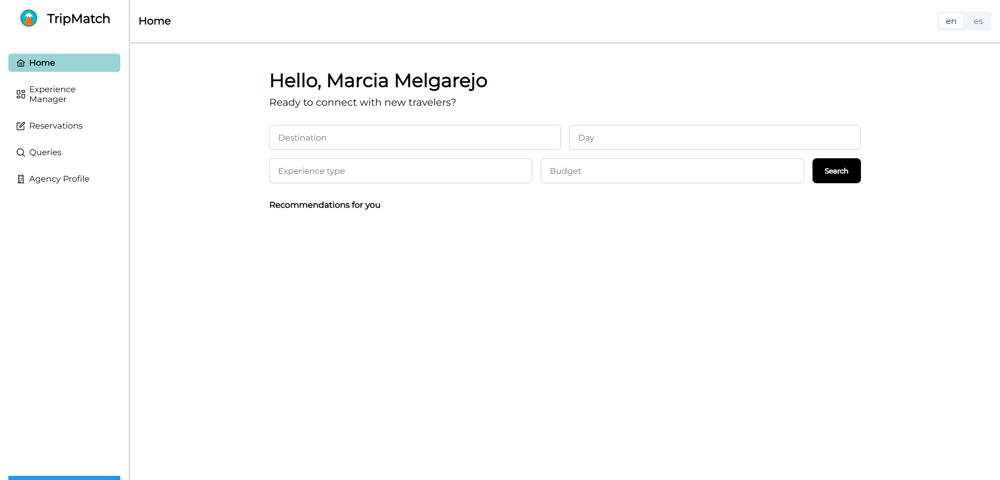
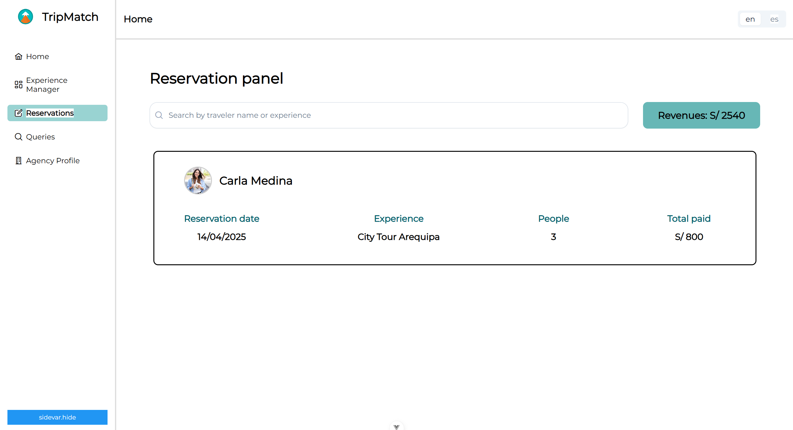
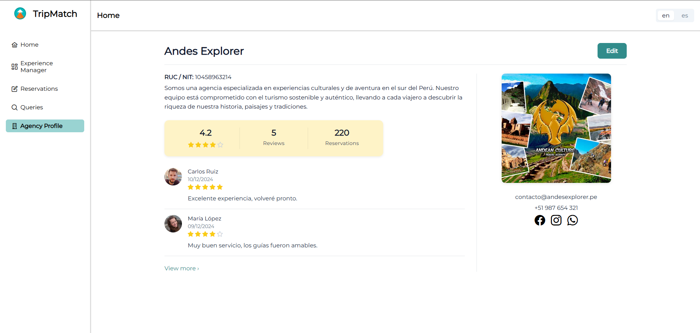
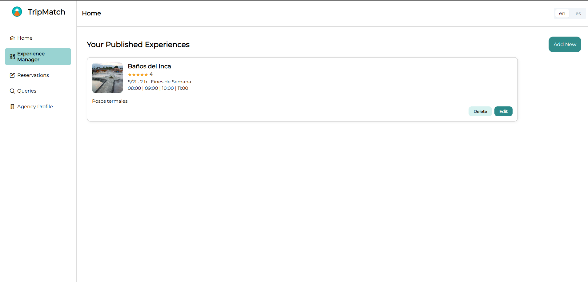

#### 5.2.2.6 Services Documentation Evidence for Sprint Review

Se definieron las rutas simuladas utilizadas en el flujo de autenticación y consultas:

- `POST /api/auth/login`
- `GET /api/agency/reservations`
- `GET /api/user/itineraries`

Los servicios están documentados en Postman y se conectarán con el backend en el Sprint 3.

#### 5.2.2.7 Software Deployment Evidence for Sprint Review

Los avances del Sprint 2 se integraron a la rama principal `main` y se configuró el despliegue continuo en **Firebase Hosting**, reemplazando el uso anterior de GitHub Pages.

- Branch principal: `main`
- Plataforma de despliegue: `Firebase`
- Acción automatizada: `firebase deploy`

**URL en producción:**  
https://trip-match-2025.web.app/manageExperience

| **Repository**       | **Branch**       | **Commit Id** | **Commit Message**                     | **Committed on** |
|----------------------|------------------|---------------|----------------------------------------|------------------|
| user/turisfera-web   | main             | y1z2x3w       | ci: deploy post Sprint 2 en Firebase   | 2025-05-10       |

#### 5.2.2.8 Team Collaboration Insights during Sprint

- Se mantuvo el uso de Discord para sincronización diaria (scrums informales)
- Uso de GitHub Projects para distribución de tareas y visualización Kanban
- La participación fue más equitativa y se mejoró el control de merges
- Las correcciones en documentación (README, C4) facilitaron la comprensión del repositorio para nuevos miembros

### 5.2.3. Sprint 3
#### 5.2.3.1. Sprint Planning 3.
<table>
    <tr>
        <td>Sprint #</td>
        <td>3</td>
    </tr>
    <tr>
        <th colspan="2"><strong>Sprint Planning Background</strong></th>
    </tr>
    <tr>
        <td>Date</td>
        <td>10/06/2025</td>
    </tr>
     <tr>
        <td>Time</td>
        <td> 11:00 AM</td>
    </tr>
     <tr>
        <td>Location</td>
        <td>Reunión virtual – Discord</td>
    </tr>
    <tr>
        <td>Prepared By</td>
        <td>Marcia Victoria Melgarejo Gomez</td>
    </tr>
    <tr>
        <td>Attendees (to planning meeting)</td>
        <td>
        - Britney Delhy Qqueso Rodríguez – U20211G671<br>
        - Rodrigo Alaya Cabrera – U202219481<br>
        - Ariadna G. Poma Muñoz – U20221D328<br>
        - Jorge Enrique Guevara Tejada – U202316057<br>
        - Raúl A. Medina Cruzado – U202210938<br>
        - María Patricia Hernández Uchuya - U202311258<br>
        - Marcia Victoria Melgarejo Gomez – U20231C505
   </td>
    </tr>
    <tr>
        <td>Sprint 3 – 2 Review Summary</td>
        <td>Durante la revisión del Sprint 2 se logró implementar el flujo de login funcional, vistas diferenciadas por rol (usuario y agencia), y navegación básica a través del layout principal. También se trabajó la visualización del perfil y la interfaz de reservas. Se identificaron oportunidades de mejora para optimizar la carga de datos y modularizar mejor la lógica en el frontend.</td>
    </tr>
    <tr>
        <td>Sprint 3 – 2 Retrospective Summary</td>
        <td>En la retrospectiva del Sprint 2, se destacó como aspectos positivos la buena comunicación y coordinación durante el sprint, así como una mayor claridad en la definición de tareas desde la planificación. Sin embargo, se identificaron oportunidades de mejora, como refinar la estimación de tiempos para evitar retrasos en tareas complejas y distribuir mejor la carga de trabajo.</td>
    </tr>
    <tr>
        <th colspan="2"><strong>Sprint Goal & User Stories</strong></th>
    </tr>
    <tr>
        <td>Sprint 3 Goal</td>
        <td>
<strong>Nuestra meta para este sprint es</strong> desarrollar e implementar las funcionalidades esenciales del backend para la aplicación TripMatch, enfocándonos en la creación de APIs RESTful para la gestión de usuarios, agencias, paquetes turísticos, destinos, reservas e itinerarios. <br> 
<br>
<strong>Creemos que</strong> esto establecerá la base de comunicación entre el frontend y el servidor, permitiendo la persistencia, consulta y manipulación segura de datos.<br>
<br>
<strong>Esto se confirmará</strong> cuando las APIs de usuarios permitan registrar y autenticar usuarios; las de agencias gestionen sus perfiles y paquetes turísticos; las de reservas permitan registrar y consultar reservas correctamente; y las de destinos e itinerarios soporten el flujo de planificación de viajes y recomendaciones personalizadas.
    </td>
    </tr>
     <tr>
        <td>Sprint 3 Velocity  </td>
        <td>42 Story Points.</td>
    </tr>
     <tr>
        <td>Sum of Story Points  </td>
        <td>42 Story Points.</td>
    </tr>
</table>

#### 5.2.3.2. Aspect Leaders and Collaborators.
<table> 
  <tr> 
    <th>Team Member (Last Name, First Name)</th> 
    <th>GitHub Username</th> 
    <th>API Gestión de Usuarios<br/>Leader (L) / Collaborator (C)</th> 
    <th>API Gestión de Agencias<br/>Leader (L) / Collaborator (C)</th> 
    <th>API Paquetes Turísticos<br/>Leader (L) / Collaborator (C)</th> 
    <th>API Reservas<br/>Leader (L) / Collaborator (C)</th> 
    <th>API Destinos<br/>Leader (L) / Collaborator (C)</th> 
    <th>API Itinerarios<br/>Leader (L) / Collaborator (C)</th> 
  </tr> 
  <tr> 
    <td>Hernández Uchuya, María Patricia </td> 
    <td>Bal2220 </td> 
    <td>L</td> 
    <td>C</td> 
    <td>C</td> 
    <td>C</td> 
    <td>L</td> 
    <td>C</td> 
  </tr> 
  <tr> 
    <td>Qqueso Rodríguez, Britney Delhy</td> 
    <td>Brit2801</td> 
    <td>C</td> 
    <td>L</td> 
    <td>C</td> 
    <td>C</td> 
    <td>C</td> 
    <td>C</td> 
  </tr> 
  <tr> 
    <td>Alaya Cabrera, Rodrigo</td> 
    <td>ALAYA1803</td> 
    <td>C</td> 
    <td>C</td> 
    <td>L</td> 
    <td>C</td> 
    <td>C</td> 
    <td>C</td> 
  </tr> 
  <tr> 
    <td>Poma Muñoz, Ariadna Geraldine</td> 
    <td>InAsui</td> 
    <td>C</td> 
    <td>C</td> 
    <td>C</td> 
    <td>L</td> 
    <td>C</td> 
    <td>C</td> 
  </tr> 
  <tr> 
    <td>Guevara Tejada, Jorge Enrique</td> 
    <td>Jorgito170 </td> 
    <td>C</td> 
    <td>C</td> 
    <td>C</td> 
    <td>C</td> 
    <td>C</td> 
    <td>L</td> 
  </tr> 
  <tr> 
    <td>Medina Cruzado, Raúl Adrián</td> 
    <td>Necxuz18</td> 
    <td>C</td> 
    <td>C</td> 
    <td>L</td> 
    <td>C</td> 
    <td>C</td> 
    <td>C</td> 
  </tr> 
  <tr> 
    <td>Melgarejo Gomez, Marcia Victoria</td> 
    <td>Mevi1217</td> 
    <td>C</td> 
    <td>C</td> 
    <td>C</td> 
    <td>L</td> 
    <td>C</td> 
    <td>C</td> 
  </tr> 
</table>

#### 5.2.3.3. Sprint Backlog 3.
<p>El objetivo de este tercer sprint es desarrollar las APIs fundamentales del backend para la plataforma TripMatch. Estas APIs abarcan la gestión de usuarios (registro, inicio de sesión), agencias de turismo, paquetes turísticos, reservas, destinos e itinerarios. Este desarrollo sentará las bases funcionales y técnicas para la integración futura con el frontend y permitirá a los usuarios interactuar con el sistema de manera segura y eficiente.</p> 
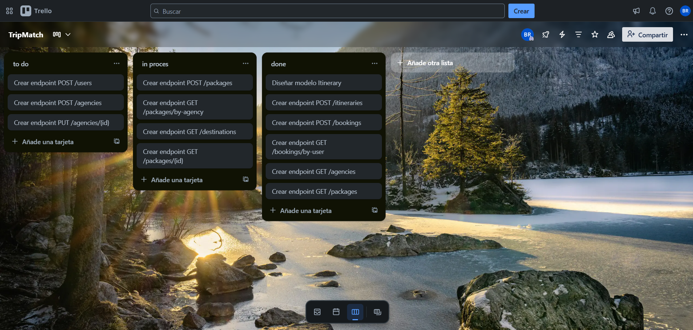

link: [trello-TripMatchBoard](https://trello.com/invite/b/6855b2983efd7b37b21cca51/ATTI7766151678b80362c4f03602943840382405CD2F/tripmatch)

<table>
  <tr>
    <th colspan="2">Sprint #</th>
    <th colspan="6">Sprint 3</th>
  </tr>
  <tr>
    <th colspan="2">User Story</th>
    <th colspan="6">Work-Item / Task</th>
  </tr>
  <tr>
    <th>TS#</th>
    <th>Title</th>
    <th>Id</th>
    <th>Task</th>
    <th>Description</th>
    <th>Estimation (Hours)</th>
    <th>Assigned To</th>
    <th>Status</th>
  </tr>

  <tr>
    <th rowspan="1">TS01</th>
    <th rowspan="1">Registro de Usuario</th>
    <td>1</td>
    <td>Crear endpoint POST /users</td>
    <td>Implementar la API para registrar un nuevo usuario con validaciones básicas.</td>
    <td>4 hr</td>
    <td>Rodrigo Alaya</td>
    <td>In Progress</td>
  </tr>

  <tr>
    <th rowspan="2">TS02</th>
    <th rowspan="2">Gestión de Agencia</th>
    <td>3</td>
    <td>Crear endpoint POST /agencies</td>
    <td>Registrar agencias con nombre comercial, RUC y datos de contacto.</td>
    <td>3 hr</td>
    <td>Marcia Melgarejo</td>
    <td>In Progress</td>
  </tr>
  <tr>
    <td>4</td>
    <td>Crear endpoint PUT /agencies/{id}</td>
    <td>Actualizar información del perfil de una agencia autenticada.</td>
    <td>3 hr</td>
    <td>Ariadna Poma</td>
    <td>To Do</td>
  </tr>

  <tr>
    <th rowspan="2">TS03</th>
    <th rowspan="2">Gestión de Paquetes Turísticos</th>
    <td>5</td>
    <td>Crear endpoint POST /packages</td>
    <td>Registrar paquetes turísticos con título, descripción, destino y precio.</td>
    <td>4 hr</td>
    <td>Jorge Guevara</td>
    <td>In Progress</td>
  </tr>
  <tr>
    <td>6</td>
    <td>Crear endpoint GET /packages/by-agency</td>
    <td>Listar paquetes turísticos registrados por una agencia autenticada.</td>
    <td>3 hr</td>
    <td>Rodrigo Alaya</td>
    <td>To Do</td>
  </tr>

 
  <tr>
    <th>TS04</th>
    <th>Listado de Destinos</th>
    <td>7</td>
    <td>Crear endpoint GET /destinations</td>
    <td>Obtener lista de destinos turísticos disponibles.</td>
    <td>2 hr</td>
    <td>Raúl Medina</td>
    <td>To Do</td>
  </tr>
  <tr>
    <th rowspan="2">TS05</th>
    <th rowspan="2">Gestión de Itinerarios</th>
    <td>8</td>
    <td>Diseñar modelo Itinerary</td>
    <td>Definir estructura de datos para los itinerarios: destinos, fechas, actividades.</td>
    <td>3 hr</td>
    <td>María Hernández</td>
    <td>In Progress</td>
  </tr>

  <tr>
    <td>9</td>
    <td>Crear endpoint POST /itineraries</td>
    <td>Registrar itinerarios relacionados a paquetes turísticos o reservas.</td>
    <td>3 hr</td>
    <td>Britney Qqueso</td>
    <td>To Do</td>
  </tr>

  <tr>
    <th rowspan="2">TS06</th>
    <th rowspan="2">Gestión de Reservas</th>
    <td>10</td>
    <td>Crear endpoint POST /bookings</td>
    <td>Permitir a los usuarios crear reservas de paquetes turísticos.</td>
    <td>3 hr</td>
    <td>Jorge Guevara</td>
    <td>In Progress</td>
  </tr>
  <tr>
    <td>11</td>
    <td>Crear endpoint GET /bookings/by-user</td>
    <td>Listar reservas realizadas por un usuario autenticado.</td>
    <td>2 hr</td>
    <td>María Hernández</td>
    <td>To Do</td>
  </tr>
  <tr>
    <th rowspan="1">TS07</th>
    <th rowspan="1">Listado de Agencias</th>
    <td>12</td>
    <td>Crear endpoint GET /agencies</td>
    <td>Permitir listar todas las agencias registradas, con filtros por ubicación o tipo de servicio.</td>
    <td>2 hr</td>
    <td>Rodrigo Alaya</td>
    <td>To Do</td>
  </tr>
  <tr>
    <th rowspan="2">TS08</th>
    <th rowspan="2">Consulta de Paquetes Turísticos</th>
    <td>13</td>
    <td>Crear endpoint GET /packages</td>
    <td>Listar todos los paquetes disponibles para usuarios, con filtros por destino, precio y duración.</td>
    <td>3 hr</td>
    <td>Ariadna Poma</td>
    <td>To Do</td>
  </tr>
  <tr>
    <td>14</td>
    <td>Crear endpoint GET /packages/{id}</td>
    <td>Obtener los detalles de un paquete turístico específico (incluye agencia, destinos e itinerario).</td>
    <td>2 hr</td>
    <td>Marcia Melgarejo</td>
    <td>To Do</td>
  </tr>
</table>

#### 5.2.3.4. Development Evidence for Sprint Review.
Durante el Sprint 3 del proyecto TripMatch, se avanzó de forma significativa en el desarrollo del backend, enfocándose en la creación de APIs RESTful fundamentales para la gestión de usuarios, agencias, paquetes turísticos, destinos, itinerarios y reservas. Estas funcionalidades sientan la base para la comunicación fluida con el frontend y habilitan la persistencia de datos críticos en la plataforma.

Se priorizó una arquitectura escalable y mantenible, alineada con buenas prácticas de diseño (DDD, separación por capas y validaciones). Esto permitió asegurar tanto la integridad de los datos como la futura extensibilidad del sistema.

A continuación, se presenta una tabla con los commits más relevantes relacionados con la implementación de estas funcionalidades:

| Repository                                                                                                     | Branch          | Commit Id | Commit Message                                    | Commit Message Body                                                                   | Committed on (Date) |
| -------------------------------------------------------------------------------------------------------------- | --------------- | --------- | ------------------------------------------------- | ------------------------------------------------------------------------------------- | ------------------- |
| [https://github.com/Turisfera/workstation-back-end.git](https://github.com/Turisfera/workstation-back-end.git) | feature/tb2 | 6a2f3bc   | feat(user): implement POST user registration      | Added endpoint for user registration with request validation and DTO assembler        | 11/06/2025          |
| [https://github.com/Turisfera/workstation-back-end.git](https://github.com/Turisfera/workstation-back-end.git) | feature/tb2 | 7c5a98d   | feat(auth): implement JWT authentication          | Implemented login endpoint with token generation and secured route access control     | 12/06/2025          |
| [https://github.com/Turisfera/workstation-back-end.git](https://github.com/Turisfera/workstation-back-end.git) | feature/tb2 | b83d6e1   | feat(agency): create POST /agencies endpoint      | Created endpoint for registering agencies with company info and validation layers     | 13/06/2025          |
| [https://github.com/Turisfera/workstation-back-end.git](https://github.com/Turisfera/workstation-back-end.git) | feature/tb2 | c19fd82   | feat(package): implement POST /packages           | Added ability to register packages including title, description, price and agencyId   | 14/06/2025          |
| [https://github.com/Turisfera/workstation-back-end.git](https://github.com/Turisfera/workstation-back-end.git) | feature/tb2 | d70a8fc   | feat(destination): create GET /destinations       | Endpoint for retrieving all available destinations for filtering packages             | 15/06/2025          |
| [https://github.com/Turisfera/workstation-back-end.git](https://github.com/Turisfera/workstation-back-end.git) | feature/tb2 | e124f1a   | feat(itinerary): create POST /itineraries         | Added itinerary model and API to attach plans to packages or bookings                 | 16/06/2025          |
| [https://github.com/Turisfera/workstation-back-end.git](https://github.com/Turisfera/workstation-back-end.git) | feature/tb2 | f3870a2   | feat(booking): implement POST /bookings           | Developed booking endpoint to reserve packages for registered users                   | 17/06/2025          |
| [https://github.com/Turisfera/workstation-back-end.git](https://github.com/Turisfera/workstation-back-end.git) | main         | 9031bed   | chore(release): merge Sprint 3 backend to develop | Merged all Sprint 3 backend features including users, agencies, packages and bookings | 18/06/2025          |


#### 5.2.3.5. Execution Evidence for Sprint Review.
Durante el Sprint 3 del proyecto TripMatch, se implementaron con éxito las principales funcionalidades del sistema, enfocadas en la gestión de usuarios, agencias, paquetes turísticos, destinos, itinerarios y reservas. Estas funciones permiten cubrir el flujo operativo inicial de la plataforma, desde el registro de los actores principales hasta la configuración y reserva de experiencias turísticas personalizadas.

A continuación, se presentan capturas de pantalla de las vistas y endpoints probados como evidencia de la correcta ejecución de estas funcionalidades:

#### Evidencia 1: 
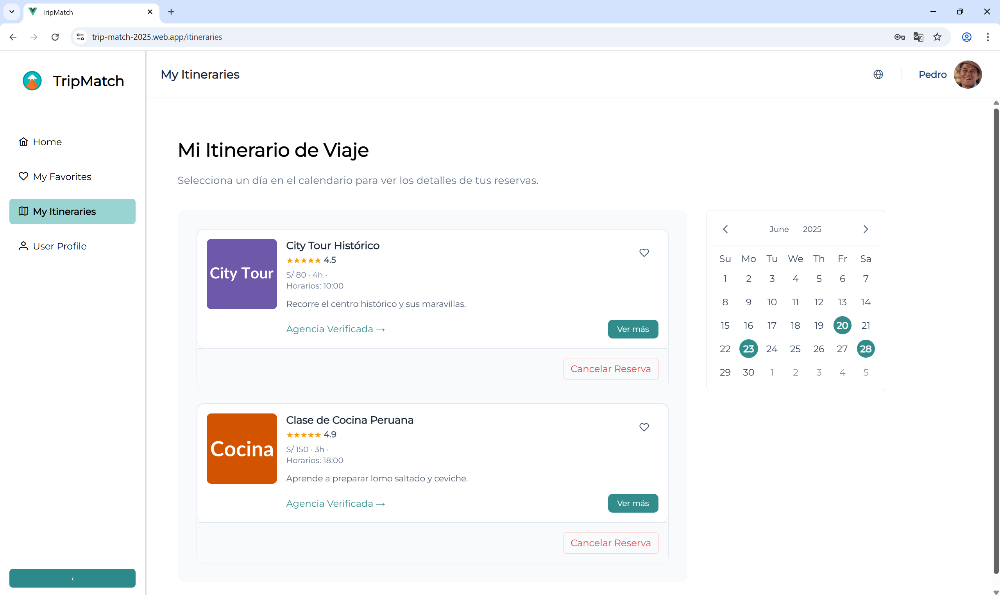

#### Evidencia 2: 
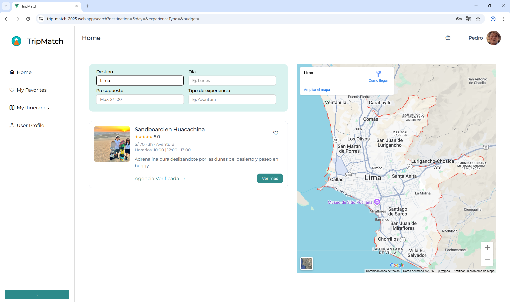

#### Evidencia 3: 
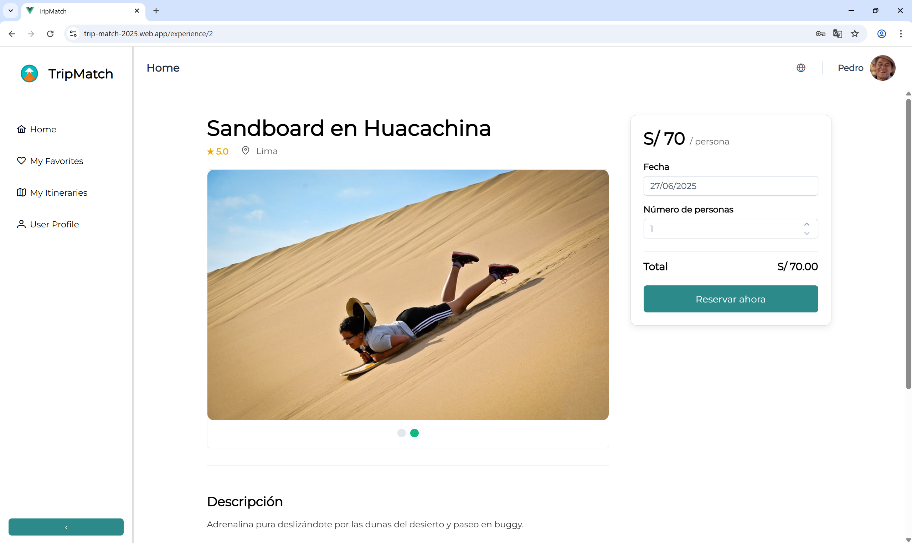


#### 5.2.3.6. Services Documentation Evidence for Sprint Review.
Durante este Sprint, se avanzó considerablemente en la documentación de los servicios REST desarrollados para el backend de TripMatch, utilizando la especificación OpenAPI (Swagger). Esta documentación es clave para facilitar la integración entre el backend y el frontend, así como para permitir pruebas rápidas y comprensión clara de la estructura de los endpoints implementados.

Los servicios documentados incluyen funcionalidades centrales como la gestión de usuarios, autenticación, creación de agencias, paquetes turísticos, reservas, itinerarios y destinos. A través de Swagger UI, se puede explorar cada uno de estos endpoints, visualizar parámetros esperados, realizar peticiones simuladas y verificar las respuestas del sistema.

| Módulo              | Acción                     | Método | Endpoint            | Parámetros (ejemplo)                                                             | Respuesta (ejemplo)                                                 |
| ------------------- | -------------------------- | ------ | ------------------- | -------------------------------------------------------------------------------- | ------------------------------------------------------------------- |
| Usuarios            | Registrar usuario          | POST   | `/api/users`        | `{"username": "britney", "email": "britney@test.com", "password": "12345678"}`   | `{"id": 1, "username": "britney", "email": "britney@test.com"}`     |
| Autenticación       | Iniciar sesión             | POST   | `/api/auth/sign-in` | `{"username": "britney", "password": "12345678"}`                                | `{"token": "eyJhbGciOi..."}`                                        |
| Agencias            | Registrar agencia          | POST   | `/api/agencies`     | `{"name": "Agencia Andes", "email": "contacto@andes.com", "ruc": "12345678901"}` | `{"id": 1, "name": "Agencia Andes", "email": "contacto@andes.com"}` |
| Paquetes turísticos | Crear paquete turístico    | POST   | `/api/packages`     | `{"name": "Cusco Explorer", "price": 550.00, "agencyId": 1}`                     | `{"id": 1, "name": "Cusco Explorer", "price": 550.00}`              |
| Reservas            | Reservar paquete turístico | POST   | `/api/bookings`     | `{"packageId": 1, "userId": 1, "travelDate": "2025-07-10"}`                      | `{"id": 1, "status": "CONFIRMED"}`                                  |
| Destinos            | Obtener todos los destinos | GET    | `/api/destinations` | -                                                                                | `[{"id": 1, "name": "Cusco"}, {"id": 2, "name": "Arequipa"}]`       |
| Itinerarios         | Registrar itinerario       | POST   | `/api/itineraries`  | `{"packageId": 1, "day": 1, "description": "Tour por el Valle Sagrado"}`         | `{"id": 1, "day": 1, "description": "Tour por el Valle Sagrado"}`   |

#### Captura de la documentación OpenAPI/Swagger
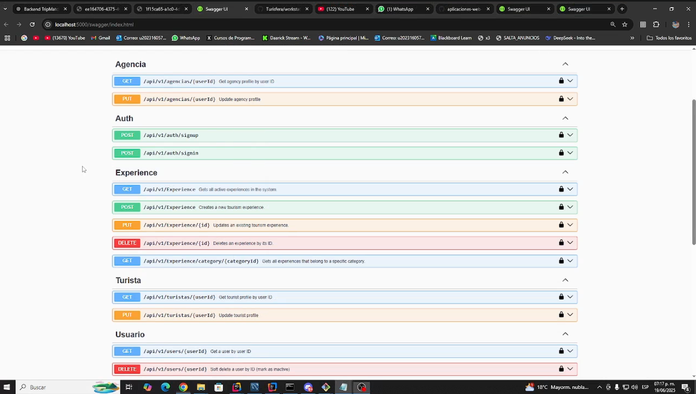

#### 5.2.3.7. Software Deployment Evidence for Sprint Review.
Durante este Sprint, se avanzó en el proceso de Deployment del backend de la aplicación TripMatch, logrando poner en funcionamiento todos los servicios desarrollados en un entorno de desarrollo accesible. Esto permitió al equipo validar funcionalmente los endpoints REST y realizar pruebas de integración iniciales con el frontend.

#### Actividades realizadas en el Sprint 3:
1. Configuración de repositorio remoto:

    * Se utilizó GitHub como repositorio de control de versiones.

    * Repositorio oficial del backend: https://github.com/Turisfera/workstation-back-end

2. Creación de entorno de despliegue local:

    * Para este Sprint se optó por un despliegue local en entorno de desarrollo utilizando:

      * Spring Boot como framework base.

      * Swagger UI para la documentación de servicios.

      * MySQL como base de datos relacional.

      * Docker para levantar contenedores del backend y base de datos en conjunto.

   * Se configuraron los siguientes archivos para automatizar el entorno:

      * Dockerfile para la imagen de backend.

      * docker-compose.yml para levantar el backend y la base de datos.

3. Ejecución local exitosa:

    * La aplicación fue levantada en el entorno local accediendo desde http://localhost:8080/swagger-ui.html.

    * Esto permitió validar el comportamiento de todos los endpoints REST desarrollados y su interacción con la base de datos.

#### Capturas del Proceso de Deployment
1. Evidencia 1:


#### 5.2.3.8. Team Collaboration Insights during Sprint.
Durante el desarrollo del Sprint 3, el equipo colaboró de forma activa, coordinada y orientada a objetivos comunes para implementar los componentes esenciales del backend de la aplicación TripMatch. El trabajo se centró en el modelado del dominio, la creación de controladores REST, el desarrollo de servicios para usuarios, agencias, paquetes turísticos, destinos y reservas, así como la configuración del entorno de despliegue local y la documentación de servicios mediante Swagger UI.

A continuación, se detalla la participación específica de cada integrante del equipo en las principales áreas funcionales del backend:

| **Nombre**                       | **Actividad**                                                                                                                                                                 |
| -------------------------------- | ----------------------------------------------------------------------------------------------------------------------------------------------------------------------------- |
| Melgarejo Gomez, Marcia Victoria  | Encargada del modelado de entidades y configuración de la base de datos MySQL. Implementó entidades como Usuario, Agencia, Paquete, Reserva e Itinerario.                     |
| Alaya Cabrera, Rodrigo           | Responsable de la documentación con Swagger (OpenAPI) y despliegue local con Docker. Participó en la estructuración del entorno de ejecución con `docker-compose`.            |
| Poma Muñoz, Ariadna G.           | Participó en la implementación de servicios y controladores REST, especialmente en los módulos de autenticación, reservas y usuarios. Realizó pruebas funcionales en Swagger. |
| Guevara Tejada, Jorge Enrique    | Colaboró en la construcción de endpoints para gestión de paquetes turísticos y destinos. Implementó validaciones y estructuras DTO para transporte de datos.                  |
| Medina Cruzado, Raúl A.          | Apoyó en el desarrollo de casos de uso de inscripción y lógica de negocio en el dominio de itinerarios.            |
| Hernández Uchuya, María Patricia | Participó activamente en los casos de uso relacionados a usuarios y autenticación. Validó flujos de creación de cuenta y login.                                               |
| Qqueso Rodríguez, Britney Delhy | Responsable de la implementación de controladores REST para destinos y paquetes. Documentó flujos en Swagger y validó el correcto funcionamiento de los endpoints.            |

Evidencia de colaboración en GitHub
A continuación, se presentan capturas del historial de commits y analítica de colaboración del repositorio oficial del backend, donde se evidencia la participación activa y sostenida de todos los integrantes del equipo durante el Sprint 3:

1. Evidencia 1:
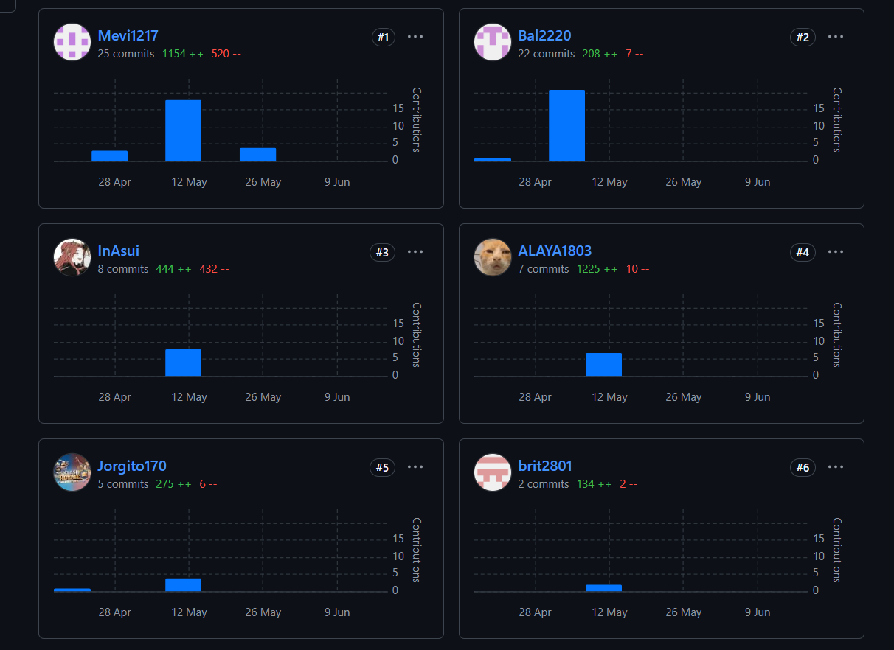


#### Repositorio de trabajo:
* Repositorio del Backend en GitHub: https://github.com/Turisfera/workstation-back-end

El equipo mantuvo una comunicación constante durante todo el Sprint, utilizando herramientas colaborativas como GitHub y reuniones breves, permitiendo una integración progresiva de los módulos desarrollados y asegurando que cada funcionalidad contara con aportes técnicos y revisiones cruzadas por parte de todos los miembros.

### 5.2.4. Sprint 4

#### 5.2.4.1. Sprint Planning 4
<table>
    <tr>
        <td>Sprint #</td>
        <td>4</td>
    </tr>
    <tr>
        <th colspan="2"><strong>Sprint Planning Background</strong></th>
    </tr>
    <tr>
        <td>Date</td>
        <td>08/07/2025</td>
    </tr>
     <tr>
        <td>Time</td>
        <td>07:00 PM</td>
    </tr>
     <tr>
        <td>Location</td>
        <td>Reunión virtual – Discord</td>
    </tr>
    <tr>
        <td>Prepared By</td>
        <td>Marcia Melgarejo, Jorge Guevara</td>
    </tr>
    <tr>
        <td>Attendees (to planning meeting)</td>
        <td>
        - Britney Delhy Qqueso Rodríguez – U20211G671<br>
        - Rodrigo Alaya Cabrera – U202219481<br>
        - Jorge Enrique Guevara Tejada – U202316057<br>
        - Raúl A. Medina Cruzado – U202210938<br>
        - María Patricia Hernández Uchuya - U202311258<br>
        - Marcia Victoria Melgarejo Gomez – U20231C505
   </td>
    </tr>
    <tr>
        <td>Sprint 4 – 3 Review Summary</td>
        <td>Durante la revisión del Sprint 3 se consolidaron las principales APIs del backend, incluyendo módulos de usuarios, agencias, reservas e itinerarios. Se logró una integración funcional con Swagger y pruebas locales exitosas. Se reconoció la necesidad de avanzar en la conexión frontend-backend, así como refinar validaciones y feedback en la interfaz.</td>
    </tr>
    <tr>
        <td>Sprint 4 – 3 Retrospective Summary</td>
        <td>En la retrospectiva del Sprint 3, se destacó el alto nivel de colaboración y la organización eficiente del equipo. Se identificó como aspecto a mejorar el tiempo de respuesta ante bugs emergentes y la necesidad de establecer pruebas automatizadas que reduzcan los tiempos de validación manual.</td>
    </tr>
    <tr>
        <th colspan="2"><strong>Sprint Goal & User Stories</strong></th>
    </tr>
    <tr>
      <td>Sprint 4 Goal</td>
        <td>
          <strong>Nuestra meta para este sprint es</strong> conectar las vistas principales del frontend con los servicios REST implementados en el backend, enfocándonos en el flujo de reserva, autenticación, perfil de usuario y visualización de paquetes turísticos.<br> 
          <strong>Creemos que</strong> esto permitirá a los usuarios interactuar directamente con datos reales, validar flujos completos y fortalecer la experiencia de navegación.<br>
          <strong>Esto se confirmará</strong> cuando el usuario pueda iniciar sesión, visualizar y editar su perfil, explorar paquetes disponibles, realizar una reserva y ver el historial de sus reservas desde la interfaz web.
        </td>
      </tr>
      <tr>
        <td>Sprint 4 Velocity  </td>
        <td>48 Story Points.</td>
      </tr>
      <tr>
        <td>Sum of Story Points  </td>
        <td>48 Story Points.</td>
      </tr>
</table>

#### 5.2.4.2. Aspect Leaders and Collaborators
#### 5.2.4.3. Sprint Backlog 4
#### 5.2.4.4. Development Evidence for Sprint Review
Durante el Sprint 4 del proyecto TripMatch, el equipo se centró en integrar el backend previamente desarrollado con las interfaces del frontend, permitiendo una interacción fluida y funcional con los datos reales a través de los servicios REST implementados. Además, se corrigieron errores en la lógica del backend, se optimizó la conexión con la base de datos y se fortaleció el control de acceso mediante roles y configuraciones CORS.<br>
En el frontend, se eliminaron valores codificados directamente en el código, se conectaron módulos clave como reservas y favoritos, y se integró la vista de perfil de agencias con sus respectivas funcionalidades.<br>
A continuación, se presentan los commits más relevantes que evidencian el avance técnico realizado durante este Sprint:

<strong>Backend – Repositorio: </strong><https://github.com/Turisfera/workstation-back-end>
| Branch | Commit Id | Commit Message | Commit Message Body | Committed on (Date) |
|------- | --------- | -------------- | ------------------- | ------------------- |
| main | ba47a1e | Fix: fix sql connection | Se solucionaron errores en la conexión con la base de datos MySQL. | 02/07/2025 |
| main | 3949490 | Feat: add endpoints, validations<br>fix tables connection and logic | Se añadieron nuevos endpoints, validaciones adicionales y correcciones en la lógica de relación entre tablas. | 04/07/2025 |
| main | d48be6c | Feat: add CORS | Se implementó configuración de CORS para permitir solicitudes del frontend. | 04/07/2025 |
| main | 7cf840f | Fix: fix user rol | Se corrigió la asignación y control de roles de usuario. | 04/07/2025 |
| main | 47fac00 | Fix: fix connections | Se solucionaron errores adicionales en conexiones de entidades. | 05/07/2025 |
| main | ef5a619 | feat: implementación de endpoint favorites | Se añadió el endpoint para gestionar productos favoritos de los usuarios. | 05/07/2025 |
| main | 46e4cd1 | fix: Change code of Booking controller | Se refactorizó el controlador de reservas para mejorar su lógica y eficiencia. | 07/07/2025 |

<strong>Frontend – Repositorio: </strong><https://github.com/Turisfera/workstation-front-end>
| Branch | Commit Id | Commit Message | Commit Message Body | Committed on (Date) |
|------- | --------- | -------------- | ------------------- | ------------------- |
| main | a40c3c7 | feat: Remove hard code and add traductions | Se eliminaron textos codificados directamente y se añadieron archivos de traducción. | 04/07/2025 |
| main | 28746e1 | feat: Remove rating display from experience cards | Se ajustó el diseño de tarjetas de experiencia, eliminando visualización de ratings. | 04/07/2025 |
| main | 0c3b8ad | Feat: add connections with database: booking, user and experience | Se establecieron las conexiones entre la interfaz y las APIs de reservas, usuarios y experiencias. | 05/07/2025 |
| main | 287af7e | feat: se implementó la conexión con el backend en la sección de favorites | Se conectó la funcionalidad de productos favoritos al backend. | 05/07/2025 |
| main | d941a0b | Fix: fix problems experiences | Corrección de errores en la lógica de experiencias. | 06/07/2025 |
| main | 096fab7 | feature: Conect the agency profile backend | Se conectó el perfil de agencia con los datos reales del backend. | 07/07/2025 |
| main | 69fc027 | feat: include a backend of reservations | Se integró la sección de reservas con los endpoints correspondientes. | 07/07/2025 |

#### 5.2.4.5. Execution Evidence for Sprint Review
#### 5.2.4.6. Services Documentation Evidence for Sprint Review
#### 5.2.4.7. Software Deployment Evidence for Sprint Review
Durante el Sprint 4 del proyecto TripMatch, se continuó consolidando el proceso de despliegue del sistema en un entorno de desarrollo controlado, asegurando la integración entre el backend y el frontend, así como la correcta interacción con los servicios de base de datos. El objetivo fue validar la conexión completa entre los componentes del sistema, incorporar mejoras técnicas y garantizar una experiencia de usuario más estable.

<strong>Actividades realizadas en el Sprint 4:</strong>

1. Configuración de repositorio remoto:

  * Se utilizó GitHub como repositorio de control de versiones.
  * Repositorio:
    * Backend: <https://github.com/Turisfera/workstation-back-end>
    * Frontend: <https://github.com/Turisfera/workstation-front-end>

2. Configuración del entorno de desarrollo local:

  * Spring Boot como framework principal del backend.
  * MySQL como sistema de gestión de base de datos relacional.
  * Swagger UI para la documentación interactiva de las APIs REST.
  * Se habilitó correctamente CORS para permitir el consumo de servicios desde el frontend.
  * Se utilizó SonarQube Cloud para análisis de calidad de código y detección de vulnerabilidades.

3. Contenedores y orquestación:

  * Se empleó Docker para contenerizar tanto el backend como la base de datos.
  * Se implementaron y actualizaron los siguientes archivos:
    * Dockerfile para empaquetar el backend como imagen.
    * docker-compose.yml para orquestar el despliegue conjunto de servicios.
  * El entorno fue levantado exitosamente en local, accediendo a la documentación en: <http://localhost:8080/swagger-ui.html>

4. Pruebas de integración:

  * Se realizaron pruebas funcionales integradas desde el frontend, validando endpoints como reservas, favoritos, autenticación y perfil de agencia.
  * Se comprobó la persistencia y recuperación de datos entre la base de datos y el cliente.

Evidencias


#### 5.2.4.8. Team Collaboration Insights during Sprint

## 5.3. Validation Interviews.

### 5.3.1. Diseño de Entrevistas.
#### Introducción
Saludo: Buenas noches, soy —--, parte del equipo de Turisfera. Estamos trabajando en una solución innovadora para facilitar el acceso a experiencias turísticas auténticas y personalizadas que conecte a viajeros con agencias de turismo de manera directa, eficiente y transparente.
Propósito de la entrevista: El objetivo de esta entrevista es recopilar tus opiniones y validar algunos aspectos clave de nuestra aplicación y landing page para asegurar que se ajuste a las necesidades de usuarios como tú.
Proceso de la sesión: Vamos a mostrarte algunas funciones de la aplicación y el diseño de la página de aterrizaje. Al final, haremos algunas preguntas para conocer tu experiencia y obtener sugerencias.
#### Preguntas Principales
Sobre el diseño y la usabilidad:
* ¿Qué opinas del diseño del prototipo de nuestra aplicación?
* ¿Consideras que el diseño es intuitivo y fácil de navegar?
Validación de funciones:
* ¿Te parecen útiles las funciones?
* ¿Crees que esta aplicación facilita el acceso a experiencias turisticas?
#### Opiniones sobre la Landing Page:
* ¿La información en el Landing Page es clara y atractiva?
* ¿Qué mejorarías en la presentación de la aplicación en la página?
#### Publicidad:
* ¿Crees que la inclusión de anuncios afectaría negativamente tu experiencia en la app?
Feedback final:
* ¿Qué otras funciones consideras que deberían incluirse o eliminarse en la app?
#### Cierre
Agradecimiento: Muchas gracias por tu tiempo y respuestas. Tu feedback es muy valioso para mejorar nuestra propuesta y desarrollar una aplicación que realmente responda a tus necesidades. ¡Hasta luego!

### 5.3.2. Registro de Entrevistas.

Segmento 1: Turistas

| Nº Entrevista | Datos del entrevistado | Resumen de la entrevista | Evidencia de entrevista |
|---------------|------------------------|--------------------------|-------------------------|
| 1 | - **Nombre:** Karla Rojas <br> - **Edad:** 19 años <br> - **Distrito:** La Molina <br> - **Link:** [Entrevista 1: Karla Rojas](https://upcedupe-my.sharepoint.com/:v:/g/personal/u202311258_upc_edu_pe/EZkH1XHIPlpMls6gDwaEYdQB9YxdJZ1nfwtxHh9s93kXNg?e=Sd1iUR) | Karla considera que la interfaz de la landing page y la aplicación es intuitiva, dinámica y genera confianza. Además, destaca que las funciones disponibles le resultan muy útiles. En su opinión, no hay aspectos que requieran mejora por el momento. Sin embargo, advierte que la incorporación de anuncios podría afectar negativamente su experiencia de navegación. | 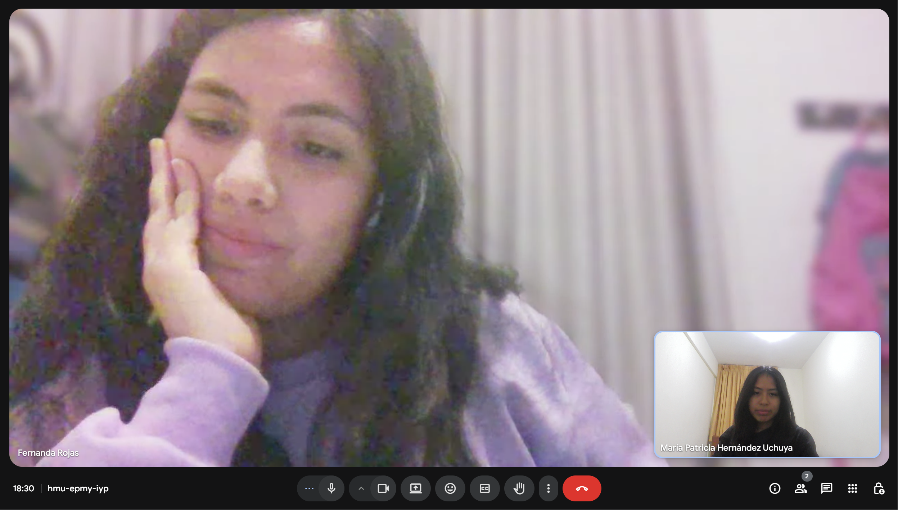 |
| 2 | - **Nombre:** Joaquin Alejandro <br> - **Edad:** 20 años <br> - **Distrito:** Jesus Maria <br> - **Link:** [Entrevista 1: Joaquin Gudiel](https://upcedupe-my.sharepoint.com/personal/u20221d382_upc_edu_pe/_layouts/15/stream.aspx?id=%2Fpersonal%2Fu20221d382%5Fupc%5Fedu%5Fpe%2FDocuments%2FVID%5F20250619%5F233803%2Emp4&referrer=StreamWebApp%2EWeb&referrerScenario=AddressBarCopied%2Eview%2Ec0a66987%2D8b57%2D438b%2D922f%2D5c0b4db84e83&isDarkMode=false) | Joaquín considera que la landing page es fácil de entender y destaca que sus opciones son muy útiles, ya que le facilitan el trabajo. También valora positivamente que la plataforma establezca conexión con agencias pequeñas, lo cual le parece una ventaja. Sin embargo, menciona que la forma en que se apliquen los anuncios en la landing page puede influir en el tiempo que permanece en ella.|  |
| 3 | - **Nombre:** Darlin Castillo <br> - **Edad:** 23 años <br> - **Distrito:** Surco <br> - **Link:** [Entrevista 3: Darlin Castillo](https://upcedupe-my.sharepoint.com/:v:/g/personal/u20211g671_upc_edu_pe/EeBfoQ4eIT1Mj1esUkQjS4YBJquJF53_foGSF_zNHw9k-g?nav=eyJyZWZlcnJhbEluZm8iOnsicmVmZXJyYWxBcHAiOiJPbmVEcml2ZUZvckJ1c2luZXNzIiwicmVmZXJyYWxBcHBQbGF0Zm9ybSI6IldlYiIsInJlZmVycmFsTW9kZSI6InZpZXciLCJyZWZlcnJhbFZpZXciOiJNeUZpbGVzTGlua0NvcHkifX0&e=mRzVwo) | Darlin considera que la página de destino es sumamente fácil de comprender, destacando su diseño intuitivo y la claridad de su presentación. Resalta que las opciones y funcionalidades que ofrece la plataforma son excepcionalmente útiles, ya que simplifican y agilizan significativamente su trabajo. Adicionalmente, valora de forma muy positiva que la plataforma tenga la capacidad de establecer conexión con agencias pequeñas, lo cual percibe como una ventaja competitiva considerable y un beneficio importante para su operación.| 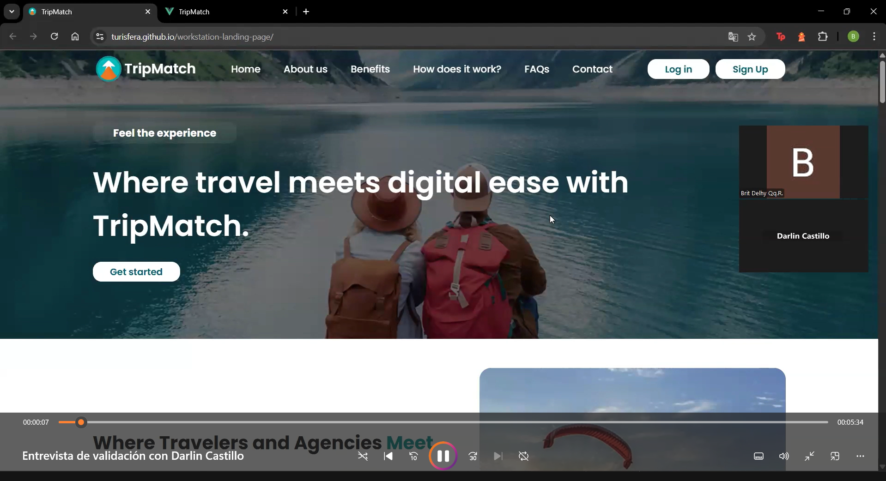 |


Segmento 2: Agencia

| Nº Entrevista | Datos del entrevistado | Resumen de la entrevista | Evidencia de entrevista |
|---------------|------------------------|--------------------------|-------------------------|
| 1 | - **Nombre:** Abraam Acosta <br> - **Edad:** 24 años <br> - **Distrito:** Santiago de Surco <br> - **Link:** [Entrevista 1: Abraam Acosta](https://upcedupe-my.sharepoint.com/:v:/g/personal/u202210938_upc_edu_pe/EfaAYpxySNFLraW-iQ5De8cBZzEnIbJyKvLQZWtedHmbgw?e=QCc61E&nav=eyJyZWZlcnJhbEluZm8iOnsicmVmZXJyYWxBcHAiOiJTdHJlYW1XZWJBcHAiLCJyZWZlcnJhbFZpZXciOiJTaGFyZURpYWxvZy1MaW5rIiwicmVmZXJyYWxBcHBQbGF0Zm9ybSI6IldlYiIsInJlZmVycmFsTW9kZSI6InZpZXcifX0%3D) |Abraam Acosta consideró que la plataforma TripMatch fue bien recibida por las agencias de turismo, quienes valoraron su facilidad de uso y la posibilidad de llegar a nuevos clientes. Sin embargo, también identificaron mejoras necesarias, como mayor seguridad en los pagos, herramientas de gestión como calendarios y métricas, y soporte técnico. En general, reconocieron el potencial de la plataforma siempre que se fortalezcan estos aspectos clave.| 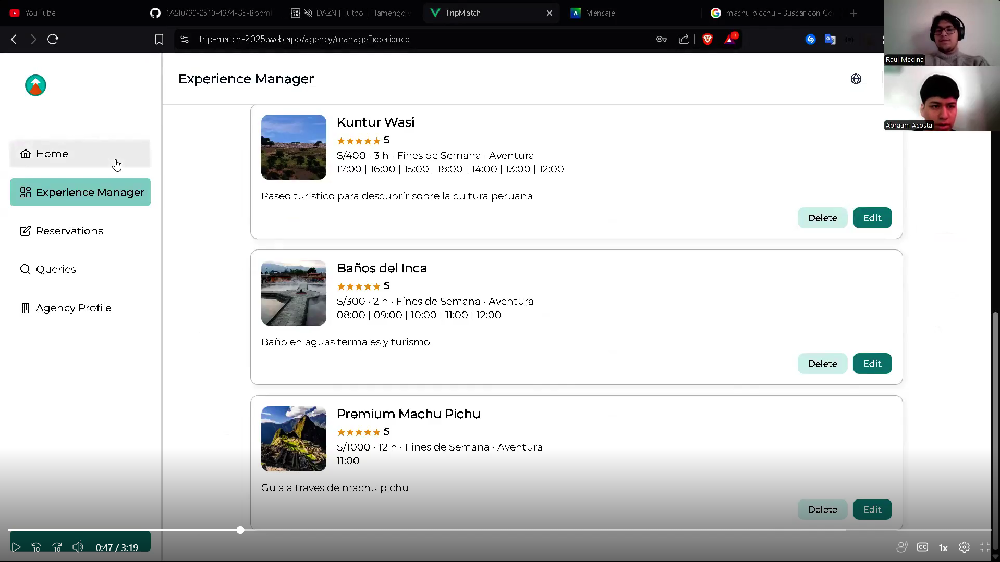 |
| 2 | - **Nombre:** Mario Lopez <br> - **Edad:** 20 años <br> - **Distrito:** La Molina <br> - **Link:** [Entrevista 2: Mario Lopez](https://upcedupe-my.sharepoint.com/:v:/g/personal/u202210938_upc_edu_pe/EVVR3ZT4tMpLg6WdDGek-VoBwyZSi3Hiky5uKjQm1PN1Ug?e=GD1SMV&nav=eyJyZWZlcnJhbEluZm8iOnsicmVmZXJyYWxBcHAiOiJTdHJlYW1XZWJBcHAiLCJyZWZlcnJhbFZpZXciOiJTaGFyZURpYWxvZy1MaW5rIiwicmVmZXJyYWxBcHBQbGF0Zm9ybSI6IldlYiIsInJlZmVycmFsTW9kZSI6InZpZXcifX0%3D) | Mario Lopez consideró que el diseño de la aplicación TripMatch es moderno, visualmente atractivo e intuitivo, con una navegación fluida y bien organizada. Destacó que las funciones actuales como la búsqueda por intereses y categorización de destinos son útiles y responden a las necesidades del usuario viajero. Señaló que la información en el landing page es clara, pero sugirió incluir testimonios, un video demostrativo y llamados a la acción más visibles. Advirtió que la publicidad podría afectar negativamente la experiencia si no es contextual y no invasiva. Finalmente, recomendó agregar funciones como wishlist, calificaciones de usuarios, modo offline y un calendario de actividades, y eliminar pasos innecesarios o elementos decorativos sin funcionalidad.| 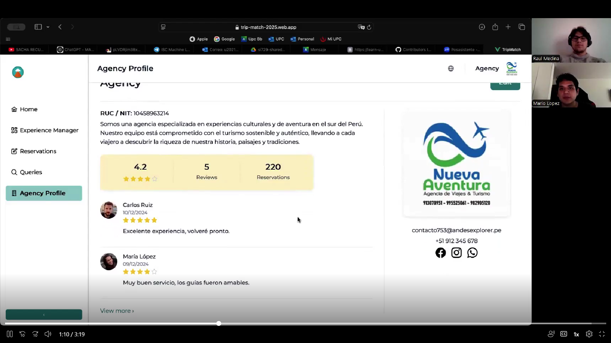 |
| 3 | - **Nombre:** Abigail Rodriguez <br> - **Edad:** 21 años <br> - **Distrito:** Santiago de Surco <br> - **Link:** [Entrevista 2: Abigail Rodriguez](https://upcedupe-my.sharepoint.com/:v:/g/personal/u202210938_upc_edu_pe/EfzzEOikkFtMinx8Wkjdp1EBTC3PtUBqpE9WyVsSf5e1tg?e=Bd6v5J&nav=eyJyZWZlcnJhbEluZm8iOnsicmVmZXJyYWxBcHAiOiJTdHJlYW1XZWJBcHAiLCJyZWZlcnJhbFZpZXciOiJTaGFyZURpYWxvZy1MaW5rIiwicmVmZXJyYWxBcHBQbGF0Zm9ybSI6IldlYiIsInJlZmVycmFsTW9kZSI6InZpZXcifX0%3D) | Abigail Rodríguez consideró que el diseño del prototipo es atractivo e intuitivo, aunque recomienda añadir guías para nuevos usuarios. Destacó la utilidad de las funciones para facilitar la búsqueda y reserva de experiencias turísticas. Sobre la Landing Page, sugirió incluir más imágenes, testimonios y una sección de preguntas frecuentes. Opinó que la publicidad no afectaría si es moderada y relevante. Finalmente, propuso agregar funciones como guardar experiencias, recibir recomendaciones y mejorar el soporte técnico, priorizando siempre las funciones más útiles para los usuarios. | 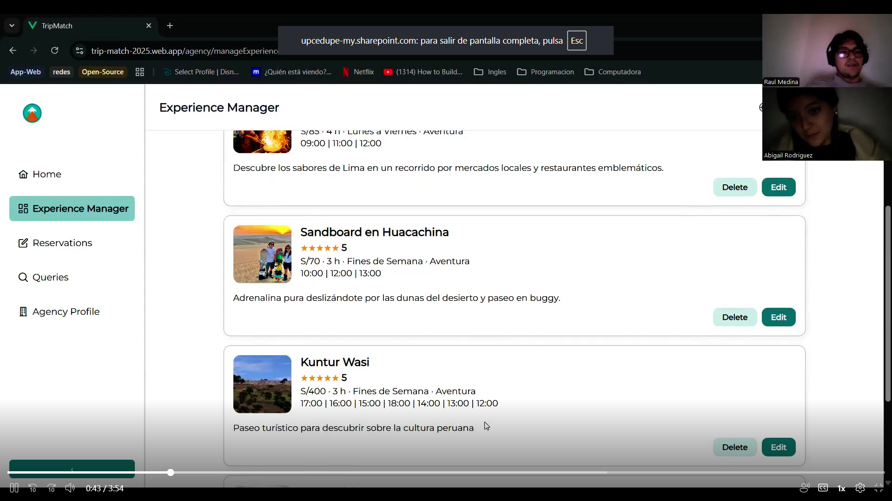 |

### 5.3.3. Evaluaciones según heurísticas.
**Site o App a Evaluar:** TripMatch

**Tareas a evaluar:**

El alcance de esta evaluación incluye la revisión de usabilidad de las siguientes tareas:

* Acceder a la aplicación desde la landing page

* Crear cuenta como turista

* Crear cuenta como agencia de turismo

* Inicio de sesión

* Visualización de la página de inicio del turista

* Visualización de la página de inicio de la agencia

* Visualización de itinerarios y favoritos (usuario turista)

* Visualización de reservas y consultas (agencia)

* Gestión de experiencias por parte de agencias

* Visualización y edición del perfil de usuario o agencia

No están incluidas en esta versión de la evaluación las siguientes tareas:

* Recuperación de cuenta

* Edición de experiencias reservadas por los usuarios

* Visualización de historial de navegación o búsquedas

**ESCALA DE SEVERIDAD:**
*Los errores serán puntuados tomando en cuenta la siguiente escala de severidad*
|***Nivel***|***Descripción***|
| :-: | :-: |
|*1*|*Problema superficial: puede ser fácilmente superado por el usuario o ocurre con muy poca frecuencia. No necesita ser arreglado a no ser que exista disponibilidad de tiempo.*|
|*2*|*Problema menor: puede ocurrir un poco más frecuentemente o es un poco más difícil de superar para el usuario. Se le debería asignar una prioridad baja resolverlo de cara al siguiente reléase*|
|*3*|*Problema mayor: ocurre frecuentemente o los usuarios no son capaces de resolverlos. Es importante que sean corregidos y se les debe asignar una prioridad alta.*|
|*4*|*Problema muy grave: un error de gran impacto que impide al usuario continuar con el uso de la herramienta. Es imperativo que sea corregido antes del lanzamiento.*|

**TABLA DE RESUMEN:**

| # | Problema                                                                        | Escala de severidad | Heurística/principio violado                 |
| - | ------------------------------------------------------------------------------- | ------------------- | -------------------------------------------- |
| 1 | No hay formulario de contacto en la landing page                                | 3                   | Usability: Help and documentation            |
| 2 | Un solo formulario de registro para dos segmentos distintos (turista y agencia) | 4                   | Usability: Flexibility and efficiency of use |

**DESCRIPCIÓN DE PROBLEMAS:**

**PROBLEMA #1:** No hay formulario de contacto en la landing page

**Severidad:** 3

**Heurística violada:** Usability: Help and documentation

**Problema**: La landing page de TripMatch incluye una sección de preguntas frecuentes (FAQs), pero no cuenta con un formulario de contacto directo para que los usuarios puedan hacer consultas adicionales. Esta omisión puede dificultar que los usuarios resuelvan dudas específicas, especialmente si no encuentran su problema entre las FAQs.

**Imagen:**
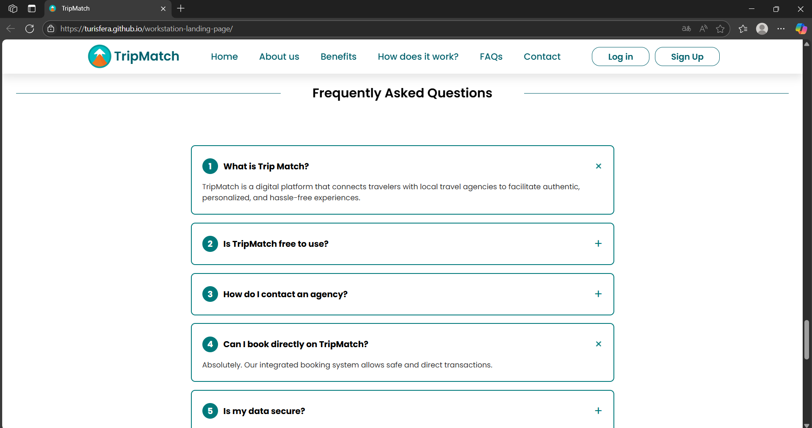

**Recomendación:** Incluir un formulario de contacto accesible desde el menú o pie de página, con campos básicos (nombre, correo, mensaje) y confirmación visual de envío. Esto facilitará el soporte a los usuarios y mejorará la percepción de accesibilidad y acompañamiento.

-----

**PROBLEMA #2:** Un solo formulario de registro para dos segmentos distintos (turista y agencia)

**Severidad:** 4

**Heurística violada:** Usability: Flexibility and efficiency of use

**Problema**: Actualmente, TripMatch utiliza un único formulario de creación de cuenta tanto para turistas como para agencias de turismo. Esto genera confusión, ya que ambos perfiles requieren campos de registro distintos (por ejemplo, nombre personal vs. nombre de empresa, intereses turísticos vs. tipos de servicios ofrecidos). Además, los flujos de navegación y uso de la aplicación también difieren entre ambos perfiles.

**Imagen:**

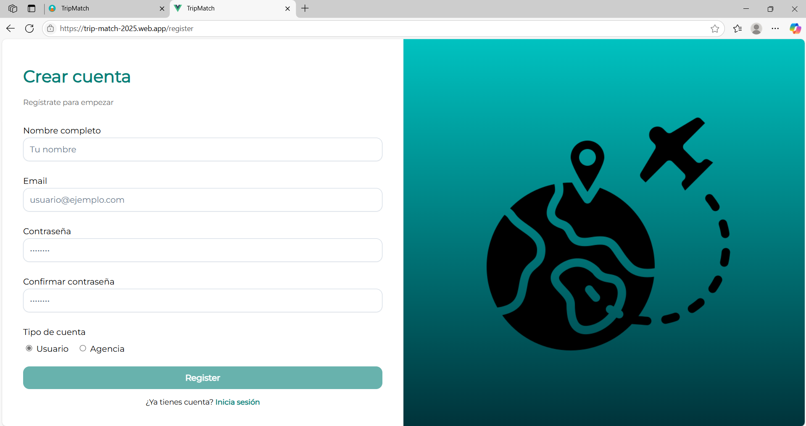

**Recomendación:** Dividir el registro en dos formularios diferenciados: uno para turistas y otro para agencias. Esto permitirá solicitar información específica relevante para cada segmento y dirigirlos al flujo adecuado después del registro, mejorando la experiencia de usuario y reduciendo fricción en el proceso de incorporación.


## 5.4. Video About-the-Product.

### Turistas
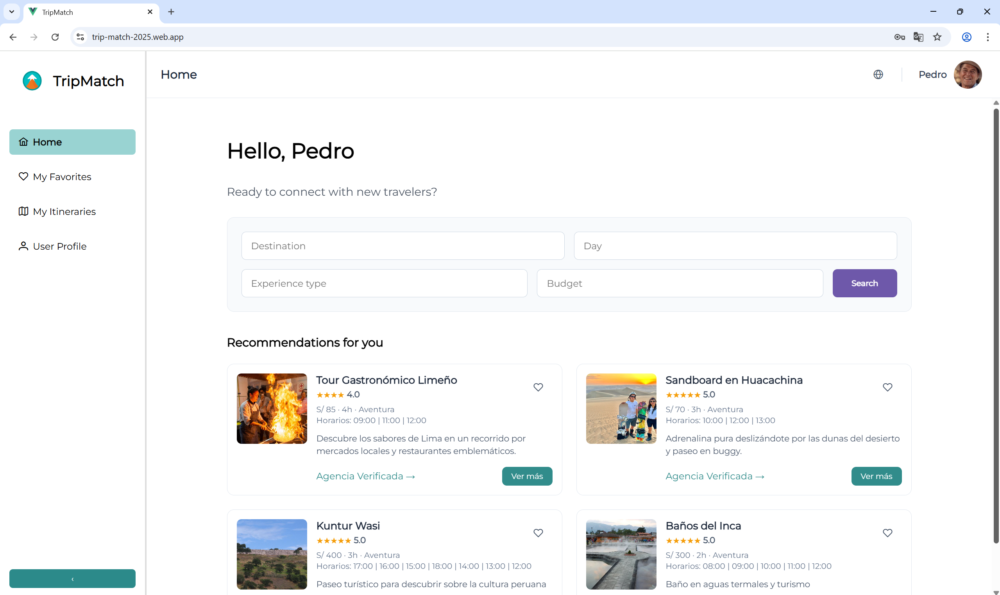<br>
Link del vídeo: [About the Product of Turist](https://upcedupe-my.sharepoint.com/:v:/g/personal/u202311258_upc_edu_pe/ES71WKL8TA5Mkv2jZmHWeF4Bg01RF-Kg-5y0kvBgq2CX9Q?nav=eyJyZWZlcnJhbEluZm8iOnsicmVmZXJyYWxBcHAiOiJTdHJlYW1XZWJBcHAiLCJyZWZlcnJhbFZpZXciOiJTaGFyZURpYWxvZy1MaW5rIiwicmVmZXJyYWxBcHBQbGF0Zm9ybSI6IldlYiIsInJlZmVycmFsTW9kZSI6InZpZXcifX0%3D&e=4Ytmb7)

### Agencias
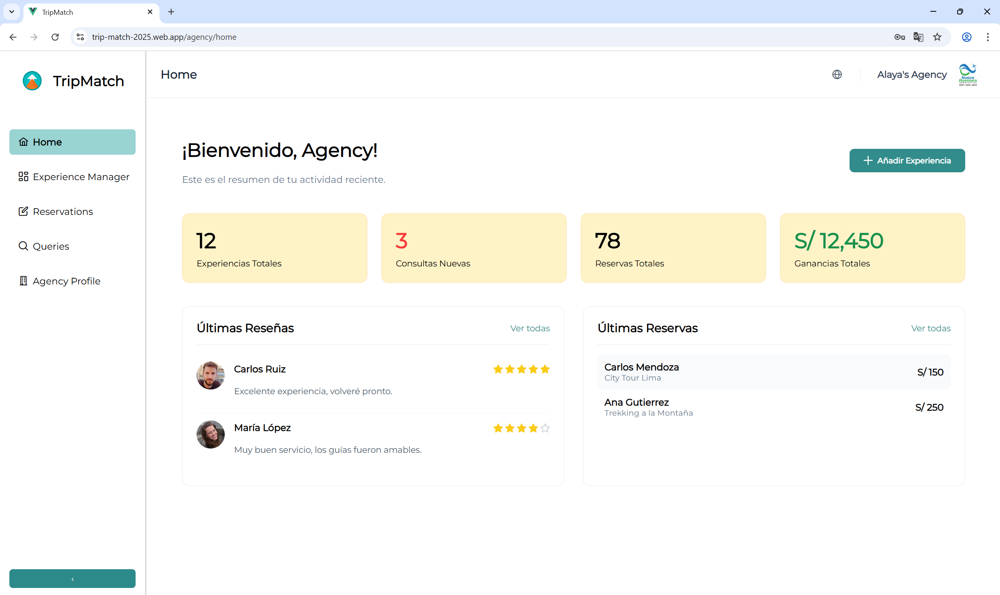<br>
Link del vídeo: [About the Product of Agency](https://upcedupe-my.sharepoint.com/:v:/g/personal/u202311258_upc_edu_pe/EbikAWyD39JGlNLimXO1YjEB36EnEO2akYm0CMjhQyJLeA?nav=eyJyZWZlcnJhbEluZm8iOnsicmVmZXJyYWxBcHAiOiJTdHJlYW1XZWJBcHAiLCJyZWZlcnJhbFZpZXciOiJTaGFyZURpYWxvZy1MaW5rIiwicmVmZXJyYWxBcHBQbGF0Zm9ybSI6IldlYiIsInJlZmVycmFsTW9kZSI6InZpZXcifX0%3D&e=7ue5sO)

# Conclusiones y recomendaciones.
## Conclusiones: 
Durante el desarrollo de TripMatch, se validaron los principales Problem Statements, confirmando que los turistas necesitan apoyo para planificar itinerarios personalizados y que los anfitriones requieren una forma sencilla de gestionar y promocionar experiencias.

Los assumptions iniciales sobre la utilidad de funciones como la generación automática de itinerarios, el uso de filtros dinámicos y la facilidad de publicación para agencias fueron confirmados a través de pruebas y entrevistas. Las hipótesis planteadas se validaron, destacando el interés de los usuarios en itinerarios personalizados, funciones de guardado y herramientas para mejorar la visibilidad de los anfitriones.

## Recomendaciones 

**Fomentar la Colaboración Constante**: Es importante mantener una comunicación fluida entre todos los miembros del equipo durante todo el proceso de desarrollo. Utilizar herramientas de gestión de proyectos y reuniones regulares para asegurar que todos estén alineados con los objetivos y plazos.

**Priorizar la Simplicidad en el Diseño**: Aunque la plataforma tiene múltiples funcionalidades, debemos asegurar que cada función esté diseñada de manera intuitiva y accesible para los usuarios, especialmente aquellos con poca experiencia tecnológica. El diseño debe ser limpio y fácil de navegar. <br/>

Optimizar la gestión del tiempo y recursos en tareas críticas, especialmente aquellas relacionadas con la integración y pruebas de funcionalidades entre los distintos componentes. <br/>

Continuar promoviendo las retrospectivas internas de equipo al final de cada Sprint, lo que ha demostrado ser útil para identificar obstáculos y mejorar la dinámica de trabajo. <br/>

Fomentar aún más la documentación técnica paso a paso, especialmente en las tareas relacionadas con infraestructura y despliegue, para facilitar el onboarding de nuevos miembros o el traspaso de responsabilidades. <br/>

# Video About-the-Team.

# Bibliografía

KPMG Tendencias. (2024, 8 de julio). *El futuro del sector turístico: hacia la máxima digitalización y personalización de los servicios al cliente*. KPMG Tendencias. Recuperado el día 10 de abril de 2025, de <https://www.tendencias.kpmg.es/2024/07/futuro-sector-turistico-digitalizacion-personalizacion/>

Ministerio de Comercio Exterior y Turismo. (2024). *Turismo Interno*. Mincetur. Recuperado el 10 de abril de 2025, de <https://www.mincetur.gob.pe/centro_de_Informacion/mapa_interactivo/turismoInterno.html>

Nissa, M. (2021, 07 de abril). *7 Estadísticas Esenciales de Reservas de Viajes Online*. Mize. Recuperado el 10 de abril de 2025, de <https://mize.tech/es/blog/reservas-de-viajes-online-las-7-estadisticas-mas-importantes/>

TravelPerk. (2022, 29 de diciembre). *Más de 60 estadísticas y tendencias de reservas de viajes en línea*. TravelPerk. Recuperado el día 10 de abril de 2025, de <https://www.travelperk.com/es/blog/estadisticas-reservas-de-viajes-en-linea/>

# Anexos
Link del Repositorio del Proyecto: https://github.com/Turisfera

Link del Proyecto Desplegado: https://trip-match-2025.web.app/

Link de la Landing Page Desplegado: https://turisfera.github.io/workstation-landing-page/

Link del Figma: https://www.figma.com/design/lflyFttFYoeptYGiVfbafR/Turisfera?node-id=0-1&t=iY0zqFc1QdBBj7eg-1

Link del Repositorio del informe: https://github.com/Turisfera/workstation-markdown

Link del Respositorio de la Landing Page: https://github.com/Turisfera/workstation-landing-page

Link del Video About-the-Product: 

Turistas: [About the Product of Turist](https://upcedupe-my.sharepoint.com/:v:/g/personal/u202311258_upc_edu_pe/ES71WKL8TA5Mkv2jZmHWeF4Bg01RF-Kg-5y0kvBgq2CX9Q?nav=eyJyZWZlcnJhbEluZm8iOnsicmVmZXJyYWxBcHAiOiJTdHJlYW1XZWJBcHAiLCJyZWZlcnJhbFZpZXciOiJTaGFyZURpYWxvZy1MaW5rIiwicmVmZXJyYWxBcHBQbGF0Zm9ybSI6IldlYiIsInJlZmVycmFsTW9kZSI6InZpZXcifX0%3D&e=4Ytmb7)

Agencias: [About the Product of Agency](https://upcedupe-my.sharepoint.com/:v:/g/personal/u202311258_upc_edu_pe/EbikAWyD39JGlNLimXO1YjEB36EnEO2akYm0CMjhQyJLeA?nav=eyJyZWZlcnJhbEluZm8iOnsicmVmZXJyYWxBcHAiOiJTdHJlYW1XZWJBcHAiLCJyZWZlcnJhbFZpZXciOiJTaGFyZURpYWxvZy1MaW5rIiwicmVmZXJyYWxBcHBQbGF0Zm9ybSI6IldlYiIsInJlZmVycmFsTW9kZSI6InZpZXcifX0%3D&e=7ue5sO)

Video de Exposición TB2: https://www.canva.com/design/DAGq67rjSbI/7zOhzIX4qRQaAqJV-BFygA/edit?utm_content=DAGq67rjSbI&utm_campaign=designshare&utm_medium=link2&utm_source=sharebutton


